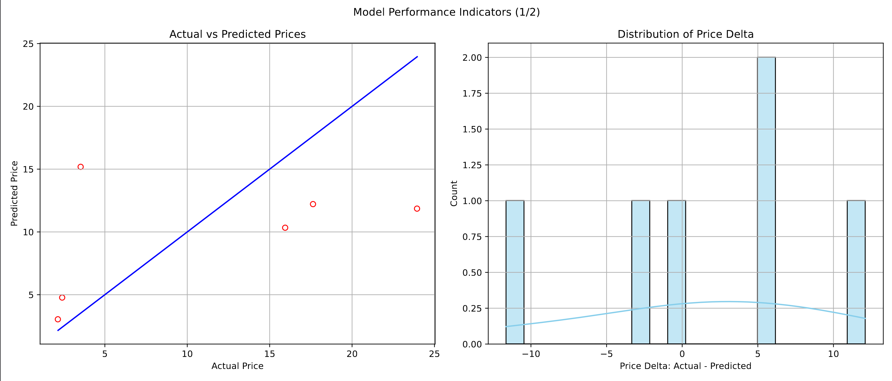

# P2Predict
     ____   ____   ____                   _  _        _   
    |  _ \ |___ \ |  _ \  _ __   ___   __| |(_)  ___ | |_ 
    | |_) |  __) || |_) || '__| / _ \ / _` || | / __|| __|
    |  __/  / __/ |  __/ | |   |  __/| (_| || || (__ | |_ 
    |_|    |_____||_|    |_|    \___| \__,_||_| \___| \__|


[](https://github.com/ahmed-khalil-hafsi/P2Predict/actions/workflows/p2predict_train.yml)

P2Predict is an open-source Python comand-line program for advanced procurement price prediction. It employs machine learning techniques to provide reliable and actionable insights into price trends, aiding in strategic decision-making in procurement. 

The project is in heavy active development - Contributions are welcome!

This project is not released for production yet.

As I work on core features first, this program is targetting procurement & commodity managers that are fairly technical. At this stage, P2Predict is not polished for the non-technical business user.

This software is released under the MIT license. See `LICENSE` for the license details.

## Features

#### Prediction
- Predict prices (or any other target feature) based on a trained model

#### Model Training
- Import training data from a CSV file
- Perform feature/impact analysis
- Auto detection of the most predictive features using RFE and a Random Forest
- Implementation of Hyper Parameter Optimization for Ridge, XGBoost and Random Forest
- Train a machine learning model on the selected features to predict the price (or any other target)
- Support for Ridge, XGBoost, and Random Forest ML algorithms
- Models can be easily saved and loaded
- Evaluation metrics (mean absolute error and R^2 scores are supported)

### Plotting
- Create a PDF file with model performance indicators (predicted vs actual price, distribution of prediction errors, ...)



## Quick Start

To use P2Predict, follow these steps:

### 0. Install dependencies
   - Install the required dependencies by invoking `pip install -r requirements.txt`
   
### 1. Prepare the data for training
   - Ensure your data is in a CSV format.
   - Remove any blanks or gaps in the data (empty columns, empty cells, etc.).
   - Address any errors in the data (e.g., #NAs).
   - Verify that numeric columns do not contain text.

### 2. Train your model
   - Use the `p2predict_train.py` tool to train a new model.
   - The tool accepts the following arguments:

     ```bash
     python3 p2predict_train.py --input PATH --target TEXT --algorithm TEXT --expert --verbose --interactive --training_features TEXT
     ```

     - OPTIONAL: `--input PATH`: Path to your input CSV file. This dataset is used for training. This must be a CSV file.
     - OPTIONAL: `--target TEXT`: Name of the feature to predict (e.g., "Price"). If you are trying to predict a price, this should be the name of your price column.
     - OPTIONAL: `--expert`: Toggle Expert Mode. This is a flag and does not require a value. If you don't call the P2Predict with --expert, the program will be in Auto Mode where P2Predict_train will optimize all decisions on behalf of the user automatically, i.e. ML algorithm, best features, evals. In Expert mode, the user has to select which algorithm to use, which features to select, ...
     - OPTIONAL: `--algorithm TEXT`: Choose the machine learning algorithm to be used.
     - OPTIONAL: `--interactive`: This is a flag to activate interactive mode. This does not require a value. If this flag is not set, P2Predict will be in non-interactive mode. This means you have to specify the --input, --algorithm, --target and --training_features. Use non-interactive mode for scripting or embedding within APIs or other libraries.
     - `--training_features TEXT`: List of training features to be used to train the model. The list must be the headers separated by a ','. Example: `--training_features Weight,Size`.


#### Examples:

     ```bash
     python3 p2predict_train.py --interactive
     ```

     Launch P2Predict in Interactive Auto-Mode. This is the most straight-forward usage of P2Predict_train. Note that here only --interactive is specified. The program will ask the user to enter all required information to create a trained model.  

     
     ```bash
     python3 p2predict_train.py --expert --interactive
     ```

     In this example, we are launching P2Predict_train in Interactive Expert mode. In Expert mode, the user has access to all advanced features including feature selection, algorithm selection, evals, ...  

     
     ```bash
     python3 p2predict_train.py --expert --input examples/example.csv --algorithm ridge --target Price --training_features Weight,Size
     ```

     In this example, we are launching P2Predict_train in Non-Interactive Expert mode. In this mode you have to specify all inputs as part of the command line call. This command trains a model using data from `dummy/example.csv`, the `ridge` algorithm, `Price` as the target feature and Weight and Size as training features.

      
### 3. Use the model to predict prices
   - Use the `p2predict.py` tool to predict a new price using a trained model.
   - The tool accepts the following arguments:

     ```bash
     python3 p2predict.py --model PATH --features TEXT
     ```

     - `--model PATH`: Path to the trained model.
     - `--features TEXT`: Comma-separated key:value list of input features.

     Example:

     ```bash
     python3 p2predict.py --model models/ridge_weight_region_price.model --features weight_g:25,region:5
     ```

     This command uses the model saved in `models/ridge_weight_region_price.model` to predict the price for an object with a weight of 25g and located in region 5. Make sure the model accepts the same features and also in the same order. The model in this example was trained using `p2predict_train`, using `weight_g` and `region` as training features.

## Dependencies

Check `requirements.text` for exact versions. Install with `pip install -r requirements.txt`
- pandas
- sklearn
- xgboost
- matplotlib
- seaborn
- joblib
- rich
- click

## Data

For data examples, check `dummy/example.csv`.

## Contributing

PRs are open. If you have a feature you'd like to add or if you've found a bug, please feel free to open an issue or submit a PR.

I am especially looking for data sets for various direct and indirect commodities (examples: ICs, Passive Components, Plastic Parts, Mechanical Parts, ...). If you know of any open datasets or if your organisation wants to donate a dataset, please contact me.

## Become a sponsor!

I work on open source projects during my free time. If you think this projects adds value to the procurement community, please consider sponsoring a donation!
