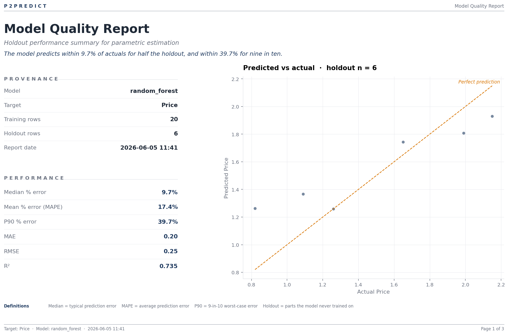

# P2Predict
     ____   ____   ____                   _  _        _   
    |  _ \ |___ \ |  _ \  _ __   ___   __| |(_)  ___ | |_ 
    | |_) |  __) || |_) || '__| / _ \ / _` || | / __|| __|
    |  __/  / __/ |  __/ | |   |  __/| (_| || || (__ | |_ 
    |_|    |_____||_|    |_|    \___| \__,_||_| \___| \__|


[](https://github.com/ahmed-khalil-hafsi/P2Predict/actions/workflows/p2predict_train.yml)

**P2Predict benchmarks what similar parts have historically cost, to inform design and sourcing decisions.**

You feed it a CSV of past purchases (technical features → price). It trains a model and lets you ask, *"given these features, what have parts like this cost?"* — turning historical data into a reality check that engineering and procurement teams can actually use together.

Source-available under the [PolyForm Noncommercial License 1.0.0](LICENSE) — free for internal and personal use; commercial use (including consulting deployments for clients or SaaS) requires a separate commercial license from the author.

### What it is (and isn't)

P2Predict is a **parametric, data-driven cost-prediction tool** — the kind of model NASA, ICEAA, and the cost-estimating bodies call *parametric estimating*. It learns `features → price` from your historical data.

It is **not bottom-up should-costing.** It does not decompose parts into material cost + labor minutes + machine time + overhead. Tools like aPriori or Siemens Teamcenter PCM do that, from first principles. P2Predict answers the complementary question: *"what has the market actually charged us for parts like this?"* The two approaches work well together — one tells you what a part ought to cost, the other tells you what similar parts have cost.

---

# Part 1 — What it's worth

P2Predict isn't trying to replace anyone's judgment. It's a shared, data-grounded reference that takes specific conversations from anecdote to numbers. Here are the conversations it's built for.

## Procurement ↔ Engineering

Most cost overruns get baked in during design — when engineering chooses features and procurement is downstream of the choice. The two functions usually meet over those choices in three places.

### Design reviews: "is this feature worth it?"

An engineer proposes tighter tolerances on a fastener — ±0.05mm instead of ±0.1mm. Procurement suspects that pushes the part above target cost.

**Without P2Predict**: a 45-minute debate based on intuition. The decision ends up driven by whoever speaks loudest.

**With P2Predict**: one `--whatif` call returns *"this change adds $0.42 per unit (+18%), with a 9-in-10 likely range of $0.30–$0.55."* Now the conversation is *"is +18% worth it for this requirement?"* — a real engineering question with a real answer.

### BOM challenges from finance: "is this realistic?"

The CFO walks in and asks the BOM owner *"are we sure this $42 per-unit BOM is achievable?"*

**Without P2Predict**: defended with anecdote and one-off supplier conversations.

**With P2Predict**: defended with `--interval` against the model. *"15 of these 18 line items are inside the model's 9-in-10 likely range. The three that aren't, and what's pulling each one: supplier choice on line 5, the EU-only requirement on line 11, the tolerance on line 14."* That's the difference between "trust us" and a numerical defense.

### Material and supplier trade-offs: "what's the actual cost delta?"

Engineering wants to move a part from aluminum to a higher-spec alloy. Procurement wants to know the cost impact before saying yes.

**Without P2Predict**: source two RFQs, take a week, get a single supplier's number.

**With P2Predict**: `--whatif "Material:Alloy7075"` returns the predicted delta based on every similar part the company has historically bought, with a SHAP attribution showing whether the cost driver is the material itself or correlated features that ride along with it. Same answer in 30 seconds.

## Inside procurement

P2Predict is also built for procurement people working without engineering in the room.

### RFQ triage: spend the meeting on the lines that need a meeting

A new RFQ arrives with 200 line items. You have an afternoon, not a week.

Running `--interval` over the batch CSV: every line gets a low/high prediction. Lines inside the likely range are routine — auto-approve or queue them. The 8–15 lines that fall outside are the ones worth a phone call. You stop spending equal attention on every line and start spending it where it actually moves spend.

### Negotiation prep: know exactly what to push back on

Supplier quotes $14.20 for a part the model predicts at $12.40 (90% range $10.80–$13.90).

With `--explain` you see the contribution table: supplier choice +$0.85, rush-delivery flag +$1.20, size +$0.40. You stop arguing about the unit price and start arguing about its *components*. *"Why is rush delivery on this line? We agreed to standard."*

### Audit defense: explain the decision six months later

Finance asks why a $14.20 unit price got approved on PO #4521.

With `--explain` + `--interval` on the saved model, there's a written rationale: the model expected $12.40 ± $1.50, the quote landed $0.30 above the high end, the drivers were tolerance and supplier — both consistent with the engineering spec on that part. That's an auditable answer with a paper trail, not "Bob said it was fine."

### Buyer onboarding: capture the institutional knowledge before the senior people leave

A senior buyer who's been benchmarking the company's plastic parts for 20 years retires. That intuition usually walks out with them.

A P2Predict model trained on the historical buys captures the *pattern* — what features drive cost in your supply base, what a typical range looks like, what looks off. The new buyer doesn't inherit Maria's intuition, but they inherit a baseline that lets them ask better questions and a backstop that flags things even Maria might have missed.

## See it on real data — [case studies](case-studies/)

Four reproducible case studies on public datasets, each targeting a different audience:

- **[Battery Management ICs](case-studies/battery-management-ics/)** — parametric pricing for EE procurement (Octopart / Mouser / DigiKey API).
- **[Used vehicles](case-studies/used-cars/)** — the tutorial, on prices that span orders of magnitude (Kaggle, CC-licensed).
- **[Aerospace fasteners](case-studies/aerospace-fasteners/)** — detecting noisy data: measuring a model's R² ceiling before tuning, on the public-domain DLA PUB LOG fastener catalog.
- **[PCBA composition](case-studies/pcba-composition/)** — composes three trained models (components + PCB + assembly) into BOM-level cost with per-stage attribution. The composability story for hardware-procurement cost engineering.

Each one ships with a `README` walking through the story, a `fetch_data.py` to pull the dataset, training command, and worked predictions with `--explain` / `--interval` / `--whatif`.

---

# Part 2 — How it works

If Part 1 sold the scenarios, this part is the tool itself: how the model is trained, what the CSV needs to look like, the CLI flags, the Python API, and the install path.


## How it works in one minute

1. **Bring your history.** A CSV of past purchases — one row per part, with technical features (weight, material, region, supplier, size, …) and the price you paid.
2. **Train a model.** P2Predict fits a regression model (Ridge / Random Forest / XGBoost), cross-validates them against each other, and keeps the best one.
3. **Ask "what would similar parts cost?"** Feed it the technical features of a new or proposed part and it returns a benchmark price grounded in your historical data.

The model learns from your data — so the benchmark reflects your supply base and your buying patterns, not a vendor's reference catalog.

## Data format

One row per part. One column is the target (the price or whatever else you want to predict); the rest are the technical features the model will learn from.

```csv
CPN,Weight,Region,Supplier,Size,Price
CP17-17921595,17,EU,supplier A,Standard,1.41
CP2-5580430,2,CN,supplier A,Small,0.18
CP30-19674030,30,SG,supplier A,Large,2.15
```

Notes that matter in practice:
- **Column types are auto-detected.** Numeric columns become numerical features; text and boolean columns become categorical. You don't have to one-hot encode by hand.
- **The target column is whatever you pass with `--target`.** It doesn't have to be called "Price" — `Cost`, `Revenue`, `Churn`, anything numeric works.
- **Identifier columns** (part numbers, SKUs, anything near-unique) are auto-detected as "high variation" and flagged for you to drop. You usually don't want them in the model.
- **Missing values:** rows with any NA in selected columns are dropped with a warning. If you want to keep them, impute upstream.
- **Outliers in the target or in numerical features:** flagged by default (Tukey IQR). Pass `--outliers drop` / `--outliers winsorize` to act on the target column, and `--feature-outliers drop` / `--feature-outliers winsorize` to act on the feature columns. Feature-side `drop` is row-level (any column outlier removes the row); feature-side `winsorize` caps each column at its own IQR bounds.
- **Time-ordered data:** if the CSV has a date column, pass `--time-column DATE` so the train/test split and CV become chronological — random splitting on time-ordered data inflates measured accuracy.

See [`examples/example.csv`](examples/example.csv) for a working procurement-shaped dataset.

## Features

#### Benchmarking / prediction
- Predict the benchmark price (or any other numerical target) for a part given its technical features
- Batch-predict an entire CSV of candidate parts in one call
- **Likely-range intervals** via `--interval` — a "9 in 10" range around each prediction, calibrated on the training holdout. Quotes outside the range are unusual and worth questioning. Coverage is mathematically guaranteed under the same distribution assumption as the model's accuracy metrics
- **Per-prediction explanations** via `--explain` — uses exact SHAP (TreeExplainer for tree models, LinearExplainer for linear models). Shows the additive decomposition `baseline + Σ contributions = prediction`, or for log-target models the strict multiplicative factors in price space
- **What-if analysis** via `--whatif "Region:EU,Supplier:B"` — compare a base scenario against a counterfactual where one or more features change. Shows base and counterfactual predictions side-by-side (with likely ranges), the delta in dollars and percent, and a SHAP-attributed decomposition of where the change came from. The design-review tool for cross-functional cost discussions
- Robust to unseen categorical values at prediction time (a new supplier code or region won't crash the model)

#### Model Training
- Import training data from a CSV file
- **Cross-validated model selection** across Ridge, Random Forest and XGBoost (`HalvingRandomSearchCV`) — auto-mode picks the best model *and* hyperparameters for your data
- **Automatic log-target transform** for positive, skewed targets (typical of price data)
- **Outlier handling** on both the target *and* the feature columns (Tukey IQR rule) with four policies each: `warn`, `drop`, `winsorize`, `keep`. Feature-side `drop` removes any row with an outlier in any numerical feature; `winsorize` caps each column at its own IQR bounds. Categorical features are ignored
- **Time-aware cross-validation** via `--time-column` — chronological train/test split and `TimeSeriesSplit` for HPO, to prevent look-ahead bias on time-ordered data
- Auto-detection of the most predictive features using a Random Forest baseline
- Auto-detection of low/no information features that might bias the model
- Tree models use `OrdinalEncoder` (fast, handles high-cardinality categoricals); linear models use `OneHotEncoder + StandardScaler`
- Expert mode lets you pick the algorithm and optionally run hyperparameter tuning — the tuned model is what gets saved
- Configurable HPO search budget via `--budget {fast,thorough}`
- Models can be saved and loaded
- Evaluation metrics: R², MAE, RMSE, and a residual-bias check

### Plotting
- Create a PDF file with model performance indicators (predicted vs actual price, distribution of prediction errors, ...)



## Three ways to use it

P2Predict ships three surfaces. Pick the one that fits the workflow:

| Surface | Who uses it | How |
|---|---|---|
| **CLI** | Procurement engineers, data scientists | `p2predict-train ...` and `p2predict ...` after `pip install` |
| **Python API** | Apps, notebooks, custom pipelines | `from p2predict import auto_train, explain, predict_interval, what_if` |
| **MCP server** *(coming v1.0)* | AI agents working on behalf of procurement teams | Typed tools the agent calls; the procurement user never touches a CLI |

All three call the same underlying math. See [`examples/python_api.py`](examples/python_api.py) for an end-to-end Python walkthrough.

## Quick Start

### 0. Install

```bash
pip install -e .          # while developing from a clone
# or once published:
pip install p2predict
```

That installs the `p2predict` and `p2predict-train` commands and the `p2predict` Python package.
   
### 1. Prepare the data for training
   - Ensure your data is in a CSV format.
   - Remove any blanks or gaps in the data (empty columns, empty cells, etc.).
   - Address any errors in the data (e.g., #NAs).
   - Verify that numeric columns do not contain text.

### 2. Train your model
   
   - After installing, use the `p2predict-train` command. From a clone you can also run `python -m p2predict.cli.train` or `python3 p2predict_train.py`.
   - The tool accepts the following arguments:

     ```bash
     p2predict-train [OPTIONS]
     ```

     - `--input`, `-i`: Path to your input CSV file. This dataset is used for training.
     - `--target`, `-t`: Name of the feature to predict (e.g., "Price").
     - `--expert`, `-x`: Toggle Expert Mode. In Expert mode, you have more control over the training process.
     - `--algorithm`, `-a`: Choose the algorithm in expert mode: `ridge`, `xgboost`, or `random_forest`.
     - `--interactive`, `-c`: Activate interactive mode. If not set, you must specify all required options.
     - `--verbose`, `-v`: Increase output verbosity.
     - `--training_features`, `-tf`: List of training features to be used, separated by commas.
     - `--budget`, `-b`: HPO search budget — `fast` (default) or `thorough`. Used by auto-mode model selection and by expert-mode `--tune`.
     - `--tune / --no-tune`: Expert mode only. Run hyperparameter tuning and save the tuned model.
     - `--outliers`: How to handle outliers in the target column (Tukey IQR rule). `warn` (default), `drop`, `winsorize`, or `keep`.
     - `--feature-outliers`: How to handle outliers in the numerical feature columns (Tukey IQR per column). `drop` removes any row with an outlier in any feature column; `winsorize` caps each column independently at its own IQR bounds. `warn` (default) reports per-column counts without changing the data. Categorical features are ignored. Useful when a misrecorded `Weight=100000` would otherwise silently distort the model.
     - `--time-column`: Name of a date column. When given, train/test split and cross-validation become chronological (`TimeSeriesSplit`) — prevents the look-ahead bias you get from random splits on time-ordered data.
     - `--json`: Emit a machine-readable JSON document to stdout instead of Rich-formatted output. Same schema family as the predict CLI. Useful for agents and scripts that need structured train results (model path, CV scores, evaluation metrics, feature importances). See [Machine-readable JSON output](#machine-readable-json-output).

     For a complete list of options, run `p2predict-train --help`.

     ### Examples:

     #### Example 1: Interactive Auto-Mode

     ```bash
     p2predict-train --interactive
     ```

     Launches P2Predict in Interactive Auto-Mode. The program guides you through the process and automatically performs CV-based model selection across Ridge, Random Forest, and XGBoost.

     #### Example 2: Non-Interactive Auto-Mode

     ```bash
     p2predict-train --input examples/example.csv --target Price
     ```

     Auto-mode picks the best algorithm and hyperparameters for you. Output names the winning algorithm and lists CV R² for each candidate.

     #### Example 3: Auto-Mode with Thorough HPO

     ```bash
     p2predict-train --input data/sales.csv --target Revenue --budget thorough
     ```

     Same as Example 2 but with a wider hyperparameter search (slower, usually higher accuracy).

     #### Example 4: Interactive Expert Mode
     
     ```bash
     p2predict-train --expert --interactive
     ```

     Interactive Expert Mode gives you control over feature selection, algorithm choice, and HPO. You're prompted before running hyperparameter tuning, and the tuned model is what gets saved.

     #### Example 5: Non-Interactive Expert Mode with Tuned XGBoost
     ```bash
     p2predict-train --expert --input examples/example.csv --algorithm xgboost --target Price --training_features Weight,Size,Region --tune --budget fast
     ```

     Trains an XGBoost model on the chosen features, runs `HalvingRandomSearchCV`, and saves the tuned model.

     #### Example 6: Specifying Multiple Training Features
     ```bash
     p2predict-train --expert --input data/housing.csv --target Price --algorithm ridge --training_features Area,Bedrooms,Location,YearBuilt
     ```

     Trains a Ridge regression model with the specified features.

   - After training, the model will be saved and can be used for predictions with `p2predict.py`.

      
### 3. Use the model to predict prices
   - Use the `p2predict.py` tool to predict a new price using a trained model.
   - The tool accepts the following arguments:

     ```bash
     p2predict -m MODEL_PATH [-p PREDICT_USING] [-i PREDICT_FILE]
     ```

     - `-m, --model MODEL_PATH`: Path to the trained model file (.model file).
     - `-p, --predict_using TEXT`: Inline prediction feature/value pair to be fed to the trained model.
     - `-i, --predict_file FILE`: A CSV file that contains prediction features and values. This file will be fed to the trained model to generate predictions.
     - `--explain`: Print a per-feature SHAP attribution alongside the prediction. In batch mode (`-i`) adds `top1_driver`, `top2_driver`, `top3_driver` columns to the output CSV.
     - `--interval N`: Show the model's likely range for the prediction. `--interval 90` produces a range that contains the target value for about 9 in 10 similar parts (calibrated on the training holdout). In batch mode adds `<target>_low` and `<target>_high` columns. Useful for supplier benchmarking and RFQ sanity checks — quotes outside the range are unusual and worth questioning.
     - `--whatif "Feature:NewValue,..."`: Compare the base scenario (from `-p`) against a counterfactual where the listed features change. Prints the new predicted price, the delta in dollars and percent, and where the change came from feature by feature. Combine with `--interval` to also see the shift in the likely range, and with `--explain` to see the SHAP breakdown of the base prediction alongside. Inline only — not supported with `-i` batch mode.
     - `--json`: Emit a machine-readable JSON document to stdout instead of Rich-formatted tables. Composes with `--interval`, `--explain`, and `--whatif` — each adds its block to the response. Designed for AI agents and scripts. See [Machine-readable JSON output](#machine-readable-json-output) below for the schema.

     Examples:

     1. Using inline prediction:
     ```bash
     p2predict -m models/my_trained_model.model -p "weight_g:25,region:5"
     ```

     This command uses the model saved in `models/my_trained_model.model` to predict the price for an object with a weight of 25g and located in region 5.

     2. Using a prediction file:
     ```bash
     p2predict -m models/my_trained_model.model -i prediction_data.csv
     ```

     This command uses the model saved in `models/my_trained_model.model` to generate predictions for all the entries in the `prediction_data.csv` file.

   Note: Make sure the features you provide (either inline or in the CSV file) match the features the model was trained on. The model in these examples was trained using `p2predict_train.py`, and the prediction features should correspond to the training features used.

## Python API

Everything the CLI can do is also reachable from Python. This is the surface an embedded application — or an AI agent acting on behalf of a procurement user — calls when it doesn't want to shell out to a subprocess.

```python
import pandas as pd
from p2predict import (
    auto_train,           # CV-based model selection (Ridge/RF/XGBoost)
    explain,              # exact SHAP attribution per prediction
    predict_interval,     # conformal "likely range" with guaranteed coverage
    what_if,              # base vs counterfactual comparison
    load_model, save_model,
)
from p2predict.prepare_data import prepare_data
from p2predict.intervals import compute_calibration_residuals

data = pd.read_csv("purchases.csv")
features = ["Weight", "Region", "Supplier", "Size"]

# Train (cross-validated model selection across three algorithms).
X_train, X_test, y_train, y_test, num, cat = prepare_data(data, features, "Price")
model, algorithm, scores, log_target = auto_train(X_train, y_train, num, cat)

# Inference + per-feature attribution.
new_part = pd.DataFrame([{"Weight": 15, "Region": "EU",
                          "Supplier": "A", "Size": "Standard"}])
calibration = compute_calibration_residuals(model, X_test, y_test)

[interval] = predict_interval(model, new_part, calibration, coverage=0.90)
explanation = explain(model, new_part, background_X=X_train.sample(100))

print(f"Predicted: {interval.prediction:.2f}")
print(f"Likely range (90%): {interval.low:.2f}–{interval.high:.2f}")
for feature, contribution in explanation.contributions.items():
    print(f"  {feature}: {contribution:+.2f}")
```

See [`examples/python_api.py`](examples/python_api.py) for an end-to-end script that loads `examples/example.csv`, trains, persists, reloads, and demonstrates all four entry points (`auto_train`, `predict_interval`, `explain`, `what_if`).

The public API surface is everything in `from p2predict import ...`; submodule paths like `p2predict.training` and `p2predict.intervals` are stable but lower-level.

## Machine-readable JSON output

Both CLIs accept `--json`, which suppresses all Rich-formatted output and emits a single JSON document on stdout instead. The schema is documented in [`src/p2predict/json_output.py`](src/p2predict/json_output.py) and versioned via a `schema_version` field on every response.

The shape of an inline prediction with all three extras composed:

```bash
p2predict -m my_model.model \
  -p "Weight:15,Region:EU,Supplier:A,Size:Standard" \
  --interval 90 --explain --whatif "Region:CN" \
  --json | jq '.'
```

```json
{
  "schema_version": "1.0",
  "command": "predict",
  "model": {
    "path": "my_model.model",
    "algorithm": "random_forest",
    "target": "Price",
    "version": "v0.9",
    "log_target": false,
    "features": ["Weight", "Region", "Supplier", "Size"]
  },
  "mode": "inline",
  "predictions": [
    {"input": {"Weight": "15", "Region": "EU", "Supplier": "A", "Size": "Standard"},
     "prediction": 1.318}
  ],
  "interval": {
    "coverage": 0.90,
    "per_row": [{"low": 1.04, "prediction": 1.318, "high": 1.59}],
    "soft_warning": null
  },
  "explanation": [
    {
      "baseline": 1.35,
      "prediction": 1.318,
      "log_target": false,
      "contributions": [
        {"feature": "Weight", "value": -0.059},
        {"feature": "Region", "value": 0.030},
        ...
      ],
      "multiplicative_factors": null,
      "dollar_attribution": null,
      "residual": 0.0
    }
  ],
  "whatif": {
    "changes": {"Region": {"from": "EU", "to": "CN"}},
    "base_prediction": 1.318,
    "counterfactual_prediction": 1.250,
    "delta": -0.068,
    "delta_pct": -5.2,
    "changed_contributions": [...],
    "interaction_contribution": -0.012,
    "interaction_is_material": false,
    "base_interval": {"low": 1.04, "high": 1.59},
    "cf_interval": {"low": 0.97, "high": 1.52}
  }
}
```

Key points for agents and downstream tools:

- **Stable schema, versioned.** Tests in [`tests/test_json_output.py`](tests/test_json_output.py) lock in the top-level keys for both commands. New fields can be added without bumping the schema version; renames or removals bump the major number.
- **stdout is exclusively the JSON document.** No banner, no logo, no spinner. `jq` and other parsers work on the raw output without preprocessing.
- **Errors emit JSON too.** Failure paths produce `{"schema_version": "1.0", "command": ..., "error": {"code": "...", "message": "..."}}` on stdout with exit code 1, so an agent piping output still gets something parseable when something goes wrong.
- **`--json` composes with `--interval`, `--explain`, and `--whatif`.** Each adds its block to the response without changing the others.
- **Interactive mode is incompatible with `--json`** — `p2predict --json` without `-p` or `-i` errors cleanly instead of prompting for input no agent can answer.

The train CLI's JSON shape (with `cv_scores`, `evaluation`, `feature_importances`, `model_path`, etc.) is documented at the top of [`src/p2predict/json_output.py`](src/p2predict/json_output.py).

## Dependencies

Check `requirements.txt` for exact versions. Install with `pip install -r requirements.txt`
- click
- joblib
- matplotlib
- numpy
- pandas
- rich
- scikit-learn (≥ 1.5)
- scipy
- seaborn
- xgboost
- halo
- questionary
- shap

## Running the tests

```bash
pip install -e ".[dev]"
pytest tests/
```

The same suite runs in CI on every push to `main` and on pull requests.

## Contributing

Bug reports, feature requests, and dataset suggestions are welcome — please open an issue.

I'm particularly keen on expanding the collection of datasets for direct and indirect commodities: ICs, passive components, plastic parts, mechanical parts, and more. If you're aware of open datasets in these areas, or your organization would like to contribute one, please reach out.

**Code contributions** require signing a Contributor License Agreement (CLA) before a pull request can be accepted. This is necessary because P2Predict is dual-licensed — noncommercial for the community, with commercial licenses available — and contributors need to explicitly grant rights that cover both. [Reach out](https://ahmedhafsi.com/contact/) before investing time in a large patch.

## Licensing

P2Predict is source-available under the [PolyForm Noncommercial License 1.0.0](LICENSE). This means:

- **Free for internal use** — companies and individuals can use P2Predict within their own organization at no cost.
- **Commercial use requires a license** — deploying P2Predict for clients, embedding it in a paid service, or offering it as part of a consulting engagement requires a separate commercial license.

Commercial licenses are available. If you are a consulting firm, systems integrator, or software vendor interested in distributing or deploying P2Predict commercially, please reach out to discuss licensing terms:

**Ahmed K. Hafsi** — [ahmedhafsi.com/contact](https://ahmedhafsi.com/contact/)

