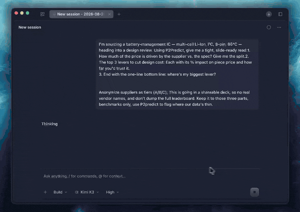
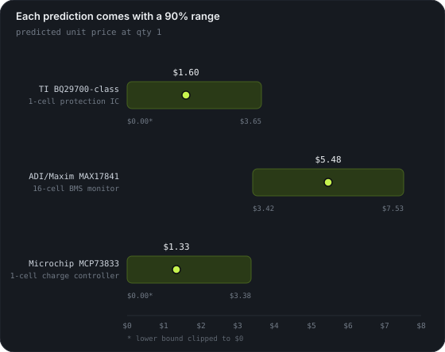
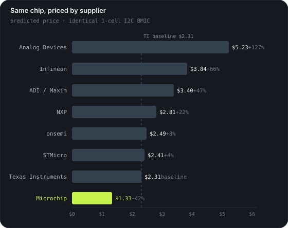
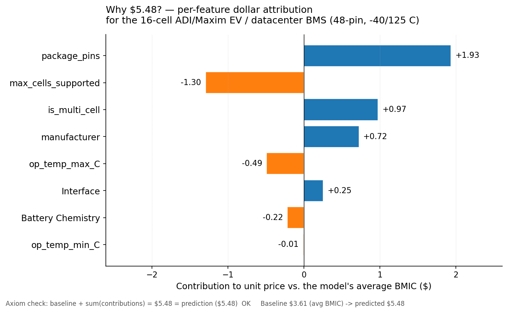
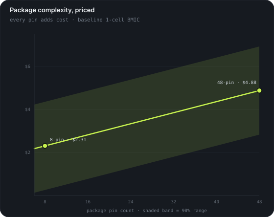

<div align="center">


### The right price is already in your data.

**P2Predict turns your purchasing history into a price model your team can talk to. Ask what a part should cost, why, and how sure the answer is, in plain language, through the AI agent you already use.**

 &nbsp;
 &nbsp;
 &nbsp;


[](https://github.com/ahmed-khalil-hafsi/P2Predict/actions/workflows/p2predict_train.yml) &nbsp;
[](https://github.com/ahmed-khalil-hafsi/P2Predict/actions/workflows/install_smoke.yml)



**Set up in one command:**

```bash
pip install "p2predict[mcp]"
```

Built for procurement and engineering teams in automotive, semiconductors, electronics, industrials, pharma, and chemicals.

</div>

## The problem

Most of what a part costs is decided upstream, in a design review procurement never sees. An engineer tightens a tolerance beyond what the application needs, or locks the part to a single supplier, and the cost rides downstream with no number attached. By the time the BOM reaches procurement, the expensive decisions are frozen and all that is left to negotiate is the rounding.

Then the quote arrives. The supplier knows their cost to the cent; you have last year's PO and a few days to respond. Multiply that across every line you buy and the leaks look the same everywhere: premiums no one benchmarked, specs no one costed, a number you cannot defend when finance asks where the savings went.

The answers are already in your purchase history. Nobody has had the time to dig them out.

## What P2Predict does

P2Predict learns from your own purchasing data what drives the price of a part: supplier, material, size, spec, region. Then it gives your team a defensible target for any new or proposed part. Your category managers ask in plain English. The answer comes back grounded in what you have actually paid.

It runs on your machine, on your data, through any AI agent your team already uses. Nothing is uploaded. No vendor catalog, no cloud, no per-seat data-sharing.

## What it is, and what it isn't

P2Predict is **parametric price prediction**. It learns the fundamental pricing structure in your historical buying data and benchmarks any part against it, the ones you are about to buy and the ones you already do. Being precise about that is the whole point, so here is the honest scope.

**What it does**

- Learns from the prices you have actually paid and predicts what a similar part should cost.
- Attributes that predicted price to each spec and to the supplier, so you can see what is moving the number.
- Puts a calibrated likely-range on every estimate and flags where the data is too thin to trust.
- Improves as you give it more of your own purchase history.

**What it does not do**

- **It is not a should-cost tool.** It does not build a part up from raw material, labor, and machine time, and it cannot tell you a supplier's true cost or margin.
- It only knows what your data has shown it. Ask about a part unlike anything in your history and it will widen the range or tell you to get a quote rather than guess.
- The per-spec breakdown shows what is *associated* with price in your data. It is a read on your market, not a causal or engineering model of why a part costs what it does.
- It does not invent data. No relevant history, no model.

## The conversations it changes

This is where P2Predict earns its keep. Every one of these is a real question your team can now answer in seconds, with a number and the confidence behind it.

### "Is this quote fair?"

Your category manager drops the quote on the agent.

> **Category manager:** *"Supplier quotes $14.20 for this part. What should it cost?"*
>
> **P2Predict:** *"$12.40. Nine times in ten the real price lands between $10.80 and $13.90. This quote is running about 15% high."*

Your category manager now knows exactly where they can push back, with real data behind it.

### When the supplier pushes back: "Are you sure that's the right price?"

This is where most negotiations stall. Now you have an answer. Ask for the breakdown.

> **Category manager:** *"Why $12.40? Break it down."*
>
> **P2Predict:** *"Supplier choice +$0.85, rush delivery +$1.20, tighter tolerance +$0.42, size +$0.40."*

Now you argue the components line by line: *"We agreed standard lead time. Take the $1.20 rush charge off and we're aligned."* A line item is hard to wave away.

### "What if we switch supplier?"

Hold the spec fixed, swap the supplier, read the delta.

> **Category manager:** *"What happens if we move this 16-cell pack monitor from Supplier A to Supplier B?"*
>
> **P2Predict:** *"Down 37.7%, about $2.07 a unit, with the per-feature breakdown to back it up."*

More targeted RFQs, and a faster sourcing decision. That number is your lever in the room.

### In the design review: "Is this feature worth it?"

Engineering proposes a tighter tolerance. Before it gets locked in, price it.

> **Engineer:** *"We want to go from ±0.1mm to ±0.05mm."*
>
> **Category manager to the agent:** *"What does that do to cost?"*
>
> **P2Predict:** *"+$0.42 a unit, +18%, likely range $0.30 to $0.55."*

Now the conversation is *"is 18% worth this requirement?"*, a priced trade-off the room can settle on numbers.

### In the cost-down workshop: "What is the design paying for that it doesn't need?"

Walk in with every spec priced. Which features carry real cost, which premiums are negotiable, where the design is paying for something the application never uses. Backed by your own data, with a confidence level on every finding.

### RFQ triage: "Which of these 200 lines deserve a call?"

Drop the whole RFQ on the agent. Every line gets a target and a range. The eight to fifteen lines that fall outside their range are the ones worth a phone call. The rest are routine. Your team spends the afternoon on what actually moves the number.

## It tells you how much to trust the number

Most tools hand you a number and walk away. P2Predict hands you the number **and tells you how confident to be in it**, per part, in dollars. That honesty is the whole point: a confident-but-wrong benchmark loses you credibility the moment a supplier checks it.



Three real parts, three different confidence ranges. The model is tight on the part it knows well and openly uncertain on the ones it doesn't. A narrow range means negotiate hard. A wide one means get a quote first. Your category manager always knows which.

- **A confidence range on every estimate.** "$12.40, and nine times in ten the real price lands between $10.80 and $13.90."
- **An honest map of where the model is strong and where it is thin.** P2Predict flags which parts of your category it can benchmark with confidence and which need a real quote, so nobody negotiates off a number the data can't support.
- **A reason for every number.** Every estimate breaks down into what each spec and the supplier contribute, so you argue the components line by line.

## See what actually drives the price

Point P2Predict at a category and it shows you the levers. These charts come straight out of the [Battery Management ICs case study](case-studies/battery-management-ics/), built on public catalog data anyone can reproduce.

**Supplier choice is the biggest lever on the board.** Same single-cell chip, identical spec, sorted by who makes it:



The premium supplier is priced at roughly four times the value option for the same part. That is a number you take into a negotiation, backed by your own data.

**Every estimate breaks down spec by spec.** Ask why a part is priced the way it is and you get the full breakdown:



Package size, supplier premium, multi-cell architecture: each one in dollars, each one adding up exactly to the predicted price. This is what lets your category manager say *"I know what I'm paying for, and here's the line I want to cut."*

**Complexity is priced, not assumed.** Every package pin on this same chip adds cost, monotonically, from $2.31 at 8 pins to $4.88 at 48 pins:



And on the 30 parts held back from training, entirely unseen by the model, predictions land within roughly 16% of the actual price half the time, and within 73% nine times in ten. That's the model showing its work on parts it never saw, not asking you to trust it blind.

## How it fits your stack

**You don't use P2Predict; your agent does.** It speaks to **any AI agent** through a standard connector — Claude, GPT, or a local model — so your category managers never learn a new tool. They ask the assistant they already use, and it runs the analysis for them. This is agentic-first: there is no dashboard and no app, the interface is the agent you already have.

Under the hood, P2Predict is two layers. A **math layer** trains on your spend, predicts the price, attributes it spec by spec, and puts a calibrated range on every estimate — the defensible statistics. A **judgment layer** sits on top and steers the conversation: which analysis to run, when to stop and ask you for more data, and whether a result is solid enough to quote or needs a real RFQ first. It's what keeps a weaker agent from overstating a number it shouldn't.

Everything runs **on your own machine**. Your purchasing data is your most sensitive commercial asset, so P2Predict never uploads it and no third party trains on it. Pair it with a local model to keep the whole loop offline, or with a cloud agent if you prefer; either way your raw spend stays put, with no data-residency conversation to have with legal.

It complements should-cost tools, it does not replace them. Bottom-up should-costing builds a part up from material, labor, and machine time to estimate what it *should cost to make*. P2Predict does not do that and is not trying to. It answers the other question every category manager actually asks: *what has the market charged us for parts like this, and what should we expect to pay for the next one?*

## Proof on public data

Three worked case studies, each reproducible end to end on data anyone can download:

- **[Battery Management ICs](case-studies/battery-management-ics/):** the closest thing to a real procurement job. A small, realistic parts slice, a supplier-premium lever you can quote, and an honest read on where the model is strong and where it needs a real quote.
- **[Used vehicles](case-studies/used-cars/):** the easy-to-follow walkthrough on prices that span orders of magnitude.
- **[Aerospace fasteners](case-studies/aerospace-fasteners/):** the honesty story. How P2Predict shows you when the data itself sets the limit, so you stop chasing accuracy the data can't give.

Each one leads with results, shows where to trust them, and points to exactly where every number comes from.

## FAQ

**Is it really free?**
Yes — including for for-profit companies. Any organization can use P2Predict internally for its own operations, procurement, and benchmarking at no cost. No seats, no trial period, no sales call. A commercial license is only needed if you use it to serve third-party clients (consulting or advisory work) or embed it in a paid product or service.

**How reliable are the numbers?**
Every estimate comes with a range, not just a number, and the range is honest about how thin your data is: wide where history is sparse, tight where it's deep. On the public case studies, predictions land within roughly 16% of the actual price half the time, and within 73% nine times in ten. That's the model showing its work, not asking you to trust it blind.

**Does my data ever leave my machine?**
No. P2Predict trains and predicts entirely on your own machine. The only thing that leaves is whatever your AI agent normally sends to its own model. Pair it with a local model to keep that offline too.

**Which AI agents does it work with?**
Any agent that speaks MCP: Claude, GPT-based agents, or a model running locally. That's the core idea behind P2Predict: it's a capability for your agent to use, not a new tool for you to learn. No dashboard, no separate login. It just shows up wherever you already do your work with your agent.

**Is this a should-cost tool?**
No. Should-costing builds a part up from material, labor, and machine time. P2Predict benchmarks against what the market has actually charged for comparable parts.

**Why is this open source?**
Because a closed tool only ever does what its vendor decided to ship. Source-available means you, or your agent, can read every line, tune the code or the interfaces to your company's ecosystem, or wire it into your own stack and other tools without waiting on anyone's roadmap. That kind of ownership doesn't exist behind a closed API.

**Who built P2Predict?**
It started in 2023 as a project in my free time, weekends and sporadic evenings. See below for the background it draws on.

**Who do I talk to about rolling this out for my team?**
Nobody, really: it installs with one pip command and runs on your own data in a few minutes. Start with [INSTALL.md](INSTALL.md) and [TECHNICAL.md](TECHNICAL.md). If you'd still like a hand, want a commercial license, or want to share a dataset for a future case study, reach out at [ahmedhafsi.com/contact](https://ahmedhafsi.com/contact). Happy to help.

## Who built it

P2Predict is built and maintained by **[Ahmed K. Hafsi](https://ahmedhafsi.com)**.

**Experience**

- **Senior Manager, Negotiation Excellence** — Infineon Technologies (2023–present). High-stakes deals across Asia, including foundry, OSAT, and strategic suppliers.
- **Senior Manager, Negotiation Excellence** — Dyson (2020–2023). Architected and led the global Negotiation Excellence capability: governance, KPIs, tooling, and renegotiation campaigns.
- **Senior Management Consultant, Negotiation & Game Theory** — TWS Partners, Munich & London (2014–2019). Advised industrial clients on negotiation strategy and applied game theory.

**Education & training**

- Karlsruhe Institute of Technology (KIT), Electrical Engineering & Information Technology (2008–2014).
- Harvard Law School, Program on Negotiation (2021). Negotiation Master Class: Advanced Strategies for Experienced Negotiators.

P2Predict comes out of that work: the tools a procurement team actually needs to walk into a negotiation knowing its number and its leverage. More at **[ahmedhafsi.com](https://ahmedhafsi.com)**.

## Try it / set it up

- **Set it up with your agent:** see **[INSTALL.md](INSTALL.md)** to install, connect your AI assistant, and point it at your data.
- **How it works under the hood:** the models, the math, the full reference live in **[TECHNICAL.md](TECHNICAL.md)**.

## Licensing

Source-available under the [PolyForm Noncommercial License 1.0.0, with an additional grant of permission for internal company use](LICENSE).

- **Free for internal use, including for-profit companies.** Any organization may use P2Predict internally for its own operations, procurement, and benchmarking at no cost. You do not need to buy anything, ask permission, or talk to anyone.
- **A commercial license is only required if you** (1) provide consulting, advisory, or procurement services to third-party clients using P2Predict, or (2) embed or integrate it into a paid product or service.

Despite the "Noncommercial" in the underlying license name, commercial *companies* are explicitly covered by the additional grant — the restriction is on selling P2Predict's use to others, not on being a business.

For a commercial license, a partnership, or to share a procurement dataset, reach out: **[ahmedhafsi.com/contact](https://ahmedhafsi.com/contact/)**.

© Ahmed K. Hafsi. P2Predict is a copyrighted work; all rights reserved except as granted under the license above.
