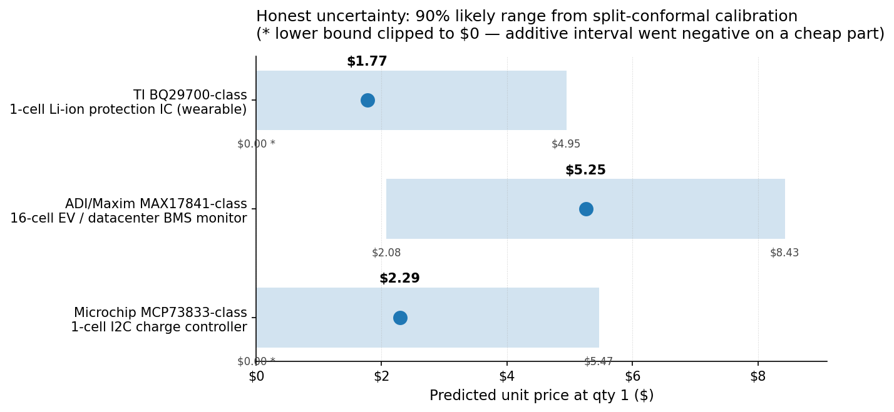
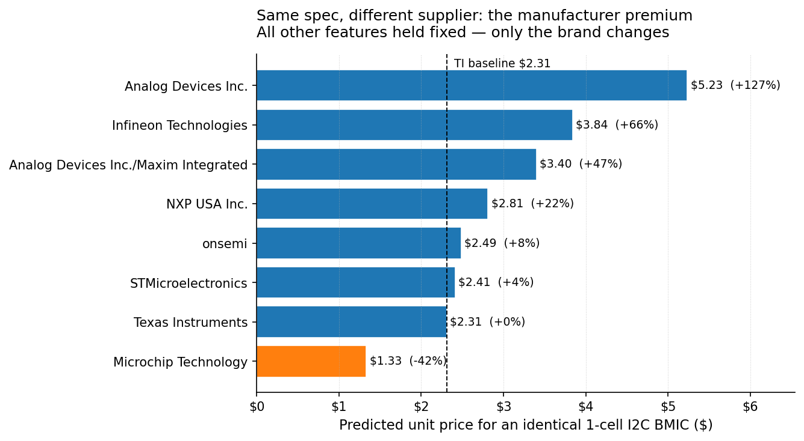

# P2Predict

### Uncover the hidden structure in your category pricing.

**P2Predict turns your purchasing history into a price model your team can talk to. Ask what a part should cost, why, and how sure the answer is, in plain language, through the AI agent you already use.**

 &nbsp;
 &nbsp;
 &nbsp;

## The problem

Your team negotiates thousands of prices a year on gut feel and last year's PO. The senior category manager who *knew* what a part should cost is retiring. Engineering adds a tolerance and nobody can say what it costs. A supplier quote lands and your category manager has no defensible number to push back with.

The pricing knowledge is sitting in your purchase history, waiting to be used.

## What P2Predict does

P2Predict learns from your own purchasing data what drives the price of a part: supplier, material, size, spec, region. Then it gives your team a defensible target for any new or proposed part. Your category managers ask in plain English. The answer comes back grounded in what you have actually paid.

It runs on your machine, on your data, through any AI agent your team already uses. Nothing is uploaded. No vendor catalog, no cloud, no per-seat data-sharing.

## What it is, and what it isn't

P2Predict is **parametric price prediction**. It learns the price patterns in your historical buying data and uses them to price the next part. Being precise about that is the whole point, so here is the honest scope.

**What it does**

- Learns from the prices you have actually paid and predicts what a similar part should cost.
- Attributes that predicted price to each spec and to the supplier, so you can see what is moving the number.
- Puts a calibrated likely-range on every estimate and flags where the data is too thin to trust.
- Improves as you give it more of your own purchase history.

**What it does not do**

- **It is not a should-cost tool.** It does not build a part up from raw material, labor, and machine time, and it cannot tell you a supplier's true cost or margin.
- It only knows what your data has shown it. Ask about a part unlike anything in your history and it will widen the range or tell you to get a quote rather than guess.
- The per-spec breakdown shows what is *associated* with price in your data. It is a read on your market, not a causal or engineering model of why a part costs what it does.
- It does not invent data. No relevant history, no model.

## The conversations it changes

This is where P2Predict earns its keep. Every one of these is a real question your team can now answer in seconds, with a number and the confidence behind it.

### "Is this quote fair?"

Your category manager drops the quote on the agent.

> **Category manager:** *"Supplier quotes $14.20 for this part. What should it cost?"*
>
> **P2Predict:** *"$12.40. Nine times in ten the real price lands between $10.80 and $13.90. This quote is running about 15% high."*

Your category manager now knows exactly where they can push back, with real data behind it.

### When the supplier pushes back: "Are you sure that's the right price?"

This is where most negotiations stall. Now you have an answer. Ask for the breakdown.

> **Category manager:** *"Why $12.40? Break it down."*
>
> **P2Predict:** *"Supplier choice +$0.85, rush delivery +$1.20, tighter tolerance +$0.42, size +$0.40."*

Now you argue the components line by line: *"We agreed standard lead time. Take the $1.20 rush charge off and we're aligned."* A line item is hard to wave away.

### "What if we switch supplier?"

Hold the spec fixed, swap the supplier, read the delta.

> **Category manager:** *"What happens if we move this 16-cell pack monitor from Supplier A to Supplier B?"*
>
> **P2Predict:** *"Down 37.7%, about $2.07 a unit, with the per-feature breakdown to back it up."*

A week of RFQs, answered in thirty seconds. That number is your lever in the room.

### In the design review: "Is this feature worth it?"

Engineering proposes a tighter tolerance. Before it gets locked in, cost it.

> **Engineer:** *"We want to go from ±0.1mm to ±0.05mm."*
>
> **Category manager to the agent:** *"What does that do to cost?"*
>
> **P2Predict:** *"+$0.42 a unit, +18%, likely range $0.30 to $0.55."*

Now the conversation is *"is 18% worth this requirement?"*, a costed trade-off the room decides on numbers.

### In the cost-down workshop: "What is the design paying for that it doesn't need?"

Walk in with every spec priced. Which features carry real cost, which premiums are negotiable, where the design is paying for something the application never uses. Backed by your own data, with a confidence level on every finding.

### RFQ triage: "Which of these 200 lines deserve a call?"

Drop the whole RFQ on the agent. Every line gets a target and a range. The eight to fifteen lines that fall outside their range are the ones worth a phone call. The rest are routine. Your team spends the afternoon on what actually moves the number.

## It tells you how much to trust the number

Most tools hand you a number and walk away. P2Predict hands you the number **and tells you how confident to be in it**, per part, in dollars. That honesty is the whole point: a confident-but-wrong benchmark loses you credibility the moment a supplier checks it.

Three real parts, three different confidence ranges. The model is tight on the part it knows well and openly uncertain on the ones it doesn't. A narrow range means negotiate hard. A wide one means get a quote first. Your category manager always knows which.

- **A confidence range on every estimate.** "$12.40, and nine times in ten the real price lands between $10.80 and $13.90."
- **An honest map of where the model is strong and where it is thin.** P2Predict flags which parts of your category it can benchmark with confidence and which need a real quote, so nobody negotiates off a number the data can't support.
- **A reason for every number.** Every estimate breaks down into what each spec and the supplier contribute, so you argue the components line by line.

## See what actually drives the price

Point P2Predict at a category and it shows you the levers. These charts come straight out of the [Battery Management ICs case study](case-studies/battery-management-ics/), built on public catalog data anyone can reproduce.

**Supplier choice is the biggest lever on the board.** Same single-cell chip, identical spec, sorted by who makes it:

The premium supplier is priced at roughly four times the value option for the same part. That is a number you take into a negotiation, backed by your own data.

**Every estimate breaks down spec by spec.** Ask why a part costs what it does and you get the receipt:

Package size, supplier premium, multi-cell architecture: each one in dollars, each one adding up exactly to the predicted price. This is what lets your category manager say *"I know what I'm paying for, and here's the line I want to cut."*

## How it fits your stack

P2Predict speaks to **any AI agent**: Claude, and any other assistant your team runs, through a standard connector. Your category managers don't learn a new tool. They ask the assistant they already use, and it does the analysis.

Everything runs **locally**. Your purchasing data is your most sensitive commercial asset, so it stays on your machine. No upload, no third-party model training on your spend, no data-residency conversation with legal.

It complements should-cost tools, it does not replace them. Bottom-up should-costing builds a part up from material, labor, and machine time to estimate what it *should cost to make*. P2Predict does not do that and is not trying to. It answers the other question every category manager actually asks: *what has the market charged us for parts like this, and what should we expect to pay for the next one?*

## Proof on public data

Three worked case studies, each reproducible end to end on data anyone can download:

- **[Battery Management ICs](case-studies/battery-management-ics/):** the closest thing to a real procurement job. A small, realistic parts slice, a supplier-premium lever you can quote, and an honest read on where the model is strong and where it needs a real quote.
- **[Used vehicles](case-studies/used-cars/):** the easy-to-follow walkthrough on prices that span orders of magnitude.
- **[Aerospace fasteners](case-studies/aerospace-fasteners/):** the honesty story. How P2Predict shows you when the data itself sets the limit, so you stop chasing accuracy the data can't give.

Each one leads with results, shows where to trust them, and points to exactly where every number comes from.

## Who built it

P2Predict is built and maintained by **[Ahmed K. Hafsi](https://ahmedhafsi.com)**, Senior Manager of Negotiation Excellence at Infineon, where he leads negotiation strategy across automotive, semiconductor, consumer, and chemicals categories in Asia-Pacific. He built and led Dyson's global Negotiation Excellence capability and advised on negotiation and applied game theory at TWS Partners in Munich and London. He trained as an engineer at the Karlsruhe Institute of Technology and works across three continents in four languages.

P2Predict comes out of that work: the tools a procurement team actually needs to walk into a negotiation knowing its number and its leverage. More on his approach to negotiation, pricing, and game theory at **[ahmedhafsi.com](https://ahmedhafsi.com)**.

## Try it / set it up

- **Set it up with your agent:** see **[INSTALL.md](INSTALL.md)** to install, connect your AI assistant, and point it at your data.
- **How it works under the hood:** the models, the math, the full reference live in **[TECHNICAL.md](TECHNICAL.md)**.

## Licensing

Source-available under the [PolyForm Noncommercial License 1.0.0](LICENSE).

- **Free for internal use:** use P2Predict inside your own organization at no cost.
- **Commercial use requires a license:** deploying for clients, embedding it in a paid service, or consulting engagements.

For a commercial license, a partnership, or to share a procurement dataset, reach out: **[ahmedhafsi.com/contact](https://ahmedhafsi.com/contact/)**.

© Ahmed K. Hafsi. P2Predict is a copyrighted work; all rights reserved except as granted under the license above.
