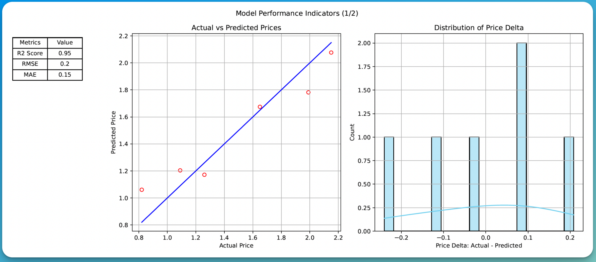

# P2Predict
     ____   ____   ____                   _  _        _   
    |  _ \ |___ \ |  _ \  _ __   ___   __| |(_)  ___ | |_ 
    | |_) |  __) || |_) || '__| / _ \ / _` || | / __|| __|
    |  __/  / __/ |  __/ | |   |  __/| (_| || || (__ | |_ 
    |_|    |_____||_|    |_|    \___| \__,_||_| \___| \__|


[](https://github.com/ahmed-khalil-hafsi/P2Predict/actions/workflows/p2predict_train.yml)

P2Predict is an open-source Python comand-line program for advanced procurement price prediction. It employs Artificial Intelligence & machine learning techniques to provide reliable and actionable insights into price trends, aiding in strategic decision-making in procurement.


The project is in active development - Contributions are welcome!

As I work on core features first, this program is targeting procurement & commodity managers that are fairly technical. At this stage, P2Predict is not polished for the non-technical business user.

This software is released under the MIT license. See `LICENSE` for the license details.

## Features

#### Prediction
- Predict prices (or any other target feature) based on a trained model

#### Model Training
- Import training data from a CSV file
- Perform feature/impact analysis
- Auto detection of the most predictive features using RFE and a Random Forest
- Auto detection of low information features that might bias the model if selected
- Implementation of Hyper Parameter Optimization for Ridge, XGBoost and Random Forest
- Train a machine learning model on the selected features to predict the price (or any other target)
- Support for Ridge, XGBoost, and Random Forest ML algorithms
- Models can be easily saved and loaded
- Evaluation metrics (mean absolute error and R^2 scores are supported)

### Plotting
- Create a PDF file with model performance indicators (predicted vs actual price, distribution of prediction errors, ...)



## Quick Start

To use P2Predict, follow these steps:

### 0. Install dependencies
   - Install the required dependencies by invoking `pip install -r requirements.txt`
   
### 1. Prepare the data for training
   - Ensure your data is in a CSV format.
   - Remove any blanks or gaps in the data (empty columns, empty cells, etc.).
   - Address any errors in the data (e.g., #NAs).
   - Verify that numeric columns do not contain text.

### 2. Train your model
   
   - Use the `p2predict_train.py` tool to train a new model.
   - The tool accepts the following arguments:

     ```bash
     python3 p2predict_train.py [OPTIONS]
     ```

     - `--input`, `-i`: Path to your input CSV file. This dataset is used for training.
     - `--target`, `-t`: Name of the feature to predict (e.g., "Price").
     - `--expert`, `-e`: Toggle Expert Mode. In Expert mode, you have more control over the training process.
     - `--algorithm`, `-a`: Choose the machine learning algorithm to be used (ridge, xgboost, or randomforest).
     - `--interactive`: Activate interactive mode. If not set, you must specify all required options.
     - `--verbose`, `-v`: Increase output verbosity.
     - `--training_features`, `-f`: List of training features to be used, separated by commas.

     For a complete list of options, run `python3 p2predict_train.py --help`.

     ### Examples:

     #### Example 1: Interactive Auto-Mode

     ```bash
     python3 p2predict_train.py --interactive
     ```

     This launches P2Predict in Interactive Auto-Mode, where the program guides you through the process and optimizes decisions automatically.

     #### Example 2: Interactive Expert Mode
     
     ```bash
     python3 p2predict_train.py --expert --interactive
     ```

     This launches P2Predict in Interactive Expert Mode, giving you access to advanced features like feature selection, algorithm selection, and hyperparameter optimization.

     #### Example 3: Non-Interactive Expert Mode with Ridge Regression
     ```bash
     python3 p2predict_train.py --expert --input examples/example.csv --algorithm ridge --target Price --training_features Weight,Size
     ```

     This runs P2Predict in Non-Interactive Expert Mode, training a Ridge regression model using the specified input file, target, and training features.

     #### Example 4: Non-Interactive Auto-Mode with XGBoost
     ```bash
     python3 p2predict_train.py --input data/sales.csv --target Revenue --algorithm xgboost
     ```

     This example trains an XGBoost model in Auto-Mode, using 'Revenue' as the target variable. The program will automatically select the best features from the 'sales.csv' file.

     #### Example 5: Verbose Mode with Random Forest
     ```bash
     python3 p2predict_train.py --input data/customer_data.csv --target Churn --algorithm randomforest --verbose
     ```

     This runs a Random Forest model training with increased verbosity, predicting customer churn based on the data in 'customer_data.csv'.

     #### Example 6: Specifying Multiple Training Features
     ```bash
     python3 p2predict_train.py --input data/housing.csv --target Price --algorithm ridge --training_features Area,Bedrooms,Location,YearBuilt
     ```

     This example trains a Ridge regression model to predict housing prices, explicitly specifying multiple training features.

   - After training, the model will be saved and can be used for predictions with `p2predict.py`.

      
### 3. Use the model to predict prices
   - Use the `p2predict.py` tool to predict a new price using a trained model.
   - The tool accepts the following arguments:

     ```bash
     python3 p2predict.py -m MODEL_PATH [-p PREDICT_USING] [-i PREDICT_FILE]
     ```

     - `-m, --model MODEL_PATH`: Path to the trained model file (.model file).
     - `-p, --predict_using TEXT`: Inline prediction feature/value pair to be fed to the trained model.
     - `-i, --predict_file FILE`: A CSV file that contains prediction features and values. This file will be fed to the trained model to generate predictions.

     Examples:

     1. Using inline prediction:
     ```bash
     python3 p2predict.py -m models/my_trained_model.model -p "weight_g:25,region:5"
     ```

     This command uses the model saved in `models/my_trained_model.model` to predict the price for an object with a weight of 25g and located in region 5.

     2. Using a prediction file:
     ```bash
     python3 p2predict.py -m models/my_trained_model.model -i prediction_data.csv
     ```

     This command uses the model saved in `models/my_trained_model.model` to generate predictions for all the entries in the `prediction_data.csv` file.

   Note: Make sure the features you provide (either inline or in the CSV file) match the features the model was trained on. The model in these examples was trained using `p2predict_train.py`, and the prediction features should correspond to the training features used.

## Dependencies

Check `requirements.txt` for exact versions. Install with `pip install -r requirements.txt`
- click
- joblib
- matplotlib
- mpld3
- numpy
- pandas
- rich
- scikit-learn
- seaborn
- xgboost
- halo
- questionary

## Data

For data examples, check `dummy/example.csv`.

## Contributing

I warmly welcome contributions to this project! If you have an exciting feature idea or have discovered a bug, I'd be delighted to hear from you. Please don't hesitate to open an issue or submit a pull request.

I'm particularly keen on expanding my collection of datasets for various direct and indirect commodities. This includes, but is not limited to, Integrated Circuits (ICs), Passive Components, Plastic Parts, and Mechanical Parts. If you're aware of any open datasets in these areas, or if your organization would like to contribute a dataset, I'd be incredibly grateful. Please reach out to me - your input could be invaluable in enhancing the project's capabilities and benefiting the wider procurement community.

## Become a sponsor!

I work on open source projects during my free time. If you think this projects adds value to the procurement community, please consider sponsoring a donation!
