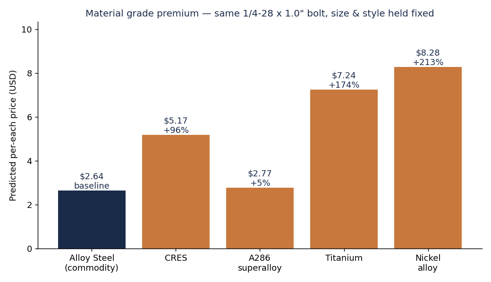
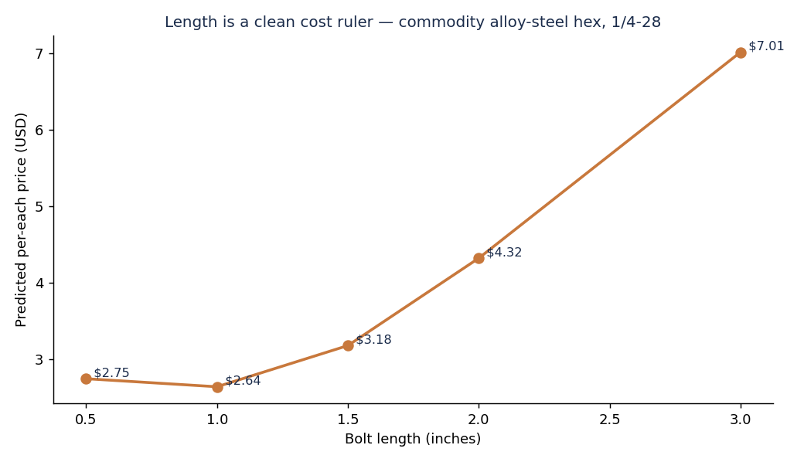
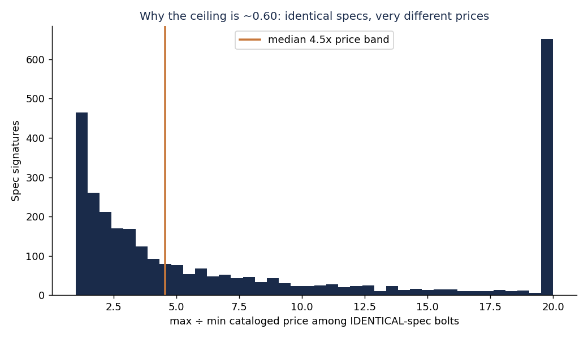
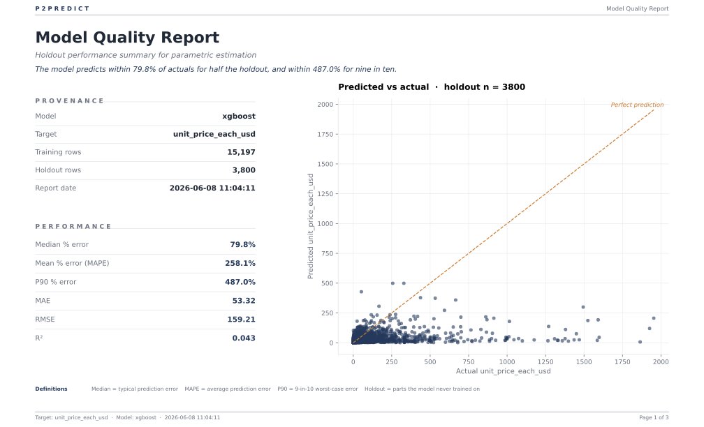
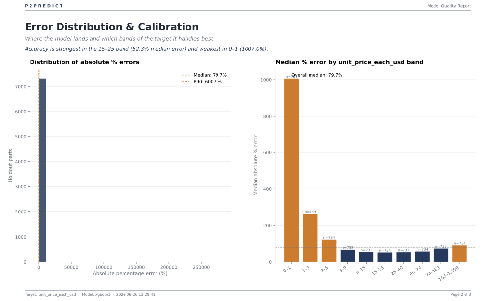
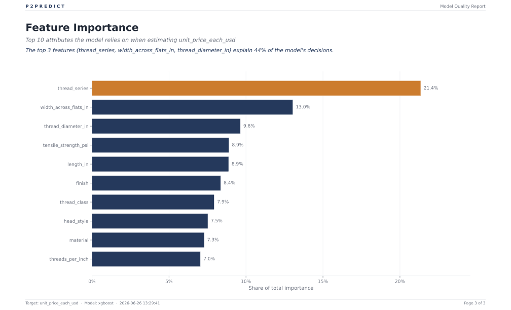

# Case study: Aerospace fasteners

> **The honest case study, the one that tells you when a number is worth
> trusting and when it isn't.** Real catalog data from the U.S. Defense Logistics
> Agency's **PUB LOG**, the master catalog the DoD, NASA, and their contractors
> order fasteners from, by National Stock Number.
>
> Bolt prices here are heavily skewed and intrinsically noisy: the catalog lists
> the same spec across a wide price band, and that caps how well *any* model can
> predict them. That's the point. Procurement teams burn real money trusting
> benchmarks the data can never support. This study shows how to measure that
> ceiling up front (`diagnose_noise.py`) and tell a solid number from a directional
> hint, the discipline that protects your credibility in a sourcing conversation.

## The procurement question

> Given a bolt's physical specs, material, head style, thread diameter, length,
> thread class, strength grade, and finish, what's the expected **per-each unit
> price**, and how much does each spec contribute? And the headline sourcing
> lever: **what does an aerospace-grade material (titanium, A286 superalloy,
> corrosion-resistant steel) cost over commodity alloy steel, holding size and
> style fixed?**

Bolts (Federal Supply Class **5306**) look like a clean parametric-pricing
target: price is driven by a handful of legible, datasheet-style specs; the
parts are bought by procurement engineers with strong intuition to sanity-check
against; and the catalog is **public domain**, fully redistributable, no API
key, no ToS gray area. The twist this study documents is that "looks clean" and
"is predictable" are different things, and you can measure the gap.

## Why this case study

Three reasons it's worth doing:

1. **It's a multiplicative-target showcase.** Fastener prices span from a cent (a
   commodity steel bolt) to ~$2,000 (an aerospace superalloy bolt), **skew
   5.36**, the textbook case for `--log-target on`. SHAP comes back as
   **multiplicative factors** ("titanium × N") and the likely-range stays
   **strictly positive**, never dipping below zero on a cheap part.

2. **Public-domain data we can fully commit.** PUB LOG is U.S. Government public
   domain, so we check a faithful cleaned sample straight into `data-sample/`.
   Anyone can reproduce without credentials, an API key, or a paid data feed.

3. **It's the honest-limits study.** Every modeling toolkit has a glossy case
   study where R² is 0.9 and everyone goes home happy. This is the other one: the
   model caps at a modest R² and **the right move is to stop tuning and prove it's
   the data, not the model.** That skill, diagnosing a noise floor, is worth
   more than another point of R² on an already-clean dataset.

## Part 1: What the analysis tells us

### What we built (in one paragraph)

We pulled **188,119** FSC-5306 NSNs from PUB LOG, joined decoded physical specs
to a unit-of-issue-normalised per-each price, and after the price + core-spec
coverage filter were left with **36,668 catalogued bolts**, and the model now
trains on **all 36,668** of them. (A prior NA-handling defect dropped any row with
a single missing value at load, shrinking the pool to 18,997 complete cases; that
fix is merged, so the effective training pool grew by ~93%.) The trainer
selected **XGBoost** with **`--log-target on`** firing automatically on the 5.36
skew. On a held-out test set (n ≈ 7,334) the model lands at **raw R² 0.021 /
log-price R² 0.322**, a **median error of 79.7%**, and **MAE $59.05**. Those are
not good numbers, and the point of this study is that **no model gets far past
them on this data** (an independent re-verification could not push log R² beyond
0.375 in any configuration). We measured the ceiling (`diagnose_noise.py`)
at **log R² ≈ 0.60**, with **80% of bolts being one-off spec signatures** and
identical specs cataloged across a **4.5× price band**. The directional signal, the material premium and the length ruler, survives the noise; the per-bolt
point estimate does not.

## For the category manager: the one-page brief

### The case

A category manager owns a book of fasteners across airframes, ground vehicles,
and ground-support equipment. The recurring question: *"Is this quote fair, and
what is the aerospace-material premium actually buying us?"* We train a P2Predict
model on FSC 5306 bolts from PUB LOG and ask it three things, what drives price,
what the material-grade premium is worth, and **where the model is solid enough
to act on versus where it's only a directional hint.**

### The findings (and where each is read off the tool)

| # | Finding | Read it here |
|---|---|---|
| 1 | **Material grade is a *directional* premium lever, but a loose one.** Holding a 1/4-28 × 1.0″ bolt fixed and swapping only the material: titanium **+174%** and nickel alloy **+213%** read as clear premiums over commodity alloy steel; CRES **+96%**. But A286 superalloy reads anomalously **+5%**, out of its expected position, and the exact ladder shuffles run-to-run. Trust the titanium/nickel *direction*, not the order or the %. | chart below · `extract_insights.py` |
| 2 | **Length is the cleanest cost ruler.** A commodity hex bolt runs $2.75 at 0.5″ → $7.01 at 3.0″ (**+155%**), broadly increasing, the one driver the model reads most cleanly. | chart below · `extract_insights.py` |
| 3 | **The catalog is intrinsically noisy, this is the headline.** 80% of bolts are one-off specs; identical specs are cataloged across a **4.5× price band**; the irreducible within-spec variance caps any model at **log R² ≈ 0.60**. | chart below · `diagnose_noise.py` |
| 4 | **The model is honest about it.** Holdout raw R² 0.021, median error 79.7%, MAE $59.05, at ~54% of the measured ceiling; some training headroom remains, but independent re-verification couldn't push log R² past 0.375 in any configuration. | quality report below |

#### Finding 1, the material premium ladder



Swap only the material on an otherwise-identical bolt and the premium materials do
read dearer, but the ladder is **messy, not clean**. Off a commodity alloy-steel
base ($2.64): CRES **+96%**, A286 superalloy **+5%**, titanium **+174%**, nickel
alloy **+213%**. Titanium and nickel land clearly above the base, that *direction*
is the robust, quotable signal. But A286 superalloy reading **below** CRES and
barely above commodity steel is out of position, and the order shuffles run-to-run.
That instability is this study's thesis showing up in the sweep: the catalog prices
these material specs loosely enough that the exact ladder won't hold still. Quote the
titanium/nickel premium as a direction; don't quote the order or the percentages.

#### Finding 2, length is a clean cost ruler



Length is the one driver the model reads most cleanly: a commodity hex bolt runs
$2.75 at 0.5″ and rises broadly to $7.01 at 3.0″ (+155%). A quote that's flat
across a 2× length jump, or far off this curve, is worth a second look.

#### Finding 3, the noise floor (the headline)



Among bolts whose *full spec signature repeats*, this is the spread of cataloged
prices within each signature, i.e. how differently the catalog prices parts that
are, to the model, identical. The **median band is 4.5×** (max ÷ min), and the
pile-up at the 20× clip shows a long tail of specs priced an order of magnitude
apart. That scatter is irreducible: no model can predict a difference whose inputs
are identical. It's why the achievable ceiling is ~0.60, not ~1.0.

### So what, the sourcing actions

- **Use the material premium as a directional anchor, not a price.** "A titanium
  bolt runs materially dearer than the alloy-steel equivalent, call it ~2–3×" is
  defensible from the data; "this exact NSN should be $3.81" is not. And don't
  over-trust the *order*: the A286 superalloy reading below CRES this run shows the
  ladder shuffles. Quote the titanium/nickel *direction*, not a precise ratio.
- **Sanity-check quotes against the length ruler.** A quote that's flat
  across a 2× length jump, or wildly off the broad length curve, is worth a
  second look. (The diameter sweep is U-shaped on this model, treat it as a
  directional hint, not a ruler.)
- **Don't use the per-each point estimate to set a should-cost.** The 90% likely
  range on a single bolt spans ~100×+ (e.g. the titanium archetype: $2.92–$302).
  That width is the honest output here, it's telling you the catalog can't
  pin the price, and neither can the model. Note the range now narrows on the
  expensive tier (see worked examples), the one place it tightens.

### So what, where's the value, where's the rubbish

An honest trust map, what to lean on, what to treat as a hint, what to ignore:

| Signal | Trust | Why |
|---|---|---|
| 🟡 **Material premium, Ti/Ni direction** | Directional only | Titanium (+174%) and nickel (+213%) read as clear premiums; but the *order* shuffles run-to-run (A286 read +5%, below CRES, this run), trust the direction, not the ladder |
| 🟢 **Length cost ruler** | Lean on it | Broadly increasing, physically sensible, the cleanest driver |
| 🟡 **Diameter cost ruler** | Directional only | U-shaped on this model ($3.13 at 0.164″ → $2.64 at 0.25″ → $6.31 at 0.5″), not monotonic, use with judgment |
| 🟡 **Exact premium %** | Directional only | Order and magnitude both move on resampling; don't quote a number |
| 🟡 **Mid-tier point estimate ($5–$155)** | Rough benchmark | Where the model is *least bad* and procurement dollars concentrate |
| 🔴 **Single-bolt point estimate, broadly** | Don't | Median 79.7% error; 4.5× catalog band on identical specs |
| 🔴 **Sub-$5 commodity bolts** | Don't | Noisiest tier; near-random relative error |

## Worked examples

Three bolt archetypes, commodity alloy-steel hex, aerospace titanium 12-point,
CRES hex, with point estimates, 90% ranges, SHAP, and the material what-if.
Produced by `python predict_examples.py`:

| Archetype | Point estimate | 90% likely range | Range width |
|---|---|---|---|
| Commodity alloy-steel hex, 1/4-28 × 1.0″ | **$2.64** | $0.14 – $50.79 | ×369 |
| Aerospace titanium 12-point, 1/4-28 × 1.0″ | **$29.73** | $2.92 – $302.36 | ×103 |
| CRES hex, 1/4-28 × 1.0″ | **$3.88** | $0.20 – $74.58 | ×369 |

The titanium point estimate rose substantially (from $17.85 to **$29.73**): the
switch to **target encoding** for categoricals (see Methodology) prices the premium
material more correctly than the old ordinal codes did.

Read those ranges as a feature, not a bug: the conformal interval is honestly
reporting the catalog's own price scatter. The bands are wide because the catalog
prices identical specs across a wide band, and that *is the finding.*

**New: the interval now narrows where the model is more consistent.** The 90%
range is no longer one global width stamped on every part. It's now **banded
(Mondrian) conformal**, calibrated *per predicted-price band*. The commodity and
CRES bolts (predicted under ~$8.75) fall in a wide band and get a **×369** range;
the expensive titanium (predicted over ~$22.12) falls in a tighter band and gets a
**×103** range. The model is more self-consistent on the high-dollar tier, so the
honest interval is correspondingly narrower exactly there, which is where the
procurement dollars and the negotiation leverage are. That's a real gain over a
single global width: a tighter, still-honest range on the parts that matter most.

## Part 2: The methodology centerpiece: detecting noisy data

When a model caps out at a modest R², the reflex is to keep tuning, more trees,
more features, a fancier algorithm. Sometimes that's right. Often the data itself
sets a hard ceiling and **no amount of tuning gets past it.** Before blaming the
model, measure the ceiling. `diagnose_noise.py` does it with two heuristics that
generalise to any dataset.

### Heuristic 1, signature uniqueness

Group every row by its full feature signature (material, head style, thread spec,
dimensions, finish, …). What fraction of rows are **one-offs**, the only bolt
with that exact signature?

```
80% of bolts are one-offs (the only bolt with that exact spec).
```

If most rows are one-offs, the model can never *interpolate* within a known spec;
it must *extrapolate* across specs. High uniqueness is a yellow flag on its own, and it means you can't even measure the noise floor from the singletons.

### Heuristic 2, the duplicate-signature noise floor

For the rows that **do** share a signature, split the target's variance into:

- **between-signature** variance, differences the features *can* explain, and
- **within-signature** variance, differences between bolts that are, as far as
  the features are concerned, **identical**. This part is *irreducible*: no model
  can predict it, because the inputs are the same.

The best R² any model can reach is therefore:

```
ceiling = 1 − within_variance / total_variance      (on the duplicate subset)
```

On this data:

```
Heuristic 2, noise floor (on the 7,475 duplicate-signature rows)
  irreducible within-signature variance = 40% of total
  => best achievable R² (log price) ceiling ≈ 0.60
  identical specs are cataloged across a 4.5x price band (median).
```

**The gotcha, and the reason this heuristic is worth writing down.** Compute the
ceiling on the **duplicate subset only.** If you divide the within-variance by the
variance over *all* rows, the one-off signatures (which add zero within-variance
by construction) mechanically drag the ceiling toward 1.0, a falsely reassuring
number. On this dataset that exact trap turned a fake **"0.93 ceiling"** into the
honest **~0.60.** We hit it ourselves; that's why it's documented.

Read the ceiling next to the model's actual log R² of 0.322. The model is at
~54% of the achievable ceiling, further from it than this study first claimed,
and part of that gap is training headroom. (The core training defects flagged in
independent re-verification, an HPO resource floor, raw-space CV scoring,
wholesale NA-row dropping, have since been fixed; this run already trains on all
36,668 rows and scores CV in log space. The gap to the ceiling persists anyway,
which is the point.) The diagnosis stands, and re-verification strengthened it:
no configuration tried
pushed log R² past 0.375, and a leave-one-out spec-twin test, predicting each
bolt from the *other* bolts with the identical spec, scores log R² **−0.17**.
A bolt's exact spec-twin barely predicts its price. The ceiling is noise the
catalog itself carries.

### Part 2b, the strengthening attempt (it didn't move the needle)

The honest follow-up to "the data is noisy" is "are you *sure* it's not the
model?" We tested the obvious strengthening move: **aggregate each spec signature
to its median price** so administrative noise averages out, then model the
medians. If the model were the bottleneck, the per-signature median model would
jump well above the row-level model.

It didn't: log R² ≈ **0.305** on per-signature medians, essentially identical to
the row-level model. That's the confirmation, **the ceiling is the data, not the
model.** When the strengthening move that *should* help doesn't, you've found a
noise floor, and the right call is to stop tuning and either go find better
features or accept the target is intrinsically noisy. (If a future feature pull
adds e.g. manufacturer or lot-quantity, that becomes a genuine follow-up study.)

## Part 3: Under the hood

## Data

**Source:** [DLA PUB LOG](https://www.dla.mil/Information-Operations/FLIS-Data-Electronic-Reading-Room/), the public release of the FLIS catalog, filtered to **FSC 5306 (Bolts)**.
Public domain; free; refreshed monthly. We use three segments:

| Segment | Gives us | Used for |
|---|---|---|
| `P_FLIS_NSN.CSV` (Identification) | NIIN, FSC, item-name | Filtering to FSC 5306 |
| `V_CHARACTERISTICS.CSV` | **Decoded** physical/performance specs | The model's features |
| `V_FLIS_MANAGEMENT.CSV` | Unit price + unit-of-issue | The target (normalised to per-each) |

**Two reproducibility paths:**

| Path | What you do | What you get |
|---|---|---|
| **Full** | Download the segment zips, run `fetch_data.py` → `prepare_data.py` → `p2predict-train` | Matches the numbers above |
| **Quick** | Train on `data-sample/bolts_sample.csv` (checked into git) | Same workflow, rougher numbers |

> **License note.** PUB LOG is **U.S. Government public domain**, fully
> redistributable. The cleaned sample in `data-sample/` is a faithful slice of
> the real catalog, not a redacted excerpt. The raw multi-GB segments and the
> full `data/bolts_clean.csv` stay gitignored simply because they're large, not
> because they're sensitive.

### Three data-hygiene steps that matter

1. **Streaming extraction.** The segments are multi-GB; `fetch_data.py` reads
   each zip member line-by-line and keeps only FSC-5306 NIINs, so it never
   unpacks the whole catalog to disk. The NIIN is the join key, FSC lives only
   in the identification file, so it's a two-stage filter (find 5306 NIINs, then
   subset the other two segments to them).

2. **Unit-of-issue normalisation.** A PUB LOG price is per unit-of-issue, per-each (EA), per-hundred (HD), per-thousand (TH), per-dozen (DZ)… We
   normalise to a true per-each price before modelling, or a $2.00/hundred bolt
   would look 100× pricier than a $2.00/each one. (See `prepare_data.py`.)

3. **A domain price ceiling, distinct from statistical outlier policy.**
   Capping at **$2,000/each** drops a handful of physically-implausible
   mis-catalogued assemblies (a $55k–$88k "bolt" is a kitted assembly, not a
   fastener). That's a *domain* filter, different from the Tukey-fence
   `--outliers warn` policy, which we leave on warn so it never silently deletes
   a near-constant spec column. Capping cut the skew from 62.6 → 5.36.

**Columns we model:**

| Column | Type | Notes |
|---|---|---|
| `unit_price_each_usd` | Numeric (target) | Normalised per-each; skew 5.36 → `--log-target on` |
| `material` | Categorical | alloy steel / CRES / A286 / nickel / titanium / aluminum |
| `head_style` | Categorical | hexagon / double-hexagon (12-pt) / socket / … |
| `thread_diameter_in` | Numeric | Parsed from "0.250 INCHES" |
| `length_in` | Numeric | Parsed from "1.500 INCHES" |
| `thread_class` | Categorical | e.g. 3A |
| `thread_series` | Categorical | UNF / UNJF / … |
| `finish` | Categorical | cadmium / zinc / passivated / anodise |
| `tensile_strength_psi` | Numeric | strength grade |
| `threads_per_inch` | Numeric | |
| `width_across_flats_in` | Numeric | |

Characteristics arrive **long** (one row per NIIN × characteristic);
`prepare_data.py` pivots that to one row per bolt with one column per spec.

## Methodology

The pipeline runs in five stages, each handled by P2Predict:

1. **Outlier handling.** `--outliers warn` and `--feature-outliers warn` flag
   Tukey-fence outliers without deleting them, important here because some spec
   columns are near-constant and silent dropping would gut them. The one removal
   we *do* make is the $2,000 domain ceiling (above), which is defensible on
   physical grounds.
2. **Train/test split** with a held-out test set the model never sees during
   fitting (n ≈ 7,334).
3. **Preprocessor**, **target encoding** for the categorical specs. The tree
   models in play here now use scikit-learn's `TargetEncoder`: each category
   (material, head style, finish, …) is mapped to its smoothed, cross-fitted mean
   price, so the encoder carries real price signal instead of an arbitrary integer
   code. (The prior `OrdinalEncoder` assigned categories meaningless ranks, part
   of why the old run under-priced premium materials like titanium; P2Predict still
   one-hot encodes only for linear models.) On the data side, the NA-handling fix
   means there is no longer wholesale row-dropping at load: this study now trains on
   all **36,668** rows, not the old **18,997** complete cases.
4. **CV model selection + hyperparameter tuning** across candidate algorithms;
   the trainer chose **XGBoost**. With the HPO-floor and log-space-scoring fixes
   in place, the CV scores are now sane and ordered as you'd expect, **ridge 0.116 < random_forest 0.286 < XGBoost 0.300** (the old run produced
   broken sub-zero floor values). The model is now selected and tuned properly;
   the data ceiling still caps the achievable quality.
5. **Conformal calibration** (for the 90% likely-range intervals) and **SHAP**
   attribution (for the per-feature "why this price").

The fastener-specific choices:

- **`--log-target on` (not auto).** The 5.36 skew means `auto` would fire anyway,
  but we set it explicitly because for a positive, multiplicative price target the
  multiplicative attribution and strictly-positive intervals are the *property we
  want*, not a coincidence of this month's sample.
- **`--outliers warn` / `--feature-outliers warn`.** Tukey-fence dropping is
  destructive when a spec column is near-constant. Keep every part; the $2,000
  domain ceiling does the one removal that's defensible.

### Feature importance (XGBoost gain, aggregated to original columns)

| Feature | Importance |
|---|---|
| `thread_series` | 0.214 |
| `width_across_flats_in` | 0.130 |
| `thread_diameter_in` | 0.096 |
| `tensile_strength_psi` | 0.089 |
| `length_in` | 0.089 |
| `finish` | 0.084 |
| `thread_class` | 0.079 |
| `head_style` | 0.075 |
| `material` | 0.073 |
| `threads_per_inch` | 0.070 |

Importance is spread broadly with no single dominating feature, itself a
fingerprint of a weak signal. `thread_series` is nominally top this run, but no
feature carries the gain decisively. When a dataset has a strong driver, one or two
features dominate; here it's smeared, because no feature is strongly predictive of a
target the catalog prices so loosely.

## Results

| Metric (holdout, n≈7,334) | Value |
|---|---|
| Algorithm | XGBoost, `--log-target on` |
| Training rows | ~29,334 |
| Raw R² | 0.021 |
| Log-price R² | 0.322 |
| Median % error | 79.7% |
| MAPE | 363% |
| P90 % error | 601% |
| MAE | $59.05 |
| RMSE | $174.29 |
| **Measured ceiling (log R²)** | **≈ 0.60** |

Read the actual log R² (0.322) next to the ceiling (≈0.60): the model captures
~54% of the achievable signal. Some of the shortfall is training headroom (see
the re-verification note below), but most of the story is still the gap between
the ceiling and 1.0, that's the catalog's noise, not the model's shortcoming.

> **Independently re-verified.** Every number in this table, and the worked
> examples, the noise-floor ceiling, and the material/length sweeps, was
> independently reproduced and stress-tested in
> [`FINDINGS-verification.md`](FINDINGS-verification.md) /
> [`verify_findings.py`](verify_findings.py) (PR #14). That re-verification also
> measured a higher ceiling of **0.71** when 8 more catalog specs + ITEM_NAME
> are added, part of the "irreducible" noise was unmeasured features.

## Model quality report (PDF)

`python generate_quality_report.py` produces a three-page model-quality report.
[**Download the full report (PDF)**](assets/model_quality_report.pdf)

### Page 1: Summary



Headline: **median prediction error 79.8%**, P90 error 487%. The
predicted-vs-actual scatter is diffuse rather than hugging the perfect-prediction
line, the visual signature of a target the features can only weakly explain. This
is the page that tells you, honestly, not to use the point estimate for pricing.

### Page 2: Error distribution and calibration



Median % error **by price band**: the model is least-bad through the **$5–$155
mid-tier** (where procurement dollars actually concentrate) and worst on **sub-$5
commodity bolts**, where a few cents of absolute error is a huge *percentage* and
the relative error is near-random. For procurement this answers *"where is the
benchmark even roughly trustworthy?"*, the mid-tier, and only directionally.

### Page 3: Feature importance



The procurement-shaped importance view. Unlike a clean dataset where one driver
dominates, here importance is **spread across thread diameter, thread series,
material, and strength** with no single feature above ~0.18, visual confirmation
that the signal is weak and diffuse, consistent with the measured noise floor.

> **How to generate this report yourself.** Run
> `python generate_quality_report.py` after training (it re-derives the holdout
> with the same split + outlier policy and writes the PDF + page PNGs into
> `assets/`).

## Reproducing this case study

```bash
# 1. Download from the FLIS Electronic Reading Room (free, no login):
#    the Identification, Characteristics, and Management segment zips.
#    Save them in e.g. ~/Downloads.

cd case-studies/aerospace-fasteners

# 2. Filter each segment to FSC 5306, streaming (disk-safe, never fully
#    unzips the multi-GB segments; uses Python's zipfile, no 7z needed).
python fetch_data.py --src-dir ~/Downloads

# 3. Pivot characteristics, join + normalise price, clean -> bolts_clean.csv
python prepare_data.py

# 4. Diagnose the noise floor BEFORE training, measure the ceiling.
python diagnose_noise.py

# 5. Train. --log-target on (heavy right skew); both outlier policies warn.
p2predict-train \
  -i data/bolts_clean.csv \
  -t unit_price_each_usd \
  -tf "material,head_style,thread_diameter_in,length_in,thread_class,thread_series,finish,tensile_strength_psi,threads_per_inch,width_across_flats_in" \
  --log-target on \
  --outliers warn \
  --feature-outliers warn \
  --budget thorough

# 6. Point estimate + 90% interval + SHAP + material what-if on 3 archetypes.
python predict_examples.py

# 7. One-feature-at-a-time sweeps (material ladder, diameter/length rulers).
python extract_insights.py

# 8. Charts + PDF quality report.
python generate_charts.py
python generate_quality_report.py
```

You can delete the downloaded segment zips after step 2 to reclaim disk.

## Part 4: Caveats

- **PUB LOG prices are catalog/standard unit prices**, not negotiated contract
  prices or bottom-up should-cost. The model predicts what similar NSNs are
  *catalogued* at, and as the noise floor shows, the catalog prices identical
  specs across a 4.5× band. Use it to spot a quote that's *wildly* off the
  directional rulers, not to set a price.
- **One FSC, deep.** We model FSC 5306 (Bolts) only. Mixing in screws (5305) or
  nuts (5310) would average across different parts, better to stay one category,
  deep, than blur several into a weaker average.
- **The headline is the method, not the metric.** R² 0.021 is not a model to
  deploy for point pricing. It's a case study in *measuring a noise floor and
  knowing when to stop tuning*, a skill that pays off most on the messy datasets
  that don't come with a glossy 0.9.
- **No quantity-break pricing, no manufacturer field.** PUB LOG carries a unit
  price, not a price-vs-quantity curve, and no clean single-supplier field, so
  the dominant legible driver is material grade, not volume leverage or brand.
  Adding either (if a future pull exposes it) is the most promising path to a
  genuine follow-up strengthening study.
