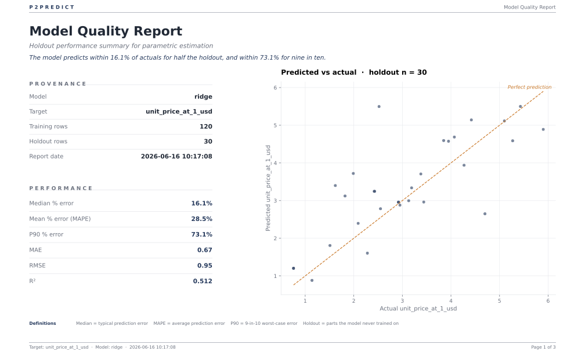
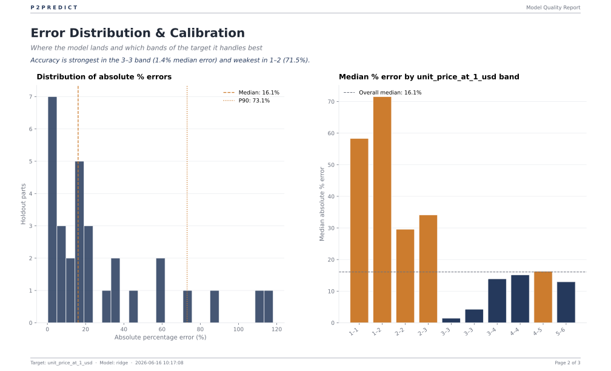
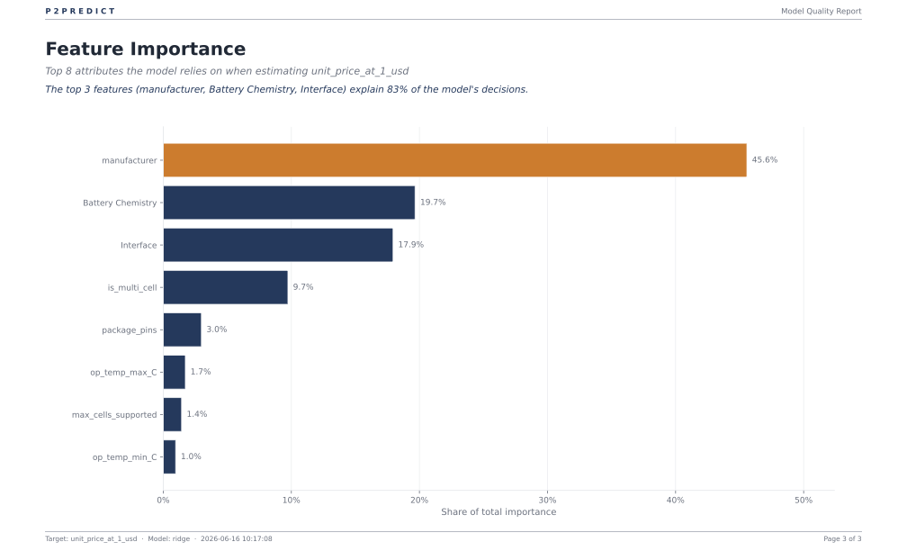

# Case Study: Battery Management ICs

Benchmarking prices on a small, messy dataset is the closest thing to a real procurement job. 

Procurement teams rarely have hundreds of thousands of data points for a single category. Usually, you have a few dozen or hundred parts, missing specs, and an urgent need to know: *What should this part cost? How much of the quote is just supplier premium? And how confident are we in this number?*

This case study uses **~150 Battery Management ICs (BMICs)** pulled from DigiKey. It shows how P2Predict performs on the exact kind of thin, real-world data a category manager faces every day. It gives you the numbers you need for a negotiation, and just as importantly, tells you when the data is too noisy to trust.

## The Sourcing Question

When sourcing BMICs—the protection, charging, and monitoring chips inside everything from wearables to EV battery packs—you are looking at a handful of key specs: manufacturer, chemistry, interface, cell count, temperature grade, and pin count. 

We trained a P2Predict model to answer:
1. What is the expected unit price for a specific spec?
2. Which specific features are driving that price?
3. If we swap suppliers but keep the spec identical, how much do we save?

---

## Part 1: Business Insights

We pulled 150 trainable BMICs from DigiKey across 13 manufacturers. Even with missing specs (which the model successfully fills in), P2Predict built a model that estimates prices with no systematic bias and an average error of ~$0.67. 

Here is what the analysis revealed.

### The Executive Summary

If you are a category manager, here are the key takeaways you can use in your sourcing strategy today:

1. **Brand premium is massive.** Holding every single technical spec equal, supplier choice alone can swing the price by nearly 4x. For a basic single-cell I2C chip, Texas Instruments sits at $2.31. Switching to Microchip drops it to $1.33 (-42%), while Analog Devices (ADI) commands $5.23 (+127%).
2. **We can quantify exact switch costs.** On a 16-cell EV pack monitor, moving from ADI/Maxim to Microchip saves exactly **$2.07 per unit (-37.7%)**. You can take this exact dollar figure into a negotiation. 
3. **Pin count is a clean cost ruler.** Package pin count is a highly reliable proxy for die size and complexity. Stepping from an 8-pin to a 48-pin package more than doubles the cost (+111%). If a supplier quotes a low-pin part at a high-pin price, push back.

   

4. **Multi-cell capability is a flat premium.** The jump from single-cell to multi-cell architecture carries a flat ~$1.74 premium, regardless of how many actual cells the chip supports. Defend single-cell designs if cost is the primary driver.

### Where to Trust the Model (and Where to Get a Quote)

Because this is a realistic, small dataset (150 parts), the model is highly accurate in some areas and noisy in others. P2Predict is designed to make this uncertainty visible.

* **🟢 Trust the supplier benchmarks.** The model has strong data on brand premiums. You can confidently use it to rank suppliers and calculate switch costs.
* **🟢 Trust mid-range estimates.** For parts in the $3–$5 range, the model is highly calibrated with a median error of just 1–2%.
* **🔴 Verify cheap parts manually.** On sub-$2 parts, the model's confidence intervals get very wide. For these commodity items, the model tells you to go get a real supplier quote rather than relying on the benchmark.
* **🔴 Ignore the temperature grade signal.** In this specific small catalog pull, premium chips happened to have narrow commercial temp ranges, making automotive grades look "cheaper." The model flags this as a weak signal, so don't base negotiations on it.

### Worked Examples: How the Model Prices a Part

P2Predict breaks down exactly why a part costs what it does, assigning a clear dollar value to each spec. 


Take the **16-cell EV / datacenter BMS monitor from ADI/Maxim**. The model predicts a price of **$5.48**. Here is exactly how it gets there:


```text
  Baseline Price (Average over training data):   $3.61
  Prediction:                                    $5.48

  Cost breakdown by feature:
    Package Pins (48-pin)              + $1.93
    Multi-cell architecture flag       + $0.97
    Manufacturer (ADI/Maxim premium)   + $0.72
    Interface                          + $0.25
    Battery Chemistry                  - $0.22
    Max cells supported                - $1.30 (Small-sample artifact)
    Temperature grade                  - $0.50 

  Total matches prediction: $5.48
```

*Note: The negative pull on "Max cells supported" is a quirk of this specific dataset—the model assigned the heavy cost of monitoring entirely to the "Multi-cell" flag, leaving the raw cell count to act as a discount. P2Predict makes these quirks visible so your engineers can sanity-check the logic.*

### The What-If Scenario

You can ask the tool how a single change impacts the price. If we take that exact same 16-cell EV BMS from above but swap the manufacturer to Microchip:

```text
  Base prediction (ADI/Maxim):    $5.48
  Counterfactual (Microchip):     $3.41
  Expected Savings:              -$2.07 (-37.7%)
```

Whether the Microchip part perfectly fits your board is an engineering question, but the model gives procurement the exact target to aim for.

---

## Part 2: Under the Hood

For the technical team, here is exactly how P2Predict processes the data, builds the model, and generates the outputs above.

### Data
* **Source:** DigiKey ProductSearch v4 API ("battery management" keyword).
* **Size:** 150 parts across 13 manufacturers. 
* **Handling Missing Data:** 48 parts are missing at least one spec. Instead of dropping these rows (which destroys small datasets), P2Predict imputes them using the median for numerics and the most frequent value for categoricals. All 150 parts are used for training.

### Pipeline & Methodology

* **Outliers:** We use Tukey's IQR rule. However, on a 150-part dataset, dropping feature outliers destroys valid data. We set `--feature-outliers warn` so all parts are retained.
* **Target Transformation:** The target price has a very low skew (0.12). P2Predict automatically detects this and leaves the log-target wrap *off*. As a result, the model operates additively, which is why SHAP values are output in exact dollars rather than percentages.
* **Algorithm Selection:** P2Predict runs cross-validation with hyperparameter search across Ridge, Random Forest, and XGBoost. **Ridge Regression** won (CV R² = 0.691). This makes sense: gradient-boosted trees typically lack the data volume to succeed on just 150 rows.
* **Pre-processing:** Categorical features are one-hot encoded for the linear model. (If a tree model had won, P2Predict automatically switches to target-encoding so trees split on price rather than alphabetical category names).
* **Confidence Intervals:** We use split-conformal prediction on a 20% holdout set to generate true 90% coverage intervals. Because the model is additive, the interval spans a fixed dollar amount (~±$2.05). For a $1.50 part, this mathematical band dips below zero. We clip it at $0 for display, but this width is a great indicator that the model is uncertain about cheap parts.
* **Feature Attribution (SHAP):** We use the exact linear explainer. The sum of the SHAP values plus the baseline exactly equals the prediction. P2Predict strictly checks this axiom on every run.

### Model Performance

| Metric | Result | What it means |
|---|---|---|
| **Holdout R²** | **0.512** | Explains ~51% of price variation from 8 basic specs. A realistic baseline for catalog data. |
| **MAE** | **$0.67** | The typical miss is roughly 20% of the $3.31 median price. |
| **Median Error** | **16.1%** | Half of the predictions land within 16% of the actual price. |
| **Residual-bias** | **p = 0.09** | Crucially, the model is **statistically unbiased**. It does not systematically over-price or under-price parts, making the SHAP attributions highly reliable on average. |

### Visual Quality Report

P2Predict generates a procurement-ready PDF report detailing model calibration and feature importance. *(You can download the full PDF in [`assets/model_quality_report.pdf`](assets/model_quality_report.pdf))*

**1. Overall Accuracy:**


**2. Calibration by Price Band:**
Notice how the model is highly accurate in the $3-$5 range but struggles on the cheapest parts, giving you a clear map of where to trust the benchmark.


**3. Feature Importance:**
Visual proof that brand premium (Manufacturer) is the single biggest driver of cost in this category.


---

## Part 3: Reproducing the Results

You can reproduce this exact analysis from the command line.

### Full Path (Requires DigiKey API Credentials)

*Note: DigiKey developer terms forbid bulk redistribution of catalog data, so you will need to pull it using your own free API credentials.*

```bash
# 1. Install dependencies and set up credentials
pip install -e .
mkdir -p ~/.digikey && chmod 700 ~/.digikey
echo '{"client_id": "YOUR_ID", "client_secret": "YOUR_SECRET"}' > ~/.digikey/credentials
chmod 600 ~/.digikey/credentials

cd case-studies/battery-management-ics

# 2. Fetch the catalog data (~150 parts)
python fetch_data.py --limit 150

# 3. Clean and prepare data
python prepare_data.py

# 4. Train the model (Note we use 'warn' for outliers to preserve row count)
p2predict-train \
  -i data/bmics_clean.csv \
  -t unit_price_at_1_usd \
  -tf "manufacturer,Battery Chemistry,Interface,max_cells_supported,op_temp_min_C,op_temp_max_C,package_pins,is_multi_cell" \
  --outliers warn \
  --feature-outliers warn \
  --budget thorough

# 5. Generate insights, charts, and the PDF report
python predict_examples.py
python extract_insights.py
python generate_charts.py
python generate_quality_report.py
```

### Quick Path (No API Account Needed)

If you just want to test the workflow without an API account, we included a scrubbed 30-row sample dataset. The metrics will be rough, but the pipeline will run end-to-end.

```bash
cd case-studies/battery-management-ics
p2predict-train \
  -i data-sample/bmics_sample.csv \
  -t unit_price_at_1_usd \
  -tf "manufacturer,Battery Chemistry,Interface,max_cells_supported,op_temp_min_C,op_temp_max_C,package_pins,is_multi_cell" \
  --outliers warn \
  --feature-outliers warn \
  --budget thorough
```

## Limitations & Next Steps

* **No Volume Pricing:** This model targets the unit price at a quantity of 1. A future iteration could model the entire quantity-break curve.
* **Basic Specs Only:** We treat each catalog column as a flat feature. The model's 51% accuracy relies purely on these public specs and doesn't account for underlying die process, wafer costs, or negotiated volume tiers. 
* **Broad Part Grouping:** We modeled all BMICs together (protection ICs, charge controllers, and pack monitors). With a larger dataset, segmenting by part family would resolve the noisy signals around cell counts and temperature grades.
```
