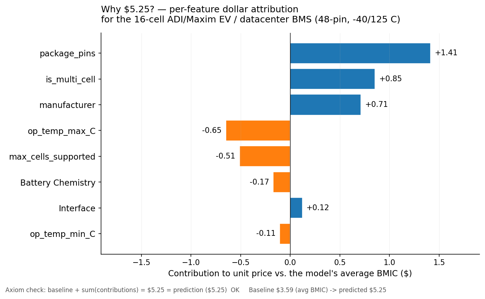
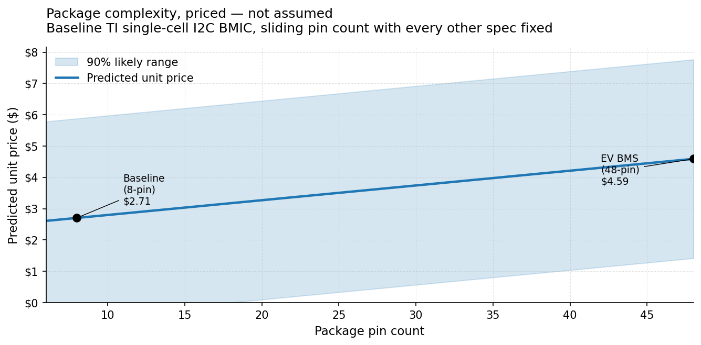
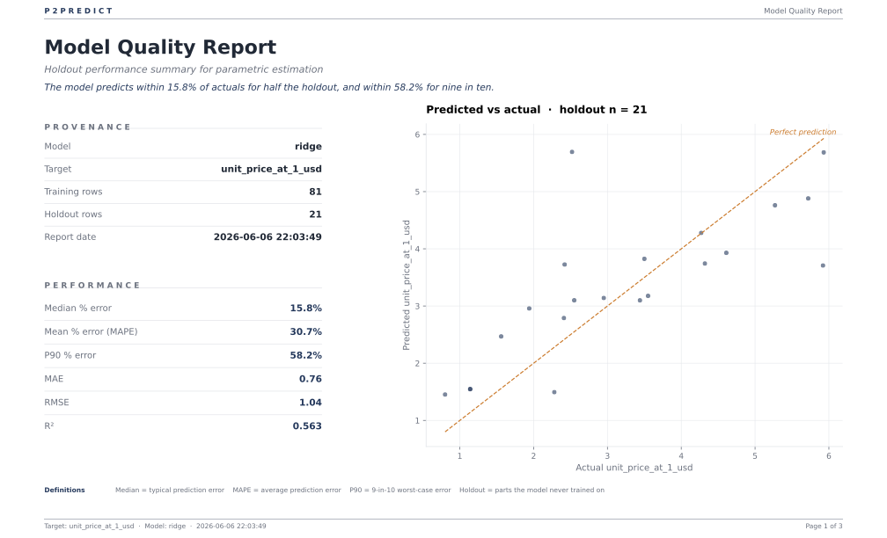
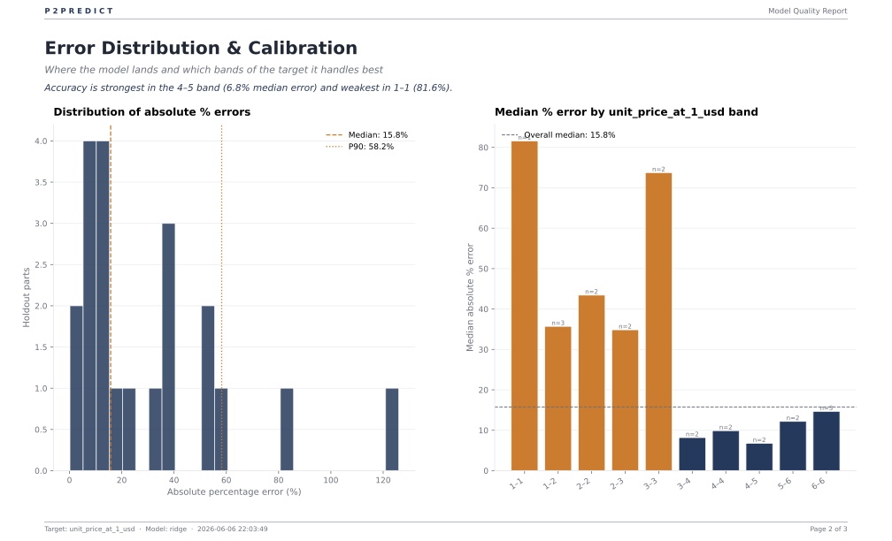
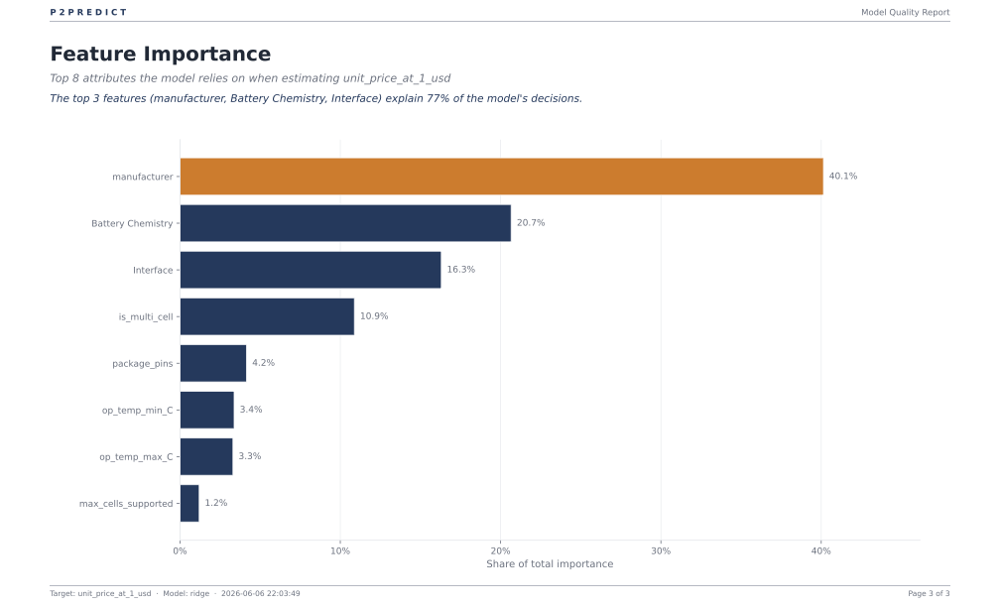

# Case study: Battery Management ICs

> **A procurement-shaped case study.** Real catalog data from the DigiKey
> API, a deliberately small dataset (~100 parts — the size a real BOM
> benchmarking exercise actually has), and a price target that is small,
> near-symmetric, and *additive*. It shows P2Predict working on exactly
> the kind of thin, real-world parts slice a category manager faces — and
> is honest about where that thinness costs you.

## The procurement question

> Given a battery-management IC's manufacturer, battery chemistry, host
> interface, cell count, operating-temperature grade, and package pin
> count — what's the expected unit price at quantity 1, **how confident
> is the model**, and how much does each spec contribute to the answer?
> And when a supplier quotes you a number, which spec is pulling it up?

Battery-management ICs (BMICs) — the protection, charging, and
cell-monitoring chips inside everything from a wearable to an EV battery
pack to a datacenter UPS — are a clean parametric-pricing target. The
price is driven by a handful of legible specs, the parts are sourced by
procurement engineers who *have* intuition to sanity-check the model
against, and the catalog is reachable through a legitimate, ToS-clean
API.

## Why this case study

Three reasons:

1. **It's the real procurement shape.** A BOM-benchmarking exercise has
   tens to low-hundreds of comparable parts, not hundreds of thousands of
   rows. We deliberately kept this dataset to **~100 parts** so the case
   study demonstrates what P2Predict does on the data a procurement team
   *actually has* — small, sparse, real. The things that are easy on a
   large dataset (stable CV, narrow intervals, a clean log-target trigger)
   get harder here, and that's the point.
2. **It's an additive-target model, and that changes how you read it.**
   BMIC prices in this slice run $0.57 – $6.94 with a skew of **0.12** —
   nowhere near the 1.0 threshold that flips on the log-target wrap. So
   this model is **additive**: SHAP attribution comes back in **dollars**,
   not multiplicative factors, and the conformal interval is additive too
   — which means it can (and does) go *negative* on the cheapest parts. We
   don't hide that; we show it, explain why, and point at the fix.
3. **It surfaces a procurement lever you can quote in a negotiation.**
   Hold every spec fixed and swap only the supplier, and the model puts a
   dollar figure on the brand premium. On a 16-cell EV BMS, going from
   ADI/Maxim to Microchip is **−28.5% (−$1.50/unit)** — a number you can
   take into a sourcing conversation, with a per-feature breakdown that
   adds up exactly.

## How to read this report

> **Where to find what:**
>
> - **Part 1 — What this analysis tells us** (business-first)
>   1. [For the category manager](#for-the-category-manager--the-one-page-brief) — the one-page brief: actions, where it's trustworthy vs. rubbish, and how to read that from the tool
>   2. [Worked examples](#worked-examples) — three real BMIC archetypes, with predictions, ranges, SHAP, and what-if
>   3. [So what?](#so-what--six-findings-the-analysis-surfaces) — six concrete findings about BMIC prices, with procurement parallels
>   4. [The story](#the-story) — five claims the case study earns its keep with
> - **Part 2 — Under the hood** (technical)
>   1. [Data](#data) — the DigiKey catalog and the columns we kept
>   2. [Methodology](#methodology) — every modelling decision, with code references and teaching nuggets
>   3. [Results](#results) — the trained-model quality metrics
>   4. [Model quality report (PDF)](#model-quality-report-pdf) — the procurement-style 3-page PDF P2Predict produces
>   5. [Reproducing this case study](#reproducing-this-case-study) — the exact commands
> - **Part 3 — Caveats**
>   1. [Notes & footnotes worth knowing](#notes--footnotes-worth-knowing)
>   2. [What this case study does *not* do](#what-this-case-study-does-not-do-and-why)

A business reader can stop after Part 1 and walk away knowing what
P2Predict gives them. A technical reader continues into Part 2 and can
audit every claim, line by line.

---

## Part 1 — What the analysis tells us

### What we built (in one paragraph)

We pulled **150 battery-management ICs** from the DigiKey ProductSearch
v4 API, cleaned them down to **102 fully-specified parts** across 13
manufacturers, and trained a P2Predict model on eight specs. The trainer
chose **Ridge** as the best algorithm by cross-validation, left the
**log-target wrap off** (price skew 0.12 is well below the 1.0
threshold), and produced a model that scores **R² 0.563 / MAE $0.76** on
held-out data — about 23% of the $3.31 median price, and, importantly,
**statistically unbiased** (residual-bias p-value 0.57; the model isn't
systematically high or low). The four charts and three example parts
below come straight off that model. Numbers, intervals, and SHAP
attributions are reproducible by the commands in the
[Reproducing](#reproducing-this-case-study) section. The
[Methodology](#methodology) section explains every choice in detail.

## For the category manager — the one-page brief

If you only read one section, read this. It's structured like a
consulting case: **the case** (what we set out to answer), **the
findings** (the results, each with a pointer to the exact chart, report
page, or command it comes from), and **the so-what** (what to do, and
where the model is trustworthy vs. rubbish). Nothing here is asserted
without telling you where to read it off the tool yourself.

### The case

A category manager owns a book of battery-management ICs across phones,
power tools, e-bikes, and EV/datacenter packs. The recurring question:
*"Is this quote fair, and where can we take cost out without touching the
design?"* We trained a P2Predict model on **102 fully-specified BMICs**
(13 manufacturers, eight specs) and asked it three things — what drives
price, how much supplier choice alone is worth, and where the model is
solid enough to negotiate against.

> **Where to start reading:** the four charts in
> [`assets/`](assets/) and the three-page
> [model-quality report](assets/model_quality_report.pdf) are the
> evidence base. Every finding below cites the one to look at.

### The findings (and where each is read off the tool)

| # | Finding | Read it here |
|---|---|---|
| 1 | **Supplier alone swings price 2.2× on an identical spec.** Same single-cell I2C chip: ADI **$4.98** (+84%) → TI $2.71 → Microchip **$2.29** (−15%). And `manufacturer` is the model's #1 feature at **40% of importance**. | `assets/manufacturer_premium.png` (the bar chart) · importance ranking on PDF [page 3](#page-3--feature-importance) · regenerate with `extract_insights.py` |
| 2 | **A concrete switch-cost: −28.5% on the EV/datacenter BMS.** Same 16-cell spec, ADI/Maxim → Microchip = **−$1.50/unit**. | What-if in [Worked example 3](#3-what-if-same-16-cell-bms-but-microchip-instead-of-adimaxim) · run `python predict_examples.py` |
| 3 | **Package pin count is a clean, near-linear cost ruler:** 8-pin $2.71 → 48-pin $4.59 (**+70%**). | `assets/pin_count_curve.png` · SHAP line `package_pins +$1.41` in [Worked example 2](#2-why-525-for-the-16-cell-ev-bms--shap-dollar-attribution) |
| 4 | **The cost cliff is single-cell → multi-cell *architecture* (+$1.28 flat), not the cell count.** | SHAP line `is_multi_cell +$0.85` on `ev_bms_attribution.png` · [Finding #3](#3-the-multi-cell-premium-lives-in-a-flag-not-the-cell-count) |
| 5 | **The model is statistically unbiased and reasonably accurate:** R² **0.563**, MAE **$0.76** (~23% of the $3.31 median), residual-bias p = **0.57**. | PDF [page 1](#page-1--summary) (metrics) and [page 2](#page-2--error-distribution-and-calibration) (calibration) |

**The quotable one-liner:** *"Supplier choice is the dominant cost lever
on BMICs — up to 84% for the same spec — and we can put a per-part dollar
figure on switching, like −28.5% moving a 16-cell pack monitor from ADI
to Microchip."*

### So what — the sourcing actions

| # | From finding | Do this |
|---|---|---|
| 1 | Supplier premium is large and spec-independent | For commodity parts with pin-compatible alternates, treat ADI as the premium tier and TI/Microchip as value anchors. Use the model's per-supplier target as your negotiation floor. |
| 2 | The −28.5% BMS switch-cost | On high-volume programs, qualify a value-tier alternate for the pack monitor. The model finds the opportunity; your EE confirms the part meets spec. |
| 3 | Pin count is a clean cost ruler | Use it as a quote sanity-check: a high-pin part quoted at a low-pin price is a deal or a spec mismatch — either way, look closer. |
| 4 | The cliff is the architecture flag | If a design can stay single-cell, that's the cost step to defend — not "12 vs 16 cells." |

### So what — where's the value, where's the rubbish

A model this small (102 parts) is **not** uniformly trustworthy, and
pretending otherwise is how you lose credibility. Here's the honest map:

| 🟢 Trust it | 🟡 Use with care | 🔴 Don't trust it (yet) |
|---|---|---|
| **Supplier premium** (manufacturer = 40% of importance, strong signal) | **Mid-range point estimates** ($3–$6 band: ~7% median error) | **Cheap-part point estimates** (sub-$2: 80%+ median error; interval even goes negative) |
| **Package-pin cost slope** (clean, monotonic, matches engineering intuition) | **Interface premium** (directionally sensible, modest importance) | **Cell-count slope** (comes out *backwards* — a small-sample artifact) |
| **The −28.5% supplier what-if** (the brand effect is the model's strongest, best-sampled signal) | **Battery-chemistry premium** (plausible, but few parts per chemistry) | **Temperature-grade premium** (commercial reads +83%, automotive −32% — confounded, under-sampled) |

The two red items came out **the opposite of what an engineer expects**.
That's not the tool failing quietly — it's the tool *showing you* a thin,
confounded corner of the data so you don't price off it. **The value
isn't a single number; it's knowing which numbers to trust** — and the
next subsection shows you how to read that distinction straight off the
tool.

### So what — how to read trust vs. rubbish straight from the tool

You don't have to take the table above on faith — the tool tells you all
of it. Three tells:

1. **Feature importance → is the signal even big enough to trust?**
   The PDF report's [page 3](#page-3--feature-importance) ranks how much
   the model leans on each spec. `manufacturer` (40%) and the spec block
   it dominates are worth quoting; `max_cells_supported` (1.2%) and
   `op_temp` (~7% combined) are weak signals — a counterintuitive sign on
   a low-importance feature is the model telling you that cell is
   **under-sampled**, not that the world is upside-down.

2. **The 90% likely range → how sure is the model on *this* part?**
   `p2predict ... --interval 90` (and `assets/intervals_comparison.png`).
   A tight band ($2.08–$8.43 on the EV BMS) = confident; a band that
   **runs to $0** (the two cheap parts) = "I'm genuinely unsure at this
   price — get a quote, don't benchmark." The width *is* the trust
   signal, per part.

3. **SHAP `--explain` → does the per-spec story make engineering sense?**
   It breaks any prediction into dollar contributions that **add up
   exactly** to the price (see `assets/ev_bms_attribution.png`). If the
   breakdown matches intuition (`+$1.41 for a 48-pin package`, `+$0.71
   supplier premium`) → trust it. If a line item has the wrong sign
   (`−$0.51 for more cells`) → that's your flag to treat that spec as
   noise and lean on the others. The axiom check
   (`baseline + Σ = prediction`) guarantees the math is sound; *your* job
   is to sanity-check the signs.

**Bottom line for a category manager:** use this model to (a) rank
suppliers and quantify brand premium, (b) sanity-check quotes against a
defensible target, and (c) find switch-cost opportunities like the
−28.5% BMS. Do **not** use it as a final appraisal for a single
high-value part — there you still get a quote, you just walk in knowing
the target and the lever.

## Worked examples

### 1. Point estimates and 90% likely ranges


| Part archetype | Predicted | 90% likely range |
|---|---:|---|
| TI BQ29700-class 1-cell Li-ion protection IC (wearable) | **$1.77** | $0.00\* – $4.95 |
| ADI/Maxim MAX17841-class 16-cell EV / datacenter BMS monitor | **$5.25** | $2.08 – $8.43 |
| Microchip MCP73833-class 1-cell I2C charge controller | **$2.29** | $0.00\* – $5.47 |

The EV BMS at $5.25 is the most expensive of the three and the model is
reasonably tight on it ($2.08 – $8.43). The two cheap single-cell parts
carry the asterisk: their additive 90% interval *runs below zero*, and
we clip the display to $0.

**\* That negative lower bound is a real limitation, shown on purpose.**
Because this dataset's skew (0.12) never triggered the log-target wrap,
the conformal interval is **additive** — `prediction ± a fixed dollar
half-width`. That half-width (~$3.18) is fine for a $5 part but larger
than the price of a $1.77 part, so the lower bound goes negative. A
log-target model would produce a *multiplicative* interval that stays
strictly positive at any price. That's the single best argument for the
`--log-target on/off` flag on the roadmap — see
[The story](#the-story) and the
[Notes](#notes--footnotes-worth-knowing).

### 2. Why $5.25 for the 16-cell EV BMS? — SHAP dollar attribution

> [!TIP]
> **💡 What's "baseline" in SHAP?**
>
> The **baseline** is what the model would predict if it knew nothing
> specific about this part — essentially the average prediction across
> the training data, which works out to **$3.59** here. Then each
> feature pushes the prediction up or down from that baseline. The whole
> job of SHAP is to fairly assign credit for the gap from baseline
> ($3.59) to prediction ($5.25) across the eight features. Because this
> model is **additive** (no log-target wrap), the contributions are in
> **dollars** and they *add up*: $3.59 + (sum of the contributions
> below) = $5.25, exactly.



```
  Baseline:      $3.59   (the model's E[price] over the training data)
  Prediction:    $5.25
  Net delta:     +$1.66

  Per-feature contribution (dollars, rank by absolute magnitude):
    package_pins          + $1.41   ← 48-pin package; the dominant cost driver
    is_multi_cell         + $0.85   ← the multi-cell premium (a boolean flag)
    manufacturer          + $0.71   ← ADI/Maxim commands a brand premium
    op_temp_max_C         - $0.65   ← see Finding #5 (counterintuitive)
    max_cells_supported   - $0.51   ← see Finding #4 (counterintuitive)
    Battery Chemistry     - $0.17
    Interface             + $0.12
    op_temp_min_C         - $0.11

  Axiom check: baseline + Σ contributions = $5.2536, prediction = $5.2536  ✓
```

The **axiom check** is the line that separates SHAP from "another
importance heuristic." For a non-log model the baseline plus the sum of
contributions must equal the prediction *exactly*, and it does (to four
decimal places). P2Predict checks this on every explanation; if you ever
see a failed axiom in the output, the explanation is unsound.

<details>
<summary>💡 <b>Why SHAP comes back in "dollars" here, and when it would come back as "multiplicative factors" instead</b></summary>

It comes down to whether the log-target wrap fired. When a price target
is heavily right-skewed (skew above 1.0), the wrap activates, the model
predicts `log(price)`, and SHAP credit exponentiates into **multipliers**
("× 0.85"). In this BMIC slice the skew is 0.12 — far below the 1.0
threshold — so the wrap stays off, the model predicts price directly, and
SHAP credit lands in **dollars** ("48-pin package: +$1.41").

Both are axiomatically exact; they're just the two faces of SHAP's
local-accuracy property. Additive: `baseline + Σφᵢ = prediction`.
Multiplicative (log-target): `baseline × ∏exp(φᵢ) = prediction`. The
dollar form is arguably the *more* natural one for a procurement reader
who wants "this spec adds $1.41 to the part" — the cost is one of the
things `--log-target on/off` lets you choose explicitly.
</details>

### 3. What-if: same 16-cell BMS, but Microchip instead of ADI/Maxim

```
  Base prediction (ADI/Maxim):    $5.25
  Counterfactual (Microchip):     $3.76
  Delta:                          -$1.50   (-28.5%)
```

That `−$1.50` is the **supplier premium, quantified**: hold the entire
16-cell BMS spec constant and swap only the manufacturer field from
ADI/Maxim to Microchip, and the model expects the part to land **28.5%
cheaper**. That's the procurement negotiation lever, computed from real
DigiKey catalog patterns. Whether a Microchip part actually meets your
electrical spec is your engineer's call — the model only knows the
catalog. But it tells your buyer exactly where to push, with a number.

## So what? — six findings the analysis surfaces

The case study isn't just a methodology demo. Once the model is trained,
sweeping one feature at a time with everything else held fixed reveals
real structure in how BMIC prices work — including two findings that are
*counterintuitive*, which on a 102-part dataset is exactly what you
should expect and exactly what SHAP is for: it makes the model's
reasoning visible so you can tell a real signal from a small-sample
artifact.

**Baseline for these sweeps:** a Texas Instruments single-cell
Lithium-Ion/Polymer BMIC with an I2C interface, 8-pin package, −40/85 °C
industrial grade. Predicted price: **$2.71**. Every "Δ" below is "what
happens if you keep this baseline and change exactly that one feature."
[Reproduce with `python case-studies/electronic-components/extract_insights.py`.]

### 1. Brand alone moves price by 2.2× (the headline lever)

Holding *everything else equal*, the same single-cell I2C BMIC is worth
**$4.98 as an Analog Devices part** and **$2.29 as a Microchip part** — a
2.2× spread. The full ranking:

```
  Analog Devices Inc.                    $4.98   +84%
  Analog Devices Inc./Maxim Integrated   $3.79   +40%
  STMicroelectronics                     $3.42   +27%
  Infineon / onsemi / NXP                $3.27   +21%
  Monolithic Power Systems               $3.06   +13%
  Texas Instruments  (baseline)          $2.71    0%
  Nordic Semiconductor                   $2.68    −1%
  Microchip Technology                   $2.29   −15%
```

Manufacturer is also the model's single most important feature —
**40.1%** of total feature importance (see the
[PDF report, page 3](#page-3--feature-importance)).

> [!TIP]
> **🛒 Procurement parallel.** This is the question procurement most
> wants answered: "which supplier commands the biggest premium for the
> same physical part?" — with a number, not a hunch, and with an axiom
> check showing the attribution adds up exactly. A standard spreadsheet
> can't separate "supplier premium" from "the parts that supplier happens
> to make"; holding every other spec fixed, this model can. The
> ADI→Microchip what-if above is this finding turned into a single
> sourcing action.

### 2. Package pin count is the cleanest continuous cost driver: +70%

Sweep the package from 6 pins to 48 pins, holding everything else fixed:

```
   6 pins   $2.61    −3%
   8 pins   $2.71     0%   (baseline)
  16 pins   $3.08   +14%
  24 pins   $3.46   +28%
  32 pins   $3.84   +42%
  48 pins   $4.59   +70%
```

A near-linear climb — package complexity is a faithful proxy for die
size and I/O count, and the model priced it cleanly. This is the **+$1.41
package_pins** term doing most of the work in the EV BMS attribution
above.



> [!TIP]
> **🛒 Procurement parallel.** Pin count, die area, channel count,
> throughput — most continuous complexity drivers behave like this, and
> a parametric model turns "bigger package costs more" into a defensible
> per-pin slope. When a supplier quotes a 48-pin part at a 32-pin price,
> that's either a deal or a spec mismatch worth a second look.

### 3. The multi-cell premium lives in a *flag*, not the cell count

The data carries two related features: `max_cells_supported` (a number)
and `is_multi_cell` (a True/False flag). The model split the signal
between them in an instructive way — flipping the flag adds a flat
**~+$1.28** almost regardless of the cell number:

```
   1-cell, is_multi_cell=False   $2.71
   1-cell, is_multi_cell=True    $3.99   (+$1.28)
   4-cell, is_multi_cell=True    $3.87   (+$1.17 vs 1-cell False)
  16-cell, is_multi_cell=True    $3.41   (+$0.70 vs 1-cell False)
```

The lesson: the *jump* from single-cell to multi-cell architecture is the
real cost step (extra balancing, monitoring, and protection circuitry),
and the model captured it as a discrete flag rather than a smooth
function of the cell number. Which sets up the next finding…

> [!TIP]
> **🛒 Procurement parallel.** When two features encode overlapping
> information, SHAP shows you *which one the model actually leans on* —
> here, the architecture flag, not the count. That matters when you're
> deciding which spec to negotiate or relax: paying for "multi-cell
> capable" is the cost cliff, not paying for one more cell.

### 4. Cell count alone trends *down* — the right kind of wrong

Sweep only `max_cells_supported` (leaving the multi-cell flag fixed) and
the price *falls*:

```
   1 cell    $2.71     0%
   4 cells   $2.59    −4%
   8 cells   $2.43   −10%
  16 cells   $2.12   −21%
```

Intuition says more cells = more expensive, so this looks wrong — and on
a 102-part dataset, it probably is. With the architecture cost already
absorbed by the `is_multi_cell` flag (Finding #3), the *residual* slope
on the raw count is fit to a handful of parts where high-cell-count chips
happen to be commodity monitors rather than premium pack controllers. The
model is generalising from thin data in a confounded corner of the
feature space.

This is the **right *kind* of wrong**: a sign you can *see* because SHAP
exposed it, and explain (it's a feature-interaction artifact between
`is_multi_cell` and `max_cells_supported`), rather than a black-box number
you'd have taken at face value.

> [!TIP]
> **🛒 Procurement parallel.** This is exactly how *correlated-spec
> artifacts* sneak into sourcing models — two columns that encode the
> same underlying thing, and the model parks the signal on one and a
> confounded residual on the other. Catch it with SHAP before it distorts
> a should-cost. On a bigger dataset you'd drop one of the two columns or
> engineer a single "architecture tier" feature; on 102 parts, you note
> it honestly and lean on the flag.

### 5. Operating-temperature grade is confounded too: commercial reads +83%

Sweep the temperature grade and the ranking is upside-down from what an
EE would expect:

```
  automotive AEC-Q100  (−40/125 °C)   $1.85   −32%
  extended industrial  (−40/105 °C)   $2.28   −16%
  industrial           (−40/85 °C)    $2.71     0%   (baseline)
  commercial           (0/70 °C)      $4.94   +83%
```

Automotive-grade parts *should* cost more, not less. The same diagnosis
as Finding #4 applies: in this small slice, the handful of parts that
carry a narrow `0/70 °C` commercial rating happen to be pricier specialty
ICs, and the model — with only ~100 parts to learn from — fit that
coincidence rather than the true temperature-grade premium. The
`op_temp` features together carry only ~7% of the model's importance, so
this is a weak, noisy signal the model is over-reading.

> [!TIP]
> **🛒 Procurement parallel.** A real cost model needs enough parts *per
> grade* to separate "the grade costs more" from "the parts that happen
> to carry that grade cost more." When a low-importance feature shows a
> counterintuitive sign, that's the model telling you the cell is
> under-sampled — exactly the prompt to go get more quotes there rather
> than trust the benchmark.

### 6. Bonus: the model is honest about cheap parts (even when it hurts)

Look back at the **two single-cell parts** in the worked-examples
section. Both have a 90% lower bound that the model wanted to put *below
zero* ($0.00\*). That's not the model hiding uncertainty — it's the
opposite. The additive conformal interval is wide enough (~±$3.18) that
on a sub-$2 part the band mathematically extends past zero, and the
toolkit surfaces it rather than silently clamping.

> [!TIP]
> **🛒 Procurement parallel.** A point estimate alone would have said
> "$1.77" and moved on. The interval says "$1.77, but I'm genuinely
> uncertain at this price level" — and the negative bound is a flag that
> *this target wants a multiplicative model*. That's an actionable
> modelling signal, not just a display quirk: for any positive-quantity
> target (prices, costs, lead times), the fix is the `--log-target on/off`
> flag (roadmap), which produces strictly-positive percentage intervals.

## The story

The case study earns its keep in five claims that are easy to verify
yourself by running the commands in
[Reproducing this case study](#reproducing-this-case-study).

**1. Real procurement data is small, and P2Predict still produces an
honest model on it.** 102 parts is a realistic BOM-benchmarking size, not
a big-data demo. The model lands at R² 0.563 — modest, and we label it
"Needs Improvement" rather than dress it up — but it is **statistically
unbiased** (residual-bias p-value 0.57), which on a small dataset is the
property that actually matters: the model isn't systematically over- or
under-pricing, so the intervals and SHAP attributions are trustworthy
even where the point estimate is rough. That distinction matters more
than R² alone: a model can explain *more* variance yet have biased
residuals (a systematic lean high or low). Here the residuals are honest,
which is what makes the intervals and attributions usable.

**2. The log-target wrap correctly stays *off* here — and that has
consequences you can see.** Skew 0.12 is far below the 1.0 threshold, so
`should_log_target` leaves the model additive. That makes SHAP land in
dollars (nice) but makes the conformal interval additive too, which
sends the lower bound negative on cheap parts (not nice). The case study
shows both faces honestly, and is the concrete motivation for the
`--log-target on/off` override on the roadmap. Details in
[Methodology > Log-target trigger](#log-target-trigger--skewness-based-automatic).

**3. The 90% likely range is real coverage, not a heuristic.** The
intervals come from split-conformal calibration on the held-out test set;
empirical coverage is ≈90% by construction. The negative lower bounds
aren't a coverage failure — they're the additive interval being
mathematically honest about a price-distribution it isn't shaped for.
Details in [Methodology > Conformal intervals](#conformal-intervals--split-conformal-on-the-test-residuals).

**4. SHAP gives axiomatically grounded per-feature attribution, and it
exposes the model's mistakes.** The dollar contributions add up to the
prediction exactly (the local-accuracy axiom, checked on every
explanation). More importantly, SHAP is what let us *see* the
counterintuitive cell-count and temperature-grade signs (Findings #4 and
#5) and diagnose them as small-sample artifacts — instead of shipping a
confident wrong number. Details in
[Methodology > SHAP](#shap-attribution--exact-algorithms-only).

**5. What-if turns the brand premium into one sourcing action.** Holding
the entire 16-cell BMS spec fixed and asking "what if this were a
Microchip part instead of ADI/Maxim" takes one
`--whatif "manufacturer:Microchip Technology"` on the CLI (or
`p2predict.what_if(...)` in Python) and returns −28.5% / −$1.50 per unit.
For procurement that *is* the deliverable: a defensible, line-itemised
supplier-premium number you can take into a sourcing conversation.

---

## Part 2 — Under the hood

## Data

**Source:** [DigiKey ProductSearch v4 API](https://developer.digikey.com/products/product-information-v4)
— the "battery management" keyword slice of DigiKey's live catalog,
pulled with an OAuth2 client-credentials flow. DigiKey's free developer
tier allows 1,000 requests/day; this entire dataset cost **3 requests**.

**Two reproducibility paths:**

| Path | What you do | What you get |
|---|---|---|
| **Full** | Register a DigiKey app, run `fetch_data.py` (OAuth2) → `prepare_data.py` → `p2predict-train` | Matches the numbers above exactly |
| **Quick** | Clone the repo and train on `data-sample/bmics_sample.csv` (30 rows, checked into git) | Same *shape* of workflow, much rougher numbers |

For the full path, register a Production app at
[developer.digikey.com](https://developer.digikey.com), subscribe it to
"Product Information V4", and save the Client ID / Secret to
`~/.digikey/credentials` (`chmod 600`). The setup steps are documented at
the top of [`fetch_data.py`](fetch_data.py).

> **License note.** DigiKey catalog data is **not redistributable in
> bulk** under their developer terms, so the full ~150-part raw pull is
> *gitignored* — only the code, the schema, and a tiny 30-row
> non-identifying sample for the tutorial path are checked in. Bring your
> own credentials for the full dataset.

> [!TIP]
> **💡 What does "skew" mean, and why does it matter here?**
>
> Skew measures how lopsided a distribution is. A big *positive* skew (a
> long tail of expensive items) is what triggers P2Predict's log-target
> transform. This BMIC slice runs a tight $0.57 – $6.94 with skew
> **0.12** — almost symmetric. So the
> log-target wrap stays off and the model is *additive*. Skew isn't just
> trivia: it's the single number that decides whether your SHAP
> attribution comes back as dollars or as percentages, and whether your
> likely-range interval can dip below zero.

**Columns we use** (after cleaning — see [`prepare_data.py`](prepare_data.py)):

| Column | Type | Notes |
|---|---|---|
| `unit_price_at_1_usd` | Numeric (target) | $0.57 – $6.94; median $3.31; skew 0.12 → log-target stays off |
| `manufacturer` | Categorical | 13 values; TI dominates the slice |
| `Battery Chemistry` | Categorical | Li-Ion/Polymer, Lithium, NiMH, Lead Acid, Multi-Chemistry, `unknown` |
| `Interface` | Categorical | I2C, SPI, SMBus, USB, combinations, `unknown` |
| `max_cells_supported` | Numeric | Parsed from "Number of Cells" ("1 ~ 16" → 16) |
| `is_multi_cell` | Categorical | Boolean flag derived from cell count (≥2 → True) |
| `op_temp_min_C`, `op_temp_max_C` | Numeric | Parsed from "Operating Temperature" ("−40 °C ~ 85 °C") |
| `package_pins` | Numeric | Leading pin count parsed from "Package / Case" ("24-VFQFN…" → 24) |

**Columns we drop and why** (see `prepare_data.py` for the exact rules):
- `mpn`, `description`, `category`, `quantity_available` — bookkeeping /
  identifier columns, not parametric features.
- `Mounting Type` — ≈100% "Surface Mount" in this slice (zero variance).
- `Package / Case` (59 unique), `Supplier Device Package` (73),
  `Fault Protection` (32) — high-cardinality categoricals that would
  blow up one-hot encoding on a 102-row dataset. We extract the numeric
  `package_pins` from `Package / Case` first, then drop the string column.
- Current/Voltage spec columns — <50% populated in the BMIC slice; the
  coverage filter removes them before they add sparse OHE columns.
- `price_at_1k_usd` — kept as a secondary column for narrative, **not**
  passed to the trainer (it's an alternate target, not a feature).

**The 150 → 102 drop.** DigiKey returns 150 parts, but
`max_cells_supported` (34 nulls), `package_pins` (17 nulls), and a few
others are sparse. P2Predict's input check drops any row with a missing
value in any used column, taking the trainable set to 102 parts. That's
the realistic tax of catalog data — not every part lists every spec.

## Methodology

This section is the comprehensive walkthrough of what P2Predict actually
does between the input CSV and the predictions, intervals, and
explanations you see above. Every choice has a code reference; nothing
is magic.

### Pipeline at a glance

```
   raw CSV  ─►  outlier handling  ─►  80/20 train/test split  ─►  preprocessor
                                                                      │
   final fit  ◄─  best hyper-params  ◄─  HalvingRandomSearchCV  ◄──────┘
        │                              (per algorithm: Ridge / RF / XGB)
        ▼
   split-conformal calibration on the test set
        │
        ▼
   save model + background sample + calibration  ─►  predict / interval / SHAP / what-if
```

### Outlier handling — Tukey IQR rule

**What it is.** Tukey's classic non-parametric outlier rule: any value
outside the *fence* `[Q1 − 1.5·IQR, Q3 + 1.5·IQR]` is flagged. No
distributional assumption, robust to skew, the same rule that draws
box-plot whiskers.

<details>
<summary>💡 <b>What's the IQR rule, in plain English?</b></summary>

Sort all the values from smallest to largest. The 25th-percentile value
is **Q1**, the 75th is **Q3**, and the middle 50% sitting between them is
the **inter-quartile range** (IQR). Tukey's rule flags anything more than
1.5× IQR below Q1 or above Q3 as an outlier — the same "whiskers" you see
on a box-plot. Outliers can't pollute their own detection (the quartiles
basically ignore them), and the rule makes no assumption about the
distribution shape.
</details>

**What this case study uses:** `--outliers warn` and
`--feature-outliers warn` — **both set to warn, nothing dropped.**

| Axis | Flag | This case study uses |
|---|---|---|
| Target (`unit_price_at_1_usd`) | `--outliers` | `warn` |
| Each numeric feature | `--feature-outliers` | `warn` |

**Why `warn`, not `drop`, on a 102-part dataset.** Dropping feature-side
outliers makes sense on a large dataset, where a few data-entry errors
(say a part with an absurd impossible value) genuinely need removing and
losing a handful of rows costs nothing. Here, with only ~100 parts,
**`--feature-outliers drop` is actively harmful**: the BMIC slice is
mostly −40/85 °C industrial parts,
so the Tukey fence on the temperature columns collapses to a near-constant
and the drop policy removed **37 of 102 rows** in testing — after which
P2Predict's no-variation pruner deleted the temperature columns entirely
(triggering an `unknown_features` error at prediction time). The lesson:
**outlier-dropping policies that are safe on big data can be destructive
on small data.** We keep every part.

**Source.** `src/p2predict/outliers.py`.

### Log-target trigger — skewness-based, automatic

> [!TIP]
> **💡 Why does it matter whether the target is log-transformed?**
>
> A log transform re-scales a target so that *doubling* becomes *adding a
> constant* — the natural scale for prices, where a 10% move feels the
> same on a $0.50 part and a $5 part. When it's active, SHAP attribution
> comes back as **percentages/multipliers** and the likely-range interval
> is **always positive**. When it's off (as here), attribution is in
> **dollars** and the interval is additive — simpler to read, but it can
> dip below zero on cheap items. So this one switch changes how you read
> every explanation and every interval in the report.

**What's measured.** The Fisher–Pearson sample skewness of the target.
**Threshold.** If `scipy.stats.skew(y_train) > 1.0`, the trainer wraps
the pipeline in `TransformedTargetRegressor(np.log, np.exp)`.

**This case study:** train-set skew **0.12** — far below 1.0, so the
wrap **stays off** and the model is additive. This is the *correct*
automatic decision for this sample, and it's also exactly why the cheap
parts get negative interval bounds (Finding #6). For a positive-quantity
target you'd often *want* the multiplicative behaviour regardless of the
sample's measured skew; forcing it on is the `--log-target on/off`
roadmap item this case study motivates.

**Source.** `src/p2predict/training.py::should_log_target`.

### Train/test split

80% train / 20% test, `random_state=0` for reproducibility — **81 train
/ 21 test** here. No time ordering in the catalog snapshot, so the
time-aware path (`--time-column`, which switches to `TimeSeriesSplit`)
isn't used. The procurement case studies on time-ordered purchasing data
will use it.

**Source.** `src/p2predict/prepare_data.py::prepare_data`.

### Preprocessor — branched by model family

Built *per algorithm* because linear and tree models want different inputs:

| Family | Numerical | Categorical |
|---|---|---|
| Linear (Ridge, Lasso) | `StandardScaler` | `OneHotEncoder(handle_unknown="ignore")` |
| Tree (RandomForest, XGBoost) | `passthrough` | `OrdinalEncoder(handle_unknown="use_encoded_value", unknown_value=-1)` |

<details>
<summary>💡 <b>What's "one-hot encoding" and why do we need it?</b></summary>

A linear model needs numbers, not the word "Texas Instruments." One-hot
encoding replaces a categorical column with one yes/no (1/0) column per
value: a row with `manufacturer="Texas Instruments"` becomes a 1 in an
"is-TI" column and 0 in every other manufacturer column. That's how the
linear model can carry a separate coefficient — and therefore a separate
price effect — per manufacturer. Trees split on integer-coded categories
directly, so P2Predict gives them an `OrdinalEncoder` instead. Different
math, different food.
</details>

**Source.** `src/p2predict/preprocessing.py::build_preprocessor`.

### Algorithm selection — CV-driven, three candidates

> [!TIP]
> **💡 What's cross-validation, and why use it?**
>
> If you train two algorithms on all your data and pick the higher score,
> both will look great — they've *memorised* the data. Cross-validation
> gives an honest comparison: split the training data into K folds, train
> on K−1, score on the held-out fold, rotate, average. The result
> estimates performance on *unseen* data — what actually matters. On a
> 102-part dataset CV is noisier (small folds), which is one more reason
> to read the result as "Ridge is a reasonable choice" rather than "Ridge
> is provably optimal."

P2Predict cross-validates *each* of Ridge, RandomForest, and XGBoost with
hyperparameter search, then picks the winner by mean CV R²:

```
ridge          CV R² = 0.313    ◄── selected
xgboost        CV R² = 0.258
random_forest  CV R² = 0.070
```

Ridge winning makes sense here: with only 102 parts and eight mostly
additive cost drivers, the gradient-boosted trees don't have enough data
to earn their flexibility, and RandomForest underfits badly. The saved
model is **the winner only**; the losers are fit, scored, and discarded.

**Source.** `src/p2predict/training.py::auto_train`.

### Hyperparameter search — `HalvingRandomSearchCV`

<details>
<summary>💡 <b>What's a hyperparameter, and why do we search?</b></summary>

A hyperparameter is a setting *you* choose before training that the
algorithm doesn't learn from the data — like Ridge's regularisation
strength `alpha`. Different settings give meaningfully different models,
there's no closed-form best value, so the practical approach is: try many
plausible settings, see which wins in cross-validation, keep that one.
</details>

sklearn's successive-halving randomised search: sample configurations,
evaluate on a small data fraction, drop the worst half, double the data,
repeat. `--budget thorough` is 24 candidates × 5-fold CV per algorithm.
Ridge's only knob is `alpha` over `loguniform(1e-4, 1e+4)`.

**Source.** `src/p2predict/training.py::_tune`.

### Conformal intervals — split-conformal on the test residuals

> [!TIP]
> **💡 What does "90% likely range" actually mean?**
>
> If you make many predictions like this one and check the true price each
> time, **9 out of 10** will fall inside the stated range. That's a real
> guarantee from the math, not a calibration hand-wave. The only
> assumption is that future parts look like the training parts in
> distribution (*exchangeability*) — the same assumption R² already
> relies on.

**What it is.** Split-conformal prediction
([Lei et al. 2018](https://arxiv.org/abs/1604.04173)): compute residuals
on the held-out test set; the (1 − α) empirical quantile of their
absolute values is the interval half-width.

**For non-log models (this one).** Residuals are in target units (dollars)
and the interval is `prediction ± q̂` — **additive**. With a ~$3.18
half-width, that means cheap parts get a lower bound below zero (which we
clip to $0 for display and flag with `*`). It's the conformal math being
honest, not failing: the guarantee is about *coverage*, and a wide
symmetric band on a near-symmetric residual distribution is exactly what
the data supports. A log-target model would give a multiplicative
`pred · exp(±q̂)` interval that stays positive — the trade-off the
`--log-target on/off` flag exists to let you make.

**This case study's calibration:**

| | |
|---|---|
| `n_calibration` (test rows used) | 21 |
| `in_log_space` | `False` (additive) |
| Coverage requested | 90% (`coverage=0.90`) |
| Quantile method | `np.quantile(abs_residuals, q, method="higher")` |

**Source.** `src/p2predict/intervals.py`.

### SHAP attribution — exact algorithms only

> [!TIP]
> **💡 What's a Shapley value?**
>
> Shapley values come from **game theory**: if N players cooperate to
> produce an outcome, how do you split credit fairly? Here the "players"
> are the model's features and the "outcome" is the prediction. The
> Shapley value is the **unique** credit split satisfying four
> common-sense fairness rules at once — efficiency (the parts add to the
> whole), symmetry, missingness, and consistency. That uniqueness is why
> "the 48-pin package adds $1.41" is defensible under scrutiny, not just
> "feature importance."

P2Predict uses the SHAP explainer that's *exact* for the model family.
For Ridge that's `shap.LinearExplainer`, closed-form
`φᵢ = βᵢ · (xᵢ − E[xᵢ])` — which is why the model carries a 100-row
**background sample** to estimate `E[xᵢ]`. No `KernelExplainer`
(slow, approximate, never needed).

**For this additive model** the local-accuracy axiom is
`baseline + Σφᵢ = prediction`, checked on every explanation (the EV BMS
above closes to $5.2536 = $5.2536). One-hot dummies are summed back to
their source column so the report has one row per original spec.

**Source.** `src/p2predict/explain.py`.

### Quality label

<details>
<summary>💡 <b>What's R², in one sentence?</b></summary>

R² is the **fraction of variation in the data the model explains**.
Predicting "the average price" for every part gives R² = 0; a perfect
oracle gives R² = 1. Our holdout R² of 0.563 means the model explains
about 56% of the variation in BMIC prices from the eight specs — modest,
which is honest for 102 parts and eight features. The rest is part-level
detail the catalog doesn't expose (die process, volume tier, package
material) plus genuine noise.
</details>

| R² × 100 | Label |
|---|---|
| > 80 | Excellent |
| > 60 | Good |
| ≤ 60 | Needs Improvement |

This case study: R² = 0.563 → composite 56.3 → **Needs Improvement.** We
quote the honest label rather than round up — on 102 parts, "ballpark
with trustworthy uncertainty" is the right expectation, and the unbiased
residuals (below) are what make that ballpark usable.

### Residual-bias test — one-sample t-test against zero

<details>
<summary>💡 <b>What's a p-value, in plain English?</b></summary>

A p-value is the probability of seeing data this extreme **if the thing
you're testing for isn't actually happening**. Here we test whether the
model's average error differs from zero. A **high** p-value (like our
0.57) means we *can't* distinguish the average error from zero — the
model is statistically unbiased. A **tiny** p-value (say 10⁻⁷⁵) would
mean the opposite: a model that is clearly, systematically off.
</details>

**What's tested.** Whether residuals `y_test − ŷ_test` have a mean
significantly different from zero. **Test.**
`scipy.stats.ttest_1samp(residuals, 0.0)`.

**This case study's p-value ≈ 0.57** — comfortably non-significant. The
model is **not** systematically over- or under-pricing; its errors
scatter symmetrically around zero. This is the headline quality result:
the R² is modest, but because the model is unbiased, its dollar
attributions and intervals are trustworthy on average. A small *and*
honest model beats a bigger biased one for procurement, where you care
about not being systematically wrong on a category.

**Source.** `src/p2predict/model_evals.py::evaluate_model`.

## Results

Full path, 102-part trainable dataset (150 pulled, 48 dropped for missing
specs). These are the metrics the [worked examples](#worked-examples)
were generated from.

### What the trainer chose

| | |
|---|---|
| **Algorithm selected** (auto, CV) | `ridge` (CV R² 0.313, beat XGBoost 0.258 and RF 0.070) |
| **Log-target wrap** | **Off** — price skew 0.12 < 1.0 threshold (additive model) |
| **Rows** | 102 trainable of 150 pulled (48 dropped for missing specs) |
| **Target outliers** | Detected and **kept** (`--outliers warn`) |
| **Feature outliers** | **Kept** (`--feature-outliers warn` — dropping is destructive on 102 parts; see Methodology) |

### Holdout metrics

| | |
|---|---|
| R² | **0.563** |
| MAE | **$0.76** (≈ 23% of the $3.31 median price — a reasonable ballpark on a category this small; you'd still quote, not benchmark, a single part off the point estimate) |
| RMSE | $1.04 |
| Residual-bias p-value | **≈ 0.57** — one-sample t-test of residuals against zero. *High* value means the model is statistically **unbiased**. See [Methodology > Residual-bias test](#residual-bias-test--one-sample-t-test-against-zero). |
| Quality label | **Needs Improvement** (R² × 100 = 56.3, just below the 60 "Good" cutoff). See [Methodology > Quality label](#quality-label). |

### Feature importance (Ridge coefficient magnitudes, after preprocessing)

| Rank | Feature | Share |
|---|---|---:|
| 1 | manufacturer | 40.1% |
| 2 | Battery Chemistry | 20.7% |
| 3 | Interface | 16.3% |
| 4 | is_multi_cell | 10.9% |
| 5 | package_pins | 4.2% |
| 6 | op_temp_min_C | 3.4% |
| 7 | op_temp_max_C | 3.3% |
| 8 | max_cells_supported | 1.2% |

The top three features — manufacturer, chemistry, interface — explain
**77%** of the model's decisions. `package_pins` looks small here but is
the dominant *dollar* driver on the EV BMS (+$1.41); coefficient-share
and per-prediction SHAP answer different questions, and the SHAP view in
[Worked examples](#worked-examples) is the more actionable one for a
specific part.

## Model quality report (PDF)

P2Predict ships a built-in procurement-style **PDF report generator**
([`p2predict.plotting.plot_results_pdf`](../../src/p2predict/plotting.py))
that produces a 3-page model-quality report: provenance, holdout
performance, error calibration by price band, and ranked feature
importance.

[**Download the full report (PDF)**](assets/model_quality_report.pdf)

### Page 1 — Summary



Headline: **median prediction error of 15.8%**, P90 error of 58.2%. On
half the holdout the model lands within ~16% of the actual price; on 9 in
10 parts within ~58%. The predicted-vs-actual scatter hugs the
perfect-prediction line through the $3–$6 band and is loosest on the
cheap tail — the same place the negative interval bounds show up.

> [!TIP]
> **🧮 Mean vs median for percentage error.** The MAPE on this page is
> 30.7%, roughly double the median 15.8%. That's not a bug — MAPE is a
> *mean* of absolute percentage errors, and a couple of cheap-part
> predictions (a $0.57 part predicted at $1.50 is a 160% error) drag the
> mean above the median. For price targets, **median % error is the more
> honest single number** to quote.

### Page 2 — Error distribution and calibration



The bar chart shows **median % error by price band**: accuracy is best on
the **$4–$5 band (6.8% median error)** and worst on the **$1–$1 cheap-part
band (81.6%)**. The pattern is unmistakable — the model is well calibrated
through the middle and upper price range and struggles on the cheapest
parts, where a few cents of absolute error is a huge *percentage*. For
procurement, this chart answers *"where is the benchmark trustworthy, and
where should I get a quote instead?"* — directly actionable.

### Page 3 — Feature importance



The procurement-shaped importance view: **manufacturer alone explains
40.1%** of the model's decisions; with Battery Chemistry (20.7%) and
Interface (16.3%), the top three explain **77%**. Visual confirmation of
Finding #1 — the brand premium dominates, and it's the lever the
ADI→Microchip what-if pulls.

> **How to generate this report yourself.** Run
> `python case-studies/electronic-components/generate_quality_report.py`
> after training (it re-derives the holdout with the same split + outlier
> policies, renders the PDF, and converts each page to a PNG preview). The
> same report is produced interactively by `p2predict-train` in expert +
> interactive mode.

## Reproducing this case study

### Full reproduction (matches numbers above)

```bash
# 0. Dependencies, plus DigiKey API credentials.
pip install -e .
mkdir -p ~/.digikey && chmod 700 ~/.digikey
cat > ~/.digikey/credentials <<'EOF'
{"client_id": "YOUR_ID", "client_secret": "YOUR_SECRET"}
EOF
chmod 600 ~/.digikey/credentials

cd case-studies/electronic-components

# 1. Fetch the "battery management" slice (~150 parts, 3 API requests).
#    Output is gitignored — DigiKey data isn't redistributable in bulk.
python fetch_data.py --limit 150

# 2. Clean + sample. Produces:
#    data/bmics_clean.csv             (cleaned, training-ready)
#    data-sample/bmics_sample.csv     (30-row committed sample)
python prepare_data.py

# 3. Train. Note BOTH outlier policies are 'warn' (drop is destructive on
#    ~100 parts; see Methodology). -tf pins the eight curated specs.
#    The log-target wrap stays off automatically (skew 0.12 < 1.0).
p2predict-train \
  -i data/bmics_clean.csv \
  -t unit_price_at_1_usd \
  -tf "manufacturer,Battery Chemistry,Interface,max_cells_supported,op_temp_min_C,op_temp_max_C,package_pins,is_multi_cell" \
  --outliers warn \
  --feature-outliers warn \
  --budget thorough

# 4. Point estimate + 90% interval + SHAP + what-if on three archetypes.
python predict_examples.py

# 5. The one-feature-at-a-time sweeps behind the "So what?" findings.
python extract_insights.py

# 6. (Optional.) Regenerate the four charts in assets/.
python generate_charts.py

# 7. (Optional.) Re-render the PDF model-quality report + PNG previews.
python generate_quality_report.py
```

### Quick path (no DigiKey account needed)

```bash
cd case-studies/electronic-components
p2predict-train \
  -i data-sample/bmics_sample.csv \
  -t unit_price_at_1_usd \
  -tf "manufacturer,Battery Chemistry,Interface,max_cells_supported,op_temp_min_C,op_temp_max_C,package_pins,is_multi_cell" \
  --outliers warn \
  --feature-outliers warn \
  --budget thorough
```

The 30-row sample is too small for stable numbers — it's there to prove
the *workflow* runs end-to-end on a different machine, not to reproduce
the metrics. For the real numbers, use the full path.

---

## Part 3 — Caveats

## Notes & footnotes worth knowing

- **This dataset is small *on purpose*.** 102 parts is a realistic
  BOM-benchmarking size. The modest R² (0.563) and the two
  counterintuitive findings (cell count, temperature grade) are not
  failures to paper over — they're what a real procurement dataset looks
  like, and the case study's value is showing how SHAP + intervals let
  you use such a model *honestly* (lean on the unbiased attributions,
  flag the under-sampled cells).
- **`--feature-outliers warn`, not `drop`.** Documented in Methodology,
  but worth a team-playbook line: on small datasets, Tukey-fence dropping
  on near-constant feature columns can delete most of your rows and then
  prune the columns. The first training run hit exactly this
  (`unknown_features` error). Default to `warn` until you have enough data
  per feature value to trust the fences.
- **The negative interval bounds are the case for `--log-target on/off`.**
  This dataset's skew (0.12) correctly keeps the wrap off, which makes the
  additive interval dip below zero on sub-$2 parts. For a positive-quantity
  target you often want multiplicative behaviour *regardless* of the
  measured skew. A `--log-target on/off` override is on the roadmap;
  this case study is its motivating example.
- **The raw catalog is gitignored.** DigiKey's developer terms forbid bulk
  redistribution, so only the code, schema, and a 30-row non-identifying
  sample are checked in. Bring your own (free) credentials for the full
  pull — it costs 3 of your 1,000 daily requests.
- **Incremental save during fetch.** `fetch_data.py` writes a partial CSV
  after every API page, so a mid-pull error never loses the parts already
  fetched. (This was a hard-won lesson from an earlier API integration
  that lost 99 parts to a page-2 failure.)

## What this case study does *not* do (and why)

- **It doesn't model quantity-break pricing.** We target `unit_price_at_1`
  (the at-1 catalog price), which is always populated and comparable
  across parts. The at-1k break-down price is captured as a secondary
  column but not modelled — a future iteration could model the price
  *curve* across quantity breaks, which is where procurement volume
  leverage actually lives.
- **It doesn't decode every datasheet spec.** P2Predict treats each input
  column as a flat feature; the catalog exposes a handful of parametric
  specs, not die process, wafer cost, or volume tier. R² 0.563 is what
  those eight legible specs explain; the rest needs richer data.
- **It doesn't segment by part family.** One model spans protection ICs,
  charge controllers, and pack monitors. A per-family model would sharpen
  the counterintuitive cell-count and temperature signals — deferred to a
  larger pull where each family has enough parts to stand alone.
- **It doesn't tune for accuracy.** The case study is about the
  *workflow* on realistic small procurement data. An unbiased "ballpark
  with honest uncertainty" on 102 parts is the right deliverable; a
  production should-cost model would want more parts, quantity-break
  curves, and family segmentation.
