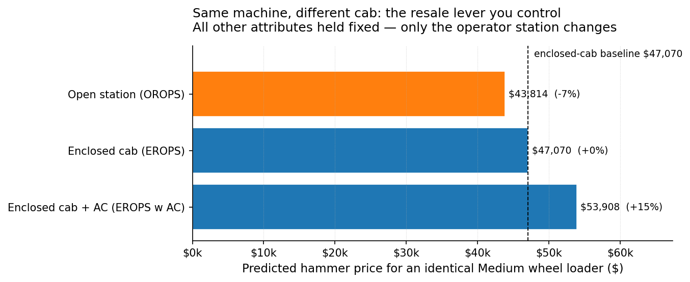
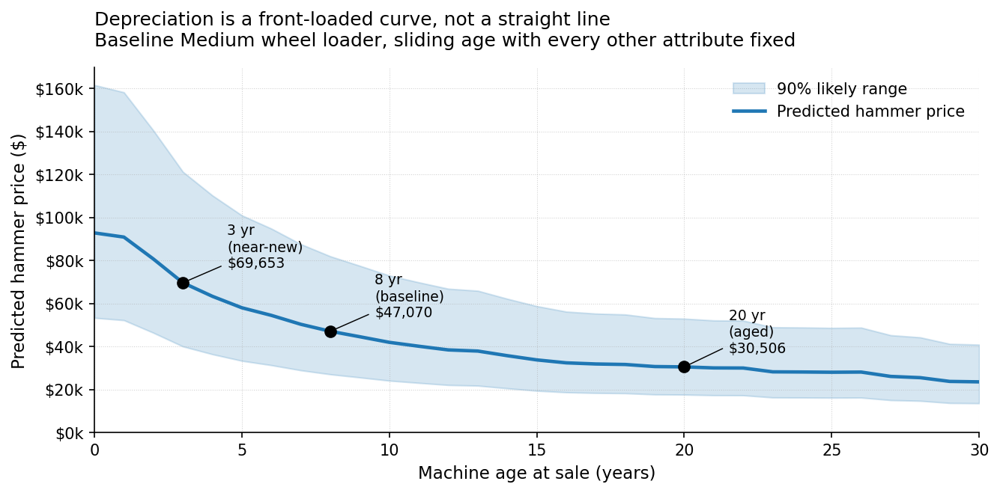
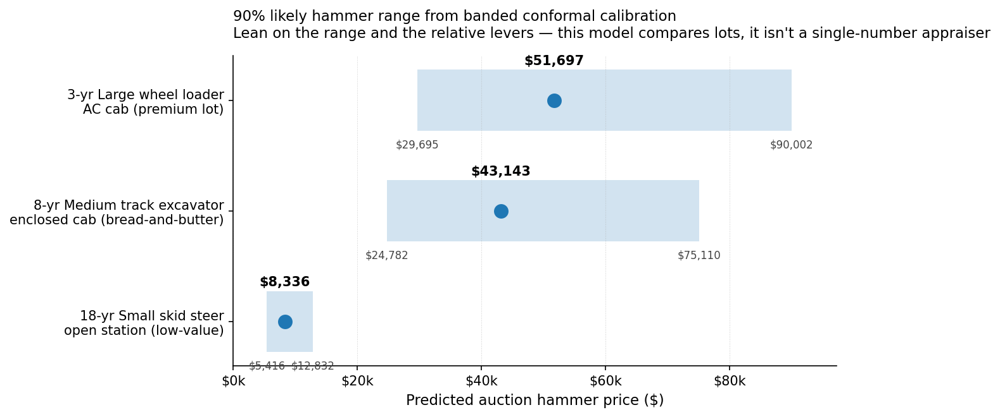
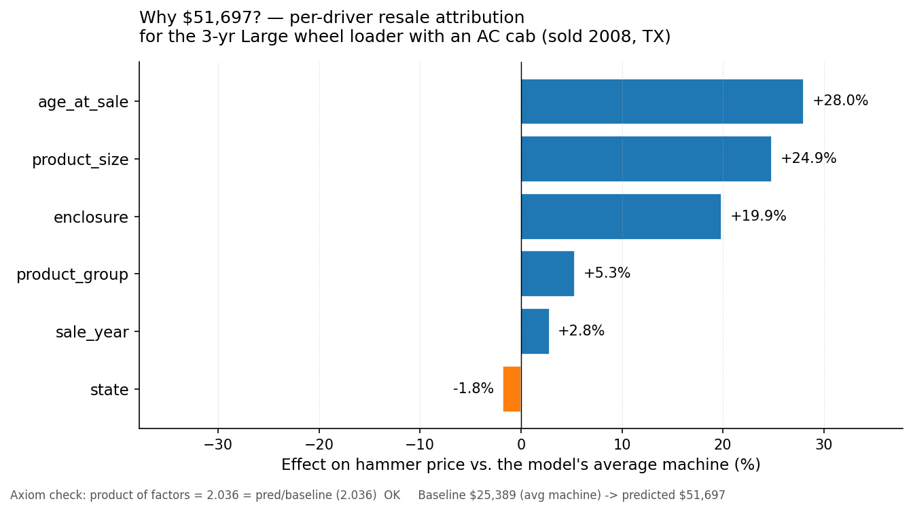
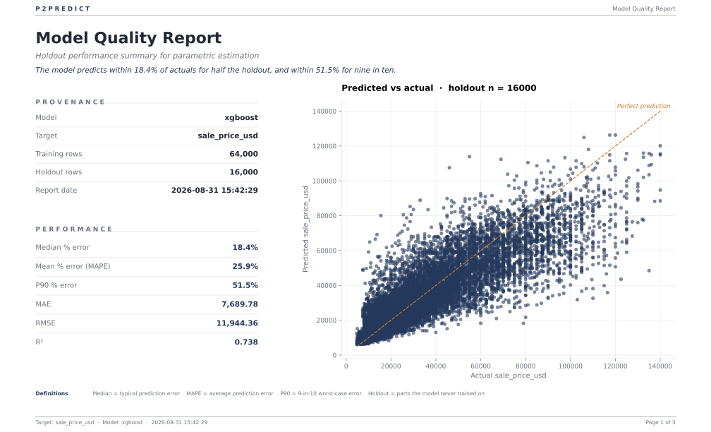
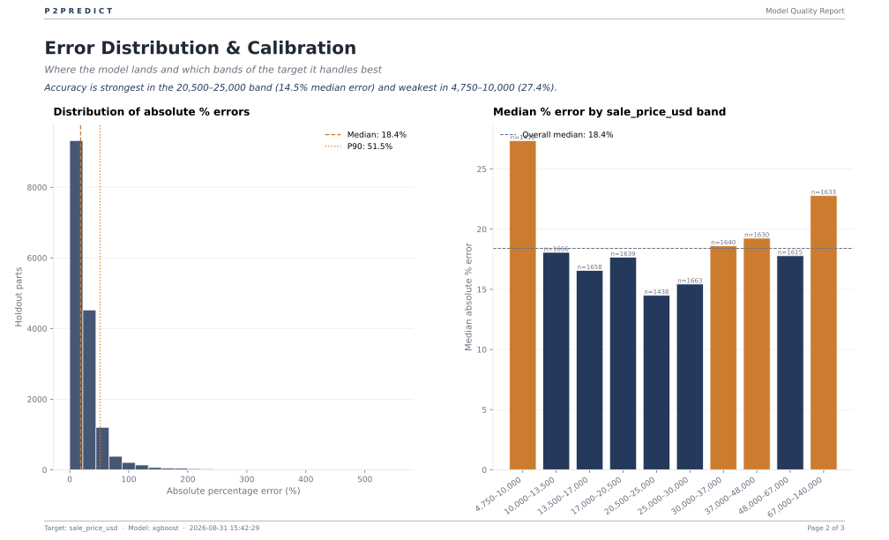
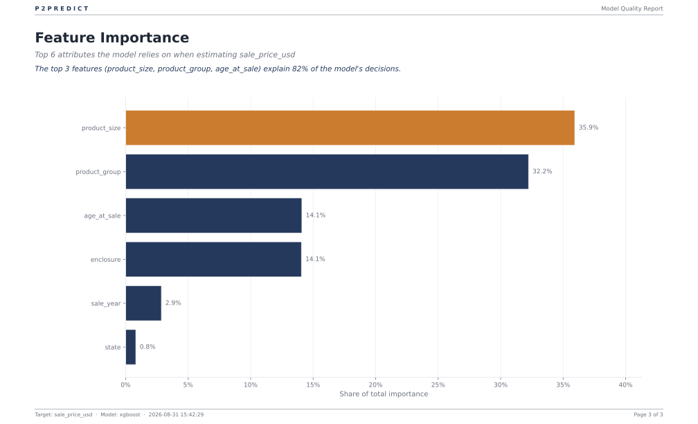

# Case Study: Heavy-Equipment Resale

Knowing what a used machine is really worth is the difference between a good sale and a giveaway.

Sellers rarely have a clean price book. You have a yard full of machines of different ages, sizes, and configurations, a buyer across the table who knows exactly what he wants to pay, and an urgent need to answer: *What will this machine actually fetch? Which parts of it are buyers really paying for? And is this offer fair, or am I being lowballed?*

Every other P2Predict case study asks the buyer's question, *what should we pay?* This one flips the chair to the **seller**. Same engine, opposite side of the table. It uses ~360,000 real heavy-equipment auction sales from the public **Blue Book for Bulldozers** dataset (excavators, dozers, loaders, backhoes, graders, skid steers), and shows how P2Predict prices a used machine, tells you which specs carry the value, and flags where the money is being left on the table.

## The Sales Question

A machine is going across the auction block. From its vintage, category, size, cab type, and where it's being sold, we trained a P2Predict model to answer:

1. What is the expected hammer price?
2. Which attributes are driving that number — and by how much?
3. Where is a machine mispriced, so a seller doesn't give it away and a buyer can spot the bargain?

---

## Part 1: Business Insights

We trained a P2Predict model on 80,000 auction records. It estimates a machine's hammer price with a median error of about 18%, and just as importantly, it tells you which parts of that price are real signal and which are noise.

Here is what the analysis revealed.

### The Executive Summary

If you sell used equipment, here are the takeaways you can act on today:

1. **An enclosed AC cab is worth about 20% — and the comps will lie to you about it.** Holding every other spec equal, a machine with an air-conditioned cab sells for roughly 20% more than the same machine with an open station. But if you price off raw comps, you'll see AC-cab machines selling for nearly **double** the open ones and badly overvalue the cab. The extra isn't the cab — it's that AC-cab machines also tend to be bigger and newer. P2Predict separates the two, so you neither give away the premium on your own machine nor overpay for someone else's.

   

   | Machine type | True cab premium (AC vs open, all else equal) |
   |---|---:|
   | Motor Graders | +49% |
   | Wheel Loaders | +23% |
   | Track-Type Tractors | +20% |
   | Track Excavators | +16% |
   | Backhoe Loaders | +11% |
   | Skid Steers | +10% |

2. **Sell your newer machines first.** Machines lose value fastest in their first few years, then barely move. A young machine sheds about **$10,000 a year**; a 20-year-old one sheds about **$500 a year**. If you're sitting on stock, the newer units are melting and the old ones can wait.

   

3. **The model finds the mispriced machines.** P2Predict draws a fair-value line under every machine. On the holdout, **16% of machines sold 25%+ below fair value** and **22% sold 25%+ above**. For a seller, the below-value list is where you're about to leave money on the table; for a buyer, it's the bargain pile. One honest caveat: the model sees six specs, not a blown engine, so treat a flag as a shortlist to go inspect, not a guarantee.

4. **Geography barely matters.** Holding the machine constant, moving it across states shifts the price by only about ±2%. Trucking a machine across the country to chase a better market isn't worth it. Sell local.

### Where to Trust the Model (and Where to Get a Comp)

Because this is real auction data, the model is sharp in some places and honest about the rest. P2Predict is designed to make that visible.

* **🟢 Trust the relative levers.** The cab premium, the depreciation curve, the size and category rankings — these are what the model is *for*. Use them to rank lots, quantify what an attribute is worth, and defend a position in a negotiation.
* **🟢 Trust the mid-market.** Accuracy is strongest in the **$13,500–$30,000** band (median error ~15%), which is where the bulk of auction volume sits.
* **🔴 Verify a reserve against a comp.** The model is even-handed on a typical machine (~1.7% lean), so the number is sound as a benchmark — but a *single lot* still misses by ~18% at the median, and far more at the price extremes. Use it to compare and rank; confirm a final reserve against recent comparable sales.
* **🔴 Widen the band on cheap and premium machines.** Error is worst on sub-$10k units (~27%) and on the $67k+ top band (~23%). For those, lean harder on a real comp.

### Worked Example: How the Model Prices a Machine

P2Predict breaks down exactly why a machine will fetch what it fetches. Because prices are heavily skewed, the model works on a percentage scale, so each driver reads as a **% lift or cut** on the price.



Take the **3-year-old Large wheel loader with an AC cab** (sold 2008, Texas). The model predicts **$51,697** — a 2.0x multiple of its $25,389 average machine. Here is exactly how it gets there:



```text
  Average machine (baseline):   $25,389
  Prediction:                   $51,697   (x2.04)

  Resale drivers (% lift/cut on the price):
    Age (3 yr, near-new)        + 28.0%   (+$9,137)
    Size (Large)                + 24.9%   (+$8,215)
    Cab (enclosed + AC)         + 19.9%   (+$6,699)
    Category (Wheel Loader)     +  5.3%   (+$1,919)
    Auction year (2008)         +  2.8%   (+$1,025)
    Auction state (Texas)       -  1.8%   (-$687)

  Product of factors = 2.036 = prediction / baseline  ✓
```

The breakdown is exact: the individual factors multiply back to the prediction to the dollar. P2Predict checks that on every run.

### The What-If Scenario

You can ask the tool how a single change moves the price. Take that same wheel loader and strip the enclosed AC cab down to an open station:

```text
  As listed (AC cab):           $51,697
  Stripped to open station:     $42,078
  The cab is worth:              $9,619  (+18.6% of hammer)
```

That's the number you take into a lot walkthrough: *this cab is carrying nearly a fifth of the machine's value.* Whether it's worth reconditioning a damaged cab before the sale becomes simple arithmetic, not a gut call.

---

## Part 2: Under the Hood

For the technical team, here is how P2Predict processes the data, builds the model, and generates the outputs above.

### Data

* **Source:** the Kaggle *Blue Book for Bulldozers* dataset (Fast Iron / Ritchie Bros. auction records). The original is a gated competition; `fetch_data.py` pulls an openly-downloadable re-upload of the identical `Train.csv`.
* **Size:** 401,125 raw auction records, 53 columns, 1989–2011.
* **Cleaning:** ~38k records use `1000` as an "unknown build year" sentinel. A resale model is anchored on machine age, so we drop those rather than impute a fake vintage, leaving **362,800** clean records. We then sample 80,000 for tractable hyperparameter search.
* **Features kept (6):** `age_at_sale`, `sale_year`, `product_group`, `product_size`, `enclosure` (cab type), and `state`.

### Pipeline & Methodology

* **Target Transformation:** the hammer price is heavily right-skewed (skew ≈ 1.5), so P2Predict automatically wraps the target with a log transform. The model is therefore **multiplicative**: SHAP drivers come out as percentages, and confidence intervals stay strictly positive.
* **Algorithm Selection:** P2Predict ran cross-validation across Ridge, Random Forest, and XGBoost. **XGBoost won** (CV R² = 0.79). This is the mirror image of the 150-part Battery Management IC study, where Ridge won: with 80,000 rows there is plenty of data for gradient-boosted trees to succeed.
* **Categorical Encoding:** because a tree model won, P2Predict automatically switches categoricals to **target-encoding**, so the trees split on resale price rather than alphabetical category order. This is what lets `state` (53 values) and `product_group` participate cleanly.
* **Confidence Intervals:** split-conformal prediction on a held-out set, calibrated in *bands* by predicted price, so a $9k skid steer gets a proportionally tighter range than a $50k loader instead of one global margin.
* **Feature Attribution (SHAP):** the multiplicative factors reconstruct the prediction exactly (product of factors = prediction ÷ baseline). P2Predict enforces that on every run.

### Model Performance

| Metric | Result | What it means |
|---|---|---|
| **Holdout R²** | **0.738** | Explains ~74% of hammer-price variation from six basic specs. |
| **MAE** | **$7,690** | The typical miss on a machine whose median price is ~$25k. |
| **Median % Error** | **18.4%** | Half of predictions land within ~18% of the actual sale price. |
| **Typical lean** | **+1.7%** | The model reads about 1.7% low on a typical machine — inside the ±5% that would change a negotiation, so it is cleared to benchmark against. |

A note on the log scale. Modelling on a percentage (log) scale and converting back to dollars pulls the *average* prediction down by about 5% — a well-known property of log models — while leaving the *typical* machine essentially unbiased. Which of those matters depends on the question you're asking: for benchmarking one machine it is the typical machine, and that is what P2Predict measures. Earlier versions tested the average and stamped this model **"unreliable"** for what was an artifact of the back-transform rather than a modelling failure; v1.1.0 judges the typical lean against a materiality band instead. Correcting the average itself — so the number targets the mean rather than the median — is a separate open question (see ROADMAP).

### Visual Quality Report

P2Predict generates a procurement-ready PDF detailing model calibration and feature importance. *(Full PDF in [`assets/model_quality_report.pdf`](assets/model_quality_report.pdf))*

**1. Overall Accuracy:**


**2. Calibration by Price Band:**
Strongest in the mid-market ($13.5k–$30k), weakest on the cheapest and priciest machines — a clear map of where to trust the benchmark and where to pull a comp.


**3. Feature Importance:**
Size and category drive 68% of the decision; the cab lever holds a genuine 14%; auction geography is under 1%.


---

## Part 3: Reproducing the Results

Run these from the **repository root** — `p2predict-train` writes the model into `./models/`, where the case-study scripts look for it.

### Full Path (Requires a Free Kaggle API Token)

```bash
# 1. Install and set up a Kaggle token (https://www.kaggle.com/settings)
pip install -e . 'kagglehub>=0.4.1'
mkdir -p ~/.kaggle && chmod 700 ~/.kaggle
printf 'KGAT_...' > ~/.kaggle/api_token && chmod 600 ~/.kaggle/api_token

# 2. Fetch the auction data (~111 MB) and clean it
python case-studies/heavy-equipment-sales/fetch_data.py
python case-studies/heavy-equipment-sales/prepare_data.py

# 3. Train the model (XGBoost wins on this data volume). Model lands in ./models/
p2predict-train \
  -i case-studies/heavy-equipment-sales/data/bulldozers_training.csv \
  -t sale_price_usd \
  -tf "age_at_sale,sale_year,product_group,product_size,enclosure,state" \
  --outliers warn \
  --feature-outliers warn \
  --budget thorough

# 4. Generate insights, charts, and the PDF report
python case-studies/heavy-equipment-sales/predict_examples.py
python case-studies/heavy-equipment-sales/extract_insights.py
python case-studies/heavy-equipment-sales/generate_charts.py
python case-studies/heavy-equipment-sales/generate_quality_report.py
```

### Quick Path (No Kaggle Account Needed)

The Blue Book data is openly redistributable, so we committed a 5,000-row sample. The metrics will be rougher, but the pipeline runs end-to-end. From the repository root:

```bash
p2predict-train \
  -i case-studies/heavy-equipment-sales/data-sample/bulldozers_sample.csv \
  -t sale_price_usd \
  -tf "age_at_sale,sale_year,product_group,product_size,enclosure,state" \
  --outliers warn \
  --feature-outliers warn \
  --budget thorough
```

## Limitations & Next Steps

* **Strong comparator; still verify a reserve.** The model is even-handed on a typical machine, so it is cleared to benchmark against — but a single lot can miss by ~18% at the median and more at the extremes, so it should not set a reserve price on its own. Pair it with recent comps.
* **No machine hours.** The hour-meter reading is blank or zero on ~83% of records, so it can't carry a usage signal without treating missing data as "brand new." Machine age carries the wear story instead. Reliable hours would add a second usage lever.
* **No make/model.** The dataset hides the manufacturer inside a messy model-description string rather than a clean column, so this study can't quantify a brand premium the way the Battery Management IC study quantifies a supplier premium. That's the natural next feature to engineer.
* **Random split, not chronological.** Auction data is time-ordered; a `--time-column` chronological split would prevent look-ahead and let the model forecast forward-looking resale, not just explain historical sales.
