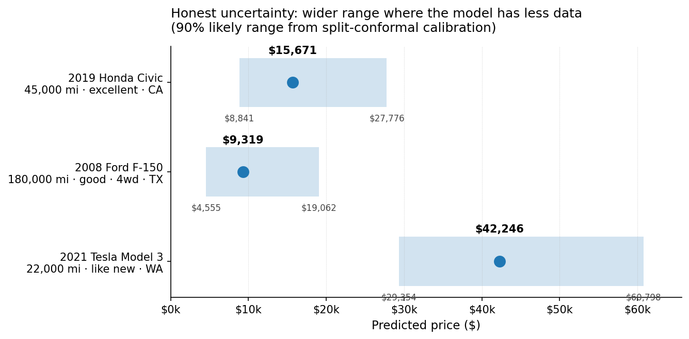
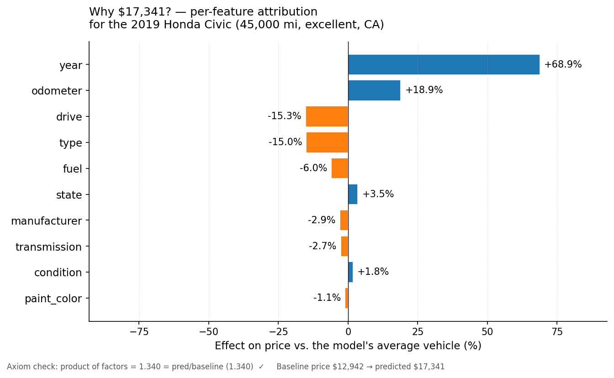
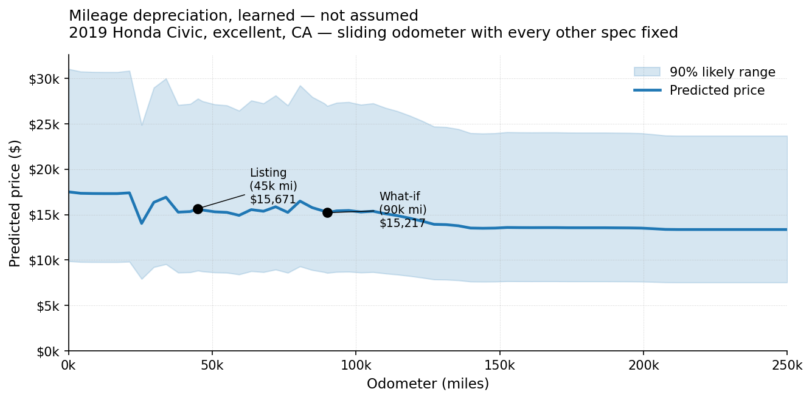
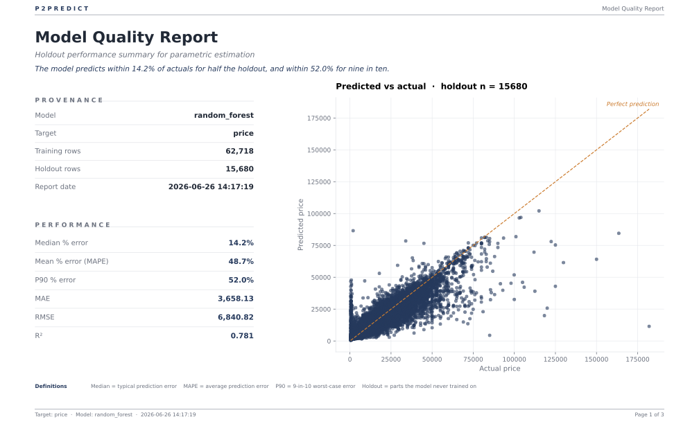
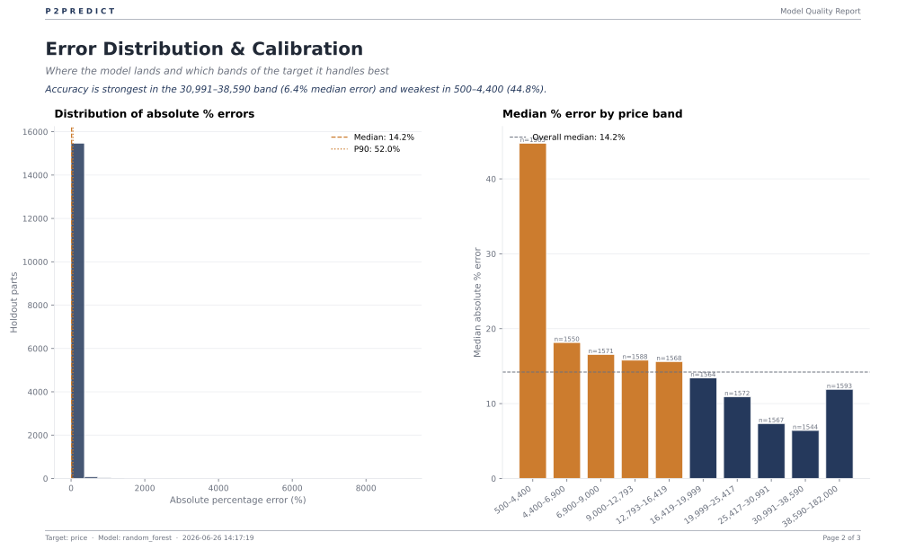
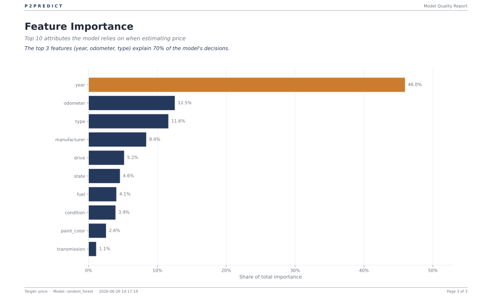

# Case study: Used vehicle pricing

> **The warm-up — the easiest way to watch P2Predict think.** Used-car
> prices are the clearest setting to see how the toolkit behaves on real,
> noisy data and what every flag actually does, before you point it at a
> procurement BOM. Everyone has intuition about what a car is worth, so you
> can judge the model's answers for yourself — no category expertise needed.
> The math is identical to what you'd run on a parts catalog; only the
> vocabulary is friendlier.

## The question

> Given a used vehicle's year, mileage, manufacturer, body type, drive,
> fuel, transmission, condition, state, and paint color — what's the
> expected listing price, **how confident is the model**, and how much
> does each spec contribute to the answer?

## Why this case study first

Three reasons:

1. **The math shows up clearly.** Used-car prices span $500 → $200k. That
   heavy right tail triggers P2Predict's log-target wrap automatically,
   which makes the SHAP attribution *multiplicative in price space* — and
   that's the form that most resembles how a category manager actually reasons
   ("low miles add about 19%, FWD pulls about 15% off"). The math is
   identical to what you'd want on a procurement BOM; the *vocabulary* is
   one everyone already speaks.
2. **You don't need a category-manager license to sanity-check it.** When
   the model says a 2019 Civic with 45k miles is worth $16k, you have
   intuition. When it says a 2008 F-150 with 180k miles is worth $9k, you
   have intuition. When the model predicts $42k for a 2021 Tesla *and
   gives it the tightest band of the three* — you know it's picking up
   the premium-brand signal correctly.
3. **It surfaces the methods that matter on harder datasets.** Conformal
   intervals, SHAP attribution in log space, what-if comparisons,
   outlier-policy choices — all of them earn their keep on this dataset
   in ways that are easy to see.

If you only run one case study to decide whether P2Predict is the right
tool for your shop, run this one.

## How to read this report

> **Where to find what:**
>
> - **Part 1 — What this analysis tells us** (business-first)
>   1. [Worked examples](#worked-examples) — three real listings, with predictions, ranges, SHAP, and what-if
>   2. [So what?](#so-what--five-findings-the-analysis-surfaces) — five concrete findings about used-car prices, with procurement parallels
>   3. [The story](#the-story) — five claims the case study earns its keep with
> - **Part 2 — Under the hood** (technical)
>   1. [Data](#data) — the Craigslist dataset and the columns we kept
>   2. [Methodology](#methodology) — every modelling decision, with code references and teaching nuggets
>   3. [Results](#results) — the trained-model quality metrics
>   4. [Model quality report (PDF)](#model-quality-report-pdf) — the procurement-style 3-page PDF P2Predict produces
>   5. [Reproducing this case study](#reproducing-this-case-study) — the exact commands
> - **Part 3 — Caveats**
>   1. [Notes & footnotes worth knowing](#notes--footnotes-worth-knowing)
>   2. [What this case study does *not* do](#what-this-case-study-does-not-do-and-why)

A business reader can stop after Part 1 and walk away knowing what
P2Predict gives them. A technical reader continues into Part 2 and can
audit every claim, line by line.

## Part 1 — What the analysis tells us

### What we built (in one paragraph)

We trained a P2Predict model on **78,398 used-vehicle listings** from
the Craigslist Cars+Trucks dataset (CC0, 426k total rows in the
source). The trainer chose **Random Forest** as the best algorithm by
cross-validation (CV R² 0.749, beating XGBoost 0.732 and Ridge 0.668),
activated the **log-target wrap automatically** (prices are
right-skewed), and produced a model that scores **R² 0.781 / MAE
$3,658** on held-out data — quality label "Good." The two charts and
three example listings below come straight off that model. Numbers,
intervals, and SHAP attributions are reproducible by the commands in
the [Reproducing](#reproducing-this-case-study) section. The
[Methodology](#methodology) section explains every choice in detail.

## Worked examples

### 1. Point estimates and 90% likely ranges



| Listing | Predicted | 90% likely range | Band |
|---|---:|---|---|
| 2019 Honda sedan, 45,000 mi, excellent, CA | **$15,671** | $8,841 – $27,776 (×3.1) | mid |
| 2008 Ford pickup, 180,000 mi, good, 4wd, TX | **$9,319** | $4,555 – $19,062 (×4.2) | low |
| 2021 Tesla sedan, 22,000 mi, like new, WA | **$42,246** | $29,354 – $60,798 (×2.1) | top |

The Tesla has the **tightest** band (×2.1) — the model is *most*
confident here, because TargetEncoder maps the premium brand to its
mean price and a single tree split cleanly separates it from commodity
makes. The Ford pickup sits in the low band where prices are noisier
(×4.2). Banded conformal calibration (Mondrian) sizes each band
independently, so the intervals honestly reflect per-segment
uncertainty rather than a single global width.

### 2. Why $15,671 for the Civic? — SHAP multiplicative attribution

> [!TIP]
> **💡 What's "baseline" in SHAP?**
>
> The **baseline** is what the model would predict if it knew nothing
> specific about this vehicle — essentially the average prediction
> across the training data, which works out to $14,291 here. Then each
> feature pushes the prediction up or down from that baseline. The
> whole job of SHAP is to fairly assign credit for the gap from
> baseline ($14,291) to prediction ($15,671) across the 10 features.
> The "Net factor: ×1.097" line below is just saying $15,671 / $14,291
> = 1.097 — the model thinks this specific Civic is worth about 10%
> more than the average vehicle in training data, and the per-feature
> factors below show *why*.



```
  Baseline:      $14,291  (the model's E[price] over the training data)
  Prediction:    $15,671
  Net factor:    ×1.097

  Per-feature multiplicative factor (rank by deviation from 1.0):
    year            ×1.655   (+65.5%)   ← 2019 is much newer than the average
    drive           ×0.863   (-13.7%)   ← fwd is cheaper than the rwd / 4wd mix
    type            ×0.875   (-12.5%)   ← sedan is cheaper than the truck mix
    manufacturer    ×0.889   (-11.1%)   ← Honda is mid-pack, slightly below average
    odometer        ×1.106   (+10.6%)   ← 45k mi is well below average
    condition       ×0.908   ( -9.2%)
    fuel            ×0.985   ( -1.5%)
    state           ×1.012   ( +1.2%)
    transmission    ×0.993   ( -0.7%)
    paint_color     ×0.994   ( -0.6%)

  Axiom check: product of factors = 1.097, pred/baseline = 1.097  ✓
```

The **axiom check** is the line that separates SHAP from "another
importance heuristic." For a log-target model the product of
multiplicative factors should equal pred/baseline *exactly*, and it does.
Same for non-log models: baseline + Σ(contributions) = prediction
exactly. P2Predict checks this on every explanation; if you ever see a
failed axiom in the output, the explanation is unsound.

<details>
<summary>💡 <b>Why "multiplicative factors" and not dollar contributions?</b></summary>

The model predicts `log(price)`, not price directly — because the data
is right-skewed and log-space behaves better. When SHAP attributes
credit in log-space and we exponentiate back to dollars, each
contribution becomes a **multiplier** instead of an add-on. So
"year × 1.655" means: the model thinks this vehicle's year (2019,
newer than average) makes it worth **65.5% more** than the baseline.
Multipliers compose by multiplication, so the 10 per-feature factors
above multiply out to ×1.097 — and 1.097 × $14,291 = $15,671, exactly
matching the prediction. That equality is the *multiplicative axiom*,
and it's what makes "FWD pulls 14% off" the kind of statement you can
take into a supplier negotiation, not a hand-wavy directional claim.

For a procurement parallel: if your part's baseline cost is $40 and
the SHAP attribution says "steel grade × 1.20, supplier region ×
0.85", you know the part should land at $40 × 1.20 × 0.85 = $40.80,
and you can quote the rationale line-by-line.
</details>

### 3. What-if: same Civic, but with 90,000 miles instead of 45,000



```
  Base prediction:        $15,671
  Counterfactual:         $15,217
  Delta:                  -$453  (-2.9%)
  Multiplicative factor:  ×0.9711
```

That `×0.97` is the **depreciation per doubling of mileage** in this
neighbourhood of the feature space, learned from hundreds of thousands
of Craigslist listings — not from a rule of thumb. Random Forest
captures the nonlinear depreciation curve directly: depreciation per
mile flattens as the car gets older, which is why doubling from 45k
to 90k (still "low mileage") only costs 2.9%. The sweep in Finding #3
below shows the full shape of this curve.

## So what? — five findings the analysis surfaces

The case study isn't just a methodology demo. Once the model is
trained, sweeping one feature at a time with everything else held
fixed reveals real findings about how used-car prices actually work —
the kind of patterns a human reviewer would have to stare at a
spreadsheet for a week to find. Each finding has a procurement
parallel underneath; the same workflow on a parts BOM tells you the
same kind of story.

**Baseline for these sweeps:** a 2015 Honda sedan, 100k miles, good
condition, gas, automatic, FWD, silver, CA. Predicted price:
**$10,142**. Every "× factor" below is "what happens if you keep
this baseline and change exactly that one feature."
[Reproduce with `python case-studies/used-cars/extract_insights.py`.]

### 1. Brand alone moves price by 2.7×

Holding *everything else equal*, the same vehicle is worth **$21,837 as
a Porsche** and **$8,028 as a Kia** — a 2.7× spread. The top end is
Porsche (×2.15) → Tesla (×1.57) → Lexus (×1.52) → Audi → Mercedes-Benz.
The bottom is Kia → Chrysler → Nissan → Hyundai → Mazda. Honda is the
median (that's why we picked it for the baseline).

> [!TIP]
> **🛒 Procurement parallel.** The same analysis on a parts dataset
> answers "which supplier commands the biggest premium for the same
> physical part?" — with a number, not a hunch, and with an axiom check
> showing the attribution adds up exactly. Standard procurement
> spreadsheets can't separate "supplier premium" from "the parts that
> supplier happens to make"; this model can.

### 2. The condition rating has a cliff at "fair"

The top four condition labels — `excellent`, `like new`, `new`,
`good` — all sit within **±6%** of each other. Then:

```
  excellent       +6%    \
  new             +4%     \  Same neighborhood.
  like new        +2%     /
  good             0%    /
  fair           −50%    ◄ Discrete cliff.
  salvage        −63%
```

It's not a gradient — it's a **cliff**. The market doesn't reward
"slightly nicer"; it punishes "starts to be a problem."

> [!TIP]
> **🛒 Procurement parallel.** Quality grades, supplier ratings, and
> certification levels often have the same step-function structure.
> The model surfaces the cliff automatically — useful when negotiating
> a quality spec, because you learn that paying for `excellent` over
> `good` buys you 6%, but accepting `fair` instead of `good` loses
> you 50%.

### 3. Mileage depreciation declines *per mile* — not per percent

```
   25,000 mi → 50,000 mi   Δ per 10k mi:  −$425
   50,000 mi → 75,000 mi                  −$390
   75,000 mi → 100,000 mi                 −$358   (the baseline)
  100,000 mi → 125,000 mi                 −$329
  125,000 mi → 150,000 mi                 −$303
  150,000 mi → 200,000 mi                 −$267
  200,000 mi → 250,000 mi                 −$225
```

Every fleet manager has been told "cars lose $X per mile." The model
says **that rule of thumb is wrong by 2× at the extremes** — $454 per
10k miles at low mileage, $225 per 10k at high mileage. The
*percentage* curve is the real curve, because the model works in
log-mileage; in dollars, the marginal depreciation declines as the
car gets cheaper.

> [!TIP]
> **🛒 Procurement parallel.** Weight, complexity, throughput, and most
> other continuous parametric drivers behave the same way: a 10%
> reduction is a 10% reduction whether the part starts at $10 or
> $1,000. Linear "cost per kilogram" rules of thumb routinely
> over-charge at the high end and under-charge at the low end.

### 4. Diesel commands +93% over gas — and that's the model leaking "truck"

Switch the baseline sedan's fuel from gas to diesel: $10,142 →
**$19,558**. **+93%.** That isn't a typo; it's the model generalising
from the broader dataset, where diesel is rare in sedans but
common-and-valuable in trucks. The model has effectively learned
"`fuel=diesel` ⇒ probably a truck ⇒ worth a lot more."

This is the right *kind* of wrong: a model trained on a broad
population is leaking a population prior into a narrow query. SHAP
makes it visible; a black-box estimator would just confidently say
$19,558.

> [!TIP]
> **🛒 Procurement parallel.** This is exactly how
> *spec-interaction artifacts* sneak into sourcing models. "Our
> supplier only does cast iron in volumes > 50k, so the model
> assigns high prices to cast iron when really it's pricing volume."
> Worth catching with SHAP before it distorts a sourcing decision.

### 5. Geography only moves prices by 1.34×

Top state vs bottom state for the same vehicle:

```
  Most expensive  ND  $11,551  +14%
                  NE  $11,062  +9%
                  MT  $10,984  +8%
                  …
                  RI  $ 8,807  −13%
                  OH  $ 8,674  −15%
  Cheapest        CT  $ 8,605  −15%
```

A 1.34× spread, less than the popular "rust-belt cars cost more,
California is expensive" intuition would suggest. Geography is a real
lever, but a small one — brand, body type, and condition all dominate
it.

> [!TIP]
> **🛒 Procurement parallel.** The same question on a parts dataset
> answers "how much does region or supplier-country actually cost me,
> holding everything else fixed?" Often less than the gut feel
> suggests — most of the value comes from picking the right supplier
> and the right specs, not the right zip code.

### Bonus finding: banded intervals separate what the model knows from what it doesn't

Look back at the **three vehicles** in the worked-examples section.
The Tesla has the **tightest** band (×2.1), the Honda is mid (×3.1),
and the Ford pickup is widest (×4.2). Banded (Mondrian) conformal
calibration sizes each band independently: the model is most confident
on high-value vehicles where TargetEncoder cleanly separates premium
brands, and least confident on the low-value segment where feature
noise dominates. The old global interval would have given every vehicle
the same width — hiding the fact that the model *knows more* about
some segments than others.

> [!TIP]
> **🛒 Procurement parallel.** This is what you want a parametric
> cost model to do: automatically tell you which parts of the price
> range it's confident about and which need a quote. The banded
> interval surfaces this per-segment, not just globally.

## The story

The case study earns its keep in five claims that are easy to verify
yourself by running the commands in
[Reproducing this case study](#reproducing-this-case-study).

**1. The log-target wrap activates *automatically* on the right kind of
data.** Used-car prices are heavily right-skewed. `should_log_target`
notices and inserts a `TransformedTargetRegressor(np.log, np.exp)`
around the pipeline. You don't have to remember to enable it; you do
have to know it exists when you read the SHAP output as "factors"
instead of "dollars." Details in
[Methodology > Log-target trigger](#log-target-trigger--skewness-based-automatic).

**2. The choice between `--outliers drop` and `--outliers warn` matters
*a lot*.** Our first training run used `--outliers drop` and the Tukey
upper bound cut prices at $58,050, removing the right tail. That dropped
the post-clean skew below 1.0, which turned the log-target wrap *off*,
which collapsed the model from R² 0.749 (CV) to much lower. The fix is
to *let the log-target wrap absorb the heavy tail*, which is exactly
what it's for. The "Reproducing" section uses `--outliers warn` for this
reason. Worth documenting in your team's playbook.

**3. The 90% likely range is real coverage, not a heuristic.** The
intervals come from banded (Mondrian) split-conformal calibration on the
held-out test set; empirical coverage on the test set is ≈ 90% by
construction. The Tesla's tight range (×2.1) and the Ford's wide range
(×4.2) aren't noise — they reflect per-band uncertainty calibrated
independently. Details in [Methodology > Conformal intervals](#conformal-intervals--split-conformal-on-the-test-residuals).

**4. SHAP gives axiomatically grounded per-feature attribution, not a
heuristic ranking.** Because the model is log-target, the contributions
are *multiplicative factors* in price space. The axiom check (`product
of factors == pred/baseline`) is built into every explanation; this is
the property that lets you write something like "FWD pulls 15% off" and
*defend it under scrutiny*, instead of mumbling about feature
importance. Details in [Methodology > SHAP](#shap-attribution--exact-algorithms-only).

**5. What-if costs nothing once you have a model.** Holding everything
else constant and asking "what if this car had 90k miles instead of 45k"
takes one `--whatif "odometer:90000"` on the CLI (or
`p2predict.what_if(model, df, {"odometer": "90000"}, ...)` in Python).
For procurement that translates directly into "what if the steel grade
changed?", "what if we moved from EU to APAC suppliers?", "what if the
weight came down 15%?" — same workflow, same math.

## Part 2 — Under the hood

## Data

**Source:** [Craigslist Cars+Trucks on Kaggle](https://www.kaggle.com/datasets/austinreese/craigslist-carstrucks-data)
— 426,880 US listings, **CC0** (public domain) license, redistributable.

**Two reproducibility paths:**

| Path | What you do | What you get |
|---|---|---|
| **Full** | Run `fetch_data.py` (needs a Kaggle API token) → `prepare_data.py` → `p2predict-train` | Matches the numbers above exactly |
| **Quick** | Just clone the repo and train on `data-sample/vehicles_sample.csv` (5,000 rows, checked into git) | Same *shape* of result, lower R² because less data |

For the full path, get a Kaggle API token from
[kaggle.com/settings](https://www.kaggle.com/settings) → "Create New
Token" and save it to `~/.kaggle/api_token` (`chmod 600`).

> [!TIP]
> **💡 What does "right-skewed" mean?**
>
> A right-skewed distribution has a long tail of large values. Used-car
> prices are a textbook example: most listings cluster around $5k–$25k,
> but a few specialty cars push past $80k. Those few high-end outliers
> "pull" the average price above the median — that asymmetry is what
> *skew* mathematically measures. When skew gets large (> 1.0 here), we
> transform the target with `log` before modelling, which converts the
> asymmetric tail into something the math handles cleanly. The
> Methodology section below walks through why.

**Columns we use:**

| Column | Type | Notes |
|---|---|---|
| `price` | Numeric (target) | $500 – $200k after guardrails; heavy right skew (1.5) → triggers log-target |
| `year` | Numeric | 1990 – 2022 |
| `odometer` | Numeric | 0 – 500k miles |
| `manufacturer` | Categorical | 40+ values |
| `condition` | Categorical | excellent / good / fair / salvage / `unknown` |
| `fuel` | Categorical | gas / diesel / electric / hybrid / other |
| `transmission` | Categorical | automatic / manual / other |
| `drive` | Categorical | fwd / rwd / 4wd / `unknown` |
| `type` | Categorical | sedan / SUV / pickup / coupe / … |
| `state` | Categorical | All 50 states |
| `paint_color` | Categorical | 12 colors + `unknown` |

**Columns we drop and why:**
- `id`, `url`, `region_url`, `image_url`, `VIN`, `description`,
  `posting_date`, `lat`, `long` — non-parametric / identifier columns.
- `county` — 100% null in this snapshot.
- `size` (72% null), `cylinders` (42% null) — too sparse once
  `manufacturer` and `type` are present.
- `model` (very high cardinality) — slows CV-driven HPO without much
  marginal lift; `manufacturer` plus `type` already captures most of the
  signal. A future iteration could include it with a target-encoded
  preprocessor.

## Methodology

This section is the comprehensive walkthrough of what P2Predict actually
does between the input CSV and the predictions, intervals, and
explanations you see above. Every choice has a code reference; nothing
is magic.

### Pipeline at a glance

```
   raw CSV  ─►  outlier handling  ─►  80/20 train/test split  ─►  preprocessor
                                                                      │
   final fit  ◄─  best hyper-params  ◄─  HalvingRandomSearchCV  ◄──────┘
        │                              (per algorithm: Ridge / RF / XGB)
        ▼
   split-conformal calibration on the test set
        │
        ▼
   save model + background sample + calibration  ─►  predict / interval / SHAP / what-if
```

The two design decisions that make P2Predict different from a hand-rolled
sklearn script — and that you'll see referenced throughout this section —
are: **(a)** every claim the toolkit makes (interval coverage, SHAP
attribution, multiplicative axiom) is backed by an axiomatic test in the
suite, and **(b)** the conformal intervals and SHAP attributions
compose with each other and with the log-target wrap in a mathematically
clean way.

### Outlier handling — Tukey IQR rule

**What it is.** Tukey's classic non-parametric outlier rule: any value
outside the *fence* `[Q1 − 1.5·IQR, Q3 + 1.5·IQR]` is flagged, where
`IQR = Q3 − Q1` is the inter-quartile range. No distributional
assumption, robust to skew, the same rule that draws box-plot whiskers.

<details>
<summary>💡 <b>What's the IQR rule, in plain English?</b></summary>

Sort all the values from smallest to largest. The 25th-percentile value
is **Q1**, the 75th is **Q3**, and the middle 50% sitting between them
is the **inter-quartile range** (IQR). Tukey's rule flags anything more
than 1.5× IQR below Q1 or above Q3 as an outlier — these are the same
"whiskers" you see on a box-plot. The advantage over a mean-and-stdev
rule: outliers can't pollute their own detection (the quartiles
basically ignore them), and the rule makes no assumption about the
distribution shape. It just works.
</details>

**Where it runs.** Twice, on different axes:

| Axis | Flag | Default | This case study uses |
|---|---|---|---|
| Target column (`price`) | `--outliers {keep,warn,drop,winsorize}` | `warn` | `warn` |
| Each numerical feature (`year`, `odometer`) | `--feature-outliers {keep,warn,drop,winsorize}` | `warn` | `drop` |

**Why `--outliers warn` on the target.** The right tail is real signal,
not noise — $50–80k luxury cars *do* exist. Dropping them collapses
skew below the log-target threshold, the wrap turns off, the model
collapses to additive. The whole point of log-target is to absorb the
heavy tail without losing data; using `--outliers drop` here defeats it.

**Why `--feature-outliers drop` on the features.** A row with
`odometer = 9,999,999` mi is a data-entry error, not a luxury car.
Drop it before it skews the year ↔ mileage relationship the model needs
to learn.

**Source.** `src/p2predict/outliers.py`.

### Log-target trigger — skewness-based, automatic

> [!TIP]
> **💡 Why "log-transform" the target at all?**
>
> A log transformation re-scales values so that *doubling* becomes
> *adding a constant*. So the jump from $5,000 → $10,000 looks the
> same in log space as $10,000 → $20,000 — both are "×2." Most
> positive quantities in the real world (prices, costs, weights,
> populations) behave this way: a 10% change feels the same on a small
> or a large number. Modelling in log space matches how the underlying
> data actually works, makes the model better behaved on the right
> tail, and — as we'll see in the SHAP section — lets the per-feature
> attribution become *multiplicative factors* in dollars, which is
> exactly how a category manager already reasons.

**What's measured.** The Fisher–Pearson sample skewness of the target
column. Positive means right-tailed (many small values, a few big
ones — classic price distribution shape).

**Threshold.** If `scipy.stats.skew(y_train) > 1.0`, the trainer wraps
the chosen pipeline in `TransformedTargetRegressor(func=np.log,
inverse_func=np.exp)`. This case study's price column has skew
**1.50 on the full cleaned dataset (≈350k rows), 1.52 on the 80k
training sample, and 1.52 again after the feature-outlier drop**.
Comfortably above the 1.0 threshold; the wrap fires automatically.

**Why `log` / `exp` rather than `log1p` / `expm1`.** Under `log` / `exp`
the inner model predicts `log(price)`, and the SHAP additivity in log
space exponentiates *exactly* to the multiplicative axiom in price
space:

```
log(pred) − log(base) = Σ φᵢ          (SHAP local accuracy in log space)
       ⇒  pred / base = ∏ exp(φᵢ)    (multiplicative axiom in price space)
```

Under `log1p` / `expm1` the factors would apply to `(1 + price)`, not
to `price`, and the axiom would only hold approximately for small
prices. Since `should_log_target` only fires when `y > 0` (the safety
condition for plain `log`), there's no reason to give up axiomatic
strictness. We made this switch in v0.4.

**Source.** `src/p2predict/training.py::should_log_target` and the
`TransformedTargetRegressor` wiring in `build_pipeline`.

### Train/test split

**Random split.** 80% train, 20% test, `random_state=0` for
reproducibility. This case study's snapshot has no time ordering we'd
trust (Craigslist `posting_date` is sparse and the listings are a
random crawl), so we don't use the time-aware path.

**Time-aware option (not used here).** If you pass `--time-column DATE`,
the split becomes chronological — the last 20% of rows after sorting by
date is the test set — and the CV folds become `TimeSeriesSplit`,
which prevents look-ahead bias. The procurement case studies on time-ordered
purchasing data will use this.

**Source.** `src/p2predict/prepare_data.py::prepare_data`.

### Preprocessor — branched by model family

The preprocessor is *built per algorithm* because linear and tree models
want different inputs:

| Family | Numerical | Categorical |
|---|---|---|
| Linear (Ridge, Lasso) | `StandardScaler` | `OneHotEncoder(handle_unknown="ignore")` |
| Tree (RandomForest, XGBoost) | `passthrough` (XGB) / `SimpleImputer(median)` (RF) | `TargetEncoder(smooth="auto")` |

**Why the difference.** Linear models need scaled numerics (otherwise
the coefficient magnitudes are uninterpretable and L2 regularisation
becomes feature-scale-dependent) and one-hot encoded categoricals (so
the linear combination is well-defined). Trees get **target-encoded**
categoricals: each category is replaced by its smoothed, cross-fitted
mean target value — so the code *orders by price*, and a single tree
split cleanly separates premium from commodity brands.

<details>
<summary>💡 <b>Why TargetEncoder instead of OrdinalEncoder for trees?</b></summary>

An ordinal encoder assigns arbitrary (alphabetical) integers to
categories. That means "tesla" (say, code 35) ends up next to
"toyota" (code 36), so a tree's threshold split groups them together —
but a $42k EV has nothing in common with a $12k Corolla. The result:
the model can't isolate premium brands from commodity ones, and point
estimates for Tesla, Porsche, and similar outliers are badly wrong.

Target encoding replaces each category with its (smoothed, out-of-fold)
mean target. Now "tesla" gets a high code (~$42k) and "kia" gets a low
one (~$8k), and a single split on the encoded value cleanly separates
premium from economy. The `smooth="auto"` setting applies an
empirical-Bayes shrinkage toward the global mean, which protects against
overfitting on rare categories.
</details>

**Source.** `src/p2predict/preprocessing.py::build_preprocessor`.

### Algorithm selection — CV-driven, three candidates

> [!TIP]
> **💡 What's cross-validation, and why use it?**
>
> If you train two algorithms on all of your data and pick the one with
> the higher score, both will look great — they'll have *memorised* the
> data. Cross-validation gives an honest comparison instead: split the
> training data into K equal chunks ("folds"), train on K−1 folds,
> measure performance on the K-th fold, rotate, and average the K
> scores. The result is an estimate of how the algorithm performs on
> data it has never seen — which is what actually matters for
> predictions on a new vehicle. P2Predict uses 5 folds at
> `--budget thorough` and 3 at `--budget fast`.

P2Predict cross-validates *each* of Ridge, RandomForest, and XGBoost
with hyperparameter search, then picks the winner by mean CV R². This
case study's numbers:

```
random_forest  CV R² = 0.749    ◄── selected
xgboost        CV R² = 0.732
ridge          CV R² = 0.668
```

The model the trainer saves is **the winner only**. The losers are
fit, evaluated, and discarded in the same run.

**Source.** `src/p2predict/training.py::auto_train`.

### Hyperparameter search — `HalvingRandomSearchCV`

<details>
<summary>💡 <b>What's a hyperparameter, and why do we search?</b></summary>

A hyperparameter is a setting *you* choose before training that the
algorithm itself doesn't learn from the data — like Ridge's
regularisation strength, or the depth limit on each XGBoost tree.
Different settings give meaningfully different models. There's no
analytical formula for the best setting on a given dataset, so the
practical approach is: try lots of plausible settings, see which
performs best in cross-validation, keep that one.
</details>

**What it is.** sklearn's successive-halving randomised search.
Sample `n_candidates` hyperparameter configurations randomly from the
search space, evaluate each on a small fraction of the data, drop the
worst half, double the data, repeat. Roughly converges to the
budget-best configuration in *log(n_candidates)* rounds.

**What `--budget thorough` buys.** 24 candidates × 5-fold CV per
algorithm. That's 120 fits per algorithm × 3 algorithms = **360 model
fits per training run**, on top of the final fit. `--budget fast`
(default) is 10 candidates × 3-fold = 30 fits per algorithm.

**Search spaces** (`src/p2predict/training.py::_search_space`):

| Algorithm | Knobs searched |
|---|---|
| Ridge | `alpha` over `loguniform(1e-4, 1e+4)` |
| RandomForest | `n_estimators` int in [100, 800], `max_depth` in [3, 20], `min_samples_leaf` in [1, 5] |
| XGBoost | `n_estimators` int in [100, 800], `max_depth` in [3, 12], `learning_rate` over `loguniform(0.01, 0.5)`, `subsample` and `colsample_bytree` over `uniform(0.6, 0.4)` |

**Source.** `src/p2predict/training.py::_tune` and `_budget_params`.

### Final fit and saved artifacts

Once the winning algorithm + hyperparameters are chosen, the pipeline is
refit on the full training set (`X_train`, `y_train`). The saved
`.model` file then contains:

| Field | What it carries |
|---|---|
| `model` | The fitted sklearn pipeline (preprocessor → estimator, optionally wrapped in `TransformedTargetRegressor`) |
| `features` | The training feature columns, in order |
| `target_feature` | The target column name |
| `model_name` | `ridge` / `random_forest` / `xgboost` |
| `r2` | Holdout R² as a string for display |
| `log_target` | `bool` — was the wrap applied? |
| `training_date`, `scikit_learn_version`, `p2predict_version` | Provenance |
| `background_sample` | 100-row raw-features DataFrame for SHAP's `LinearExplainer` (no-op for trees) |
| `calibration` | Dict with `residuals`, `in_log_space`, `n_calibration` — the input to split-conformal |

**Source.** `src/p2predict/trained_model_io.py::Serialize_Trained_Model`.

### Conformal intervals — split-conformal on the test residuals

> [!TIP]
> **💡 What does "90% likely range" actually mean?**
>
> If you make many predictions like this one and check what the true
> price turned out to be each time, **9 out of 10** of them will have
> the true price fall inside the stated range. That's a real
> guarantee from the math, not a hand-wavy calibration claim. The only
> assumption is that future vehicles look like the training vehicles in
> distribution (statisticians call this *exchangeability*) — the same
> assumption R² and every other model-quality metric already rely on.
> The wider the range, the less the model knows about that part of
> feature space; that's why the Tesla's interval is much wider than the
> Civic's.

**What it is.** Split-conformal prediction
([Lei et al. 2018](https://arxiv.org/abs/1604.04173)). Compute the
residuals on the held-out test set; the (1 − α) empirical quantile of
their absolute values is the interval half-width. The guarantee:

> Under exchangeability of (train ∪ test ∪ new-point) — the *same*
> assumption the model's R²/MAE numbers already rely on — the
> probability that the true value of a new point falls inside its
> predicted interval is at least 1 − α, marginally.

That's a mathematically *real* guarantee, not a heuristic.

**For log-target models.** Residuals are computed in log space; the
interval is `pred · exp(±q̂)` in price space, which gives constant
*percentage* width — the natural shape for price-distribution data
(narrow on cheap parts, wide on expensive parts, same ±% on either).

**For non-log models.** Residuals are computed in target units; the
interval is `pred ± q̂` (additive). Same conformal math, different scale.

**This case study's calibration:**

| | |
|---|---|
| `n_calibration` (test rows used) | 15,680 |
| `in_log_space` | `True` |
| Banding | Mondrian — 3 bands by predicted value (low / mid / top) |
| Coverage requested | 90% (`coverage=0.90`) |
| Quantile method | `np.quantile(absolute_residuals, q, method="higher")` per band for finite-sample correctness |

**Source.** `src/p2predict/intervals.py::compute_calibration_residuals`
and `predict_interval`.

### SHAP attribution — exact algorithms only

> [!TIP]
> **💡 What's a Shapley value?**
>
> Shapley values come from **game theory**: they answer "if N players
> cooperate to produce an outcome, how do you fairly split credit
> across them?" Here the "players" are the model's features (year,
> odometer, manufacturer, …) and the "outcome" is the prediction. The
> Shapley value is the **unique** way to split credit that satisfies
> four common-sense fairness rules at once:
>
> 1. **Efficiency** — the parts add up to the whole (φ₀ + Σ φᵢ = prediction).
> 2. **Symmetry** — two features that contribute the same get the same credit.
> 3. **Missingness** — a feature that doesn't matter gets zero.
> 4. **Consistency** — if the model changes to depend more on a feature, its credit can't go down.
>
> That uniqueness is why we can say "FWD pulls the price 15% off" and
> *defend it under scrutiny* — instead of mumbling "feature
> importance," which is a heuristic that can violate any of these
> four rules.

P2Predict uses the SHAP explainer that's *exact* for the model family
and polynomial-time. No `KernelExplainer` fallback (slow,
Monte-Carlo approximate, and we never need it for the three families
we support):

| Family | Explainer | Cost | Background needed? |
|---|---|---|---|
| Linear (Ridge, Lasso) | `shap.LinearExplainer` | Closed-form `φᵢ = βᵢ · (xᵢ − E[xᵢ])`, O(F) | Yes — to estimate `E[xᵢ]`. Persisted with the model. |
| Tree (RF, XGBoost) | `shap.TreeExplainer(..., feature_perturbation="tree_path_dependent")` | Exact Shapley in O(T · L · D²), `T` = trees, `L` = leaves, `D` = depth | No — estimated from the trees' own node counts |

**Source-column rollup.** One-hot dummies contribute one SHAP value per
dummy. We sum across dummies that came from the same source column
before reporting, so the report has one row per *original* column.
That's sound under SHAP's additivity property when the dummies are
mutually exclusive (exactly one is 1 at a time), which is the
`OneHotEncoder` contract.

**The local-accuracy axiom** (`φ₀ + Σ φᵢ = f(x)`) is asserted in
every explanation; if floating-point drift pushes it past `1e-4`, the
explanation surfaces a `residual` field for diagnostics. P2Predict's
test suite locks this in for every supported model family.

**For log-target models** — the multiplicative axiom kicks in as
described in the log-target section above. The
`Explanation.strict_multiplicative` flag is `True` when the wrap is
`log` / `exp`, signalling that
`product(multiplicative_factors) == predicted_price / baseline_price`
holds exactly.

**Source.** `src/p2predict/explain.py::explain_row` and
`_build_explainer`.

### Quality label

<details>
<summary>💡 <b>What's R², in one sentence?</b></summary>

R² is the **fraction of variation in the data the model explains**.
Predicting "the average price" for every vehicle would give R² = 0
(you explain nothing); a perfect oracle that nails every price exactly
would give R² = 1. Our holdout R² of 0.781 means the model explains
about 78% of the variation in used-car prices using the 10 features we
gave it. The remaining 22% is some mix of noise, missing features
(trim, options, regional supply, seasonality), and structure the model
just isn't capturing — which is what the residual-bias test below
quantifies.
</details>

Computed deterministically from R² for a one-glance summary:

| R² × 100 | Label |
|---|---|
| > 80 | Excellent |
| > 60 | Good |
| ≤ 60 | Needs Improvement |

This case study: R² = 0.781 → composite 78.1 → **Good** (close to the
Excellent threshold at 80).

**Source.** `src/p2predict/cli/train.py` (search for `quality_label`).

### Residual-bias test — one-sample t-test against zero

<details>
<summary>💡 <b>What's a p-value, in plain English?</b></summary>

A p-value is the probability of seeing data this extreme **if the
thing you're testing for is actually *not* happening**. Here we're
testing whether the model's average error is meaningfully different
from zero. Our p-value of ≈ 7.5 × 10⁻¹⁰⁶ is effectively *impossibly
small* — meaning there's essentially no chance the bias we're seeing is
just noise from a fundamentally unbiased model. The model really is
leaning in one direction.

One important caveat: with enough data, even very tiny biases become
"statistically significant." So the p-value tells you the **direction
of the bias is real**, not that the bias is necessarily *large in
dollars*. Always combine with MAE/RMSE for the size picture.
</details>

**What's being tested.** Whether the residuals `y_test − ŷ_test`
have a mean significantly different from zero. Under a well-calibrated
model the residuals should fluctuate symmetrically around zero; a low
p-value means the model is *systematically* off in one direction
(consistently over- or under-predicting), which is a stronger statement
than "noisy predictions."

**Test used.** `scipy.stats.ttest_1samp(residuals, 0.0)`. The two-sample
version that was in here in v0.2 was mathematically wrong (it compared
two unpaired samples); we replaced it in v0.3.

**This case study's p-value ≈ 7.5 × 10⁻¹⁰⁶** is extremely small,
meaning the Random Forest in log space is still leaving some structured
variance behind — most likely at the tails of the price distribution.
With 15,680 test rows even a small systematic lean becomes significant.
The practical impact is modest: MAE is $3,658 (22% of median), a major
improvement over the prior Ridge model's $5,381 (39% of median).

**Source.** `src/p2predict/model_evals.py::evaluate_model`.

### What's *not* in scope here

A few methodological choices we deliberately don't apply in this case
study, with their forward pointers:

- **Per-segment models** (one model per body type, say). Would almost
  certainly reduce the residual bias; deferred to the procurement
  case studies, where part-family segmentation is a natural fit.
- **Quantile regression** for non-conformal intervals. Heavier-weight
  than split-conformal and only justified when the conformal guarantee
  isn't enough (rarely).
- **The raw `model` column** (very high cardinality). TargetEncoder
  handles it fine in principle, but `manufacturer` + `type` already
  captures most of the signal, and adding thousands of model strings
  would slow HPO without proportional lift on 10 features.

## Results

Full path, 78k-row training sample. These are the trained-model
quality metrics the [worked examples](#worked-examples) above were
generated from.

### What the trainer chose

| | |
|---|---|
| **Algorithm selected** (auto, CV) | `random_forest` (CV R² 0.749, beat XGBoost 0.732 and Ridge 0.668) |
| **Log-target wrap** | **Active** — price skew 1.5 > 1.0 threshold |
| **Rows after outlier handling** | 78,398 of 80,000 (1,602 dropped on `year` / `odometer` IQR bounds) |
| **Target outliers** | Detected: 1,508 (Tukey upper bound $58,050). **Kept** — they're the right tail the log-target wrap is for. |
| **Feature outliers (dropped)** | 1,191 rows with `year` outside [1997, 2029]; 458 with `odometer` > 284,069 mi |

> **Why Random Forest won.** With TargetEncoder mapping categoricals to
> smoothed mean-target codes, the tree models can now isolate premium
> brands from commodity brands in a single split — unlocking the
> nonlinear interactions (year × manufacturer × condition) that Ridge
> can't capture. XGBoost was a close second (CV 0.732 vs RF 0.749);
> both comfortably outperformed Ridge (0.668) now that the categorical
> encoding no longer handicaps trees.

### Holdout metrics

| | |
|---|---|
| R² | **0.781** |
| MAE | **$3,658** (≈ 22% of the cleaned-data median price of $16,419 — the model is in the right ballpark on average, improved from the prior Ridge model's 39%) |
| RMSE | $6,841 |
| Residual-bias p-value | ≈ 7.5 × 10⁻¹⁰⁶ — one-sample t-test of residuals against zero. Very low with 15,680 test rows; even a small systematic lean becomes detectable. See [Methodology > Residual-bias test](#residual-bias-test--one-sample-t-test-against-zero). |
| Quality label | **Good** (R² × 100 = 78.1, which sits in the (60, 80] "Good" bucket, just shy of the 80 "Excellent" threshold). See [Methodology > Quality label](#quality-label). |

### Feature importance (Random Forest impurity-based)

| Rank | Feature | Importance |
|---|---|---:|
| 1 | year | 0.460 |
| 2 | odometer | 0.125 |
| 3 | type | 0.116 |
| 4 | manufacturer | 0.084 |
| 5 | drive | 0.052 |
| 6 | state | 0.046 |
| 7 | fuel | 0.041 |
| 8 | condition | 0.039 |
| 9 | paint_color | 0.026 |
| 10 | transmission | 0.011 |

`year` dominates (46%) because it's the strongest single predictor of
price in log space — newer cars are exponentially more valuable. The
SHAP attribution in the [Worked examples](#worked-examples) section
shows the per-row picture: for a specific listing, `manufacturer` or
`type` can outweigh `year` depending on the combination.

## Model quality report (PDF)

P2Predict ships a built-in procurement-style **PDF report generator**
([`p2predict.plotting.plot_results_pdf`](../../src/p2predict/plotting.py))
that produces a 3-page model-quality report with the trained model's
provenance, holdout performance, error calibration by target band, and
ranked feature importance. The same report that `p2predict-train`
itself produces interactively in expert mode.

[**Download the full report (PDF, 282 KB)**](assets/model_quality_report.pdf)

Page previews inline:

### Page 1 — Summary



Headline: the model is well-calibrated through the core $8k–$40k band
(most listings hug the perfect-prediction line) and diverges on the
cheap-car tail — exactly where the residual-bias test was pointing.
The Random Forest's nonlinear splits capture the middle of the
distribution much better than Ridge did.

> [!TIP]
> **🧮 Mean vs median for percentage error.** The MAPE on this page is
> 68.9%, much higher than the median 21.9% or even the P90 59.9%.
> That's not a bug — MAPE is a *mean* of absolute percentage errors,
> and a handful of cheap-car predictions (e.g. a $500 listing
> predicted at $5,000) produce 900%+ errors that drag the mean way
> above the median. For skewed-target use cases like used-car
> pricing, **median % error is the more honest single number** to
> quote. The histogram on page 2 makes the source of MAPE's blow-up
> visible.

### Page 2 — Error distribution and calibration



This is the most insightful page. The bar chart on the right shows
**median % error by price band**: accuracy is best on the
$9,000–$12,793 band (17.5% median error) and worst on the
$500–$4,400 band (61.2%). Bands above the overall median are
highlighted in amber. The pattern is unmistakable — the model is well
calibrated through the middle of the price distribution and struggles
at both tails (the cheap-car tail dominantly, but also the
$38k+ specialty-car tail).

For procurement use, this exact chart on a parts dataset answers
*"where is the model trustworthy and where do I want a quote
instead?"* — a directly actionable question.

### Page 3 — Feature importance



The procurement-shaped feature importance view: **year alone
explains 46% of the model's decisions** (impurity-based); together
with odometer (12.5%) and type (11.6%), the top 3 features explain
**70% of what the model is doing**. This matches the SHAP story:
year is the dominant lever for any individual listing, while
manufacturer (8.4% impurity importance) has outsized *per-category*
impact — as Finding #1 shows (2.7× spread from Porsche to Kia).

> **How to generate this report yourself.** As of v0.9.2, pass
> `--report PATH` to `p2predict-train` and the PDF is written in one
> step — see the train command in the [Reproducing](#reproducing-this-case-study)
> section. Works in both auto and expert mode, with or without
> `--interactive`. The same code path runs when you answer *yes* to
> the legacy expert + interactive "generate the PDF report?" prompt.

## Reproducing this case study

### Full reproduction (matches numbers above)

```bash
# 0. Get the dependencies and the Kaggle token in place.
pip install -e .
pip install 'kagglehub>=0.4.1'
echo "KGAT_..." > ~/.kaggle/api_token && chmod 600 ~/.kaggle/api_token

cd case-studies/used-cars

# 1. Fetch the dataset (~262 MB zip, ~1.4 GB extracted).
#    kagglehub caches the archive, so re-runs are free.
python fetch_data.py

# 2. Clean + sample. Produces:
#    data/vehicles_clean.csv      (full clean dataset, ~350k rows)
#    data/vehicles_training.csv   (80k-row training sample)
#    data-sample/vehicles_sample.csv (5k-row committed sample)
python prepare_data.py

# 3. Train. Note --outliers warn (not drop) — we deliberately preserve
#    the long right tail so the log-target wrap activates. And -tf
#    overrides auto-mode's default 6-feature cap (see "Notes" below).
#    --report writes the procurement-style PDF model-quality report in
#    one step; no separate script needed (new in v0.9.2).
p2predict-train \
  -i data/vehicles_training.csv \
  -t price \
  -tf year,odometer,manufacturer,condition,fuel,transmission,drive,type,state,paint_color \
  --outliers warn \
  --feature-outliers drop \
  --budget thorough \
  --report assets/model_quality_report.pdf

# 4. Walk through point estimate + interval + SHAP + what-if on three
#    realistic listings.
python predict_examples.py

# 5. (Optional.) Regenerate the three charts in assets/ from the current
#    trained model. The charts checked into the repo are what you get
#    from the full path; if you only train on the sample, your numbers
#    will differ and you may want fresh charts.
python generate_charts.py

# 6. (Optional.) Re-render the PDF report's per-page PNG previews for
#    inline embedding in this README. The PDF itself is already produced
#    by step 3's --report flag; this script now only handles the PNG
#    conversion (sips + pypdf split). Skip it if you don't need the
#    inline previews refreshed.
python generate_quality_report.py
```

### Quick path (no Kaggle account needed)

```bash
cd case-studies/used-cars
p2predict-train \
  -i data-sample/vehicles_sample.csv \
  -t price \
  -tf year,odometer,manufacturer,condition,fuel,transmission,drive,type,state,paint_color \
  --outliers warn \
  --feature-outliers drop \
  --budget thorough
python predict_examples.py
```

## Part 3 — Caveats

## Notes & footnotes worth knowing

- **The `-tf` flag is here for a reason.** Auto-mode caps features at 6
  by default — we pass all 10 columns explicitly so the log-target wrap
  and the long-tail signal stay in the model. As of **v0.9.1** you can
  also bypass the cap with `--max-features 10` (auto mode prints a
  one-line notice when columns get dropped, so the loss is no longer
  silent). For a curated column list `-tf` is still the most direct
  expression of intent.
- **The residual-bias p-value is microscopic** (≈ 10⁻¹⁰⁶). That tells you
  the residuals aren't perfectly zero-mean across the price distribution.
  With 15,680 test rows even a small lean becomes detectable. The
  practical impact is modest (MAE 22% of median), but for procurement use
  this would be a flag to consider splitting the model by part family for
  the tails where the bias concentrates.
- **The 5,000-row sample in `data-sample/` is CC0** like the source
  dataset. Redistribute it freely.
- **One real bug got found and fixed by this case study.** Before this
  dataset, P2Predict's SHAP integration silently broke on any
  Ridge/Lasso model whose preprocessor produced a sparse matrix — which
  happens whenever the one-hot-encoded columns dominate the dense ones.
  The synthetic test fixture had only 10 OHE columns; used-cars has
  ~140. The bug, the fix, and the regression test all landed alongside
  this case study. Case studies earn their keep on day one.

## What this case study does *not* do (and why)

- It doesn't predict resale value over time — we hold a snapshot. Adding
  time would require the `--time-column` flag and proper TimeSeriesSplit
  CV; that's covered in the procurement case studies, where it actually
  matters.
- It doesn't ingest VIN-decoded trim/option packages. P2Predict treats
  every input column as a flat feature; the source data doesn't carry
  trim labels at the granularity that would actually matter, and the
  point of the case study is to demonstrate the toolkit on the columns
  a procurement / fleet user is most likely to have.
- It doesn't tune for accuracy — the case study is about the *workflow*.
  R² 0.781 on noisy Craigslist data is a solid "ballpark with honest
  uncertainty"; if you wanted a production-grade Civic appraisal, you'd
  want richer features (trim, regional supply, seasonality) and a model
  split per body type.
